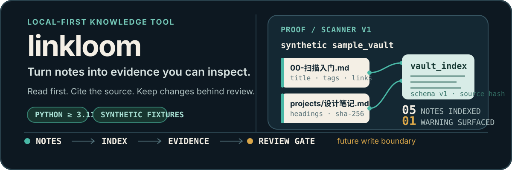

# linkloom

[English](README.md) · [简体中文](README.zh-CN.md)

<p align="center">
  
</p>

Linkloom is a local-first toolkit for turning Markdown and Obsidian notes into
deterministic, inspectable artifacts—starting with a read-only scanner. It is
being built for people who want to recover knowledge from a long-lived vault
without handing an opaque system permission to rewrite it.

> **Current status · Scanner v1 accepted on synthetic fixtures.** The first
> user-facing slice can discover Markdown files, extract their existing
> structure, emit a machine-readable index and summary, and prove that the
> source fixture stayed unchanged. Later search, connection, action and
> write-back workflows are not presented as finished product capabilities.

## First proof: scan a synthetic vault

The smallest useful run is local, deterministic, and needs no provider key or
real vault:

```bash
python -m pip install -e .
python -m linkloom scan tests/fixtures/sample_vault --output .artifacts/readme-demo/scan
```

Expected output:

```text
Indexed notes: 5
Warnings: 1
Index: .../.artifacts/readme-demo/scan/vault_index.json
Summary: .../.artifacts/readme-demo/scan/scan_summary.md
```

The fixture intentionally includes one malformed frontmatter case. Linkloom
keeps the note visible and records a warning instead of stopping the scan.

The generated `vault_index.json` contains each note's relative path, title,
headings, existing tags, WikiLink targets, byte size and source SHA-256. The
companion `scan_summary.md` gives a human-readable inventory. Artifacts must
live outside the input root.

## What is true today

- **Read-only Scanner — Accepted.** Synthetic fixture coverage proves
  discovery, structure extraction, deterministic output, warnings, path safety
  and input immutability.
- **Runtime, provider and safety foundations — Acceptance records exist.** M0
  and Gate A/B records document bounded engineering evidence; they do not mean
  the full assistant is production-ready.
- **Team Decision Eval Seed — Accepted as eval seed.** It contains 30 cases,
  6 workspaces and 36 notes; Golden 8 is formally frozen.
- **Search, explainable relations, diagnostics and action continuity — Planned /
  experimental.** Supporting experiments exist, but not a completed
  end-to-end user promise.
- **Real-vault mutation — Future only.** Real writes remain forbidden at the
  current gate. Any later write needs a visible plan, exact approval,
  source-version check, backup, audit and rollback.

[`relation_eval/`](relation_eval/README.md) is a separate synthetic evaluation
laboratory. Its mock perfect score demonstrates pipeline plumbing, not model
intelligence or a real-model benchmark.

## The evidence thread

Linkloom's design is a sequence of increasingly consequential boundaries:

```text
approved Markdown root
        │
        ▼
read-only scan ──► deterministic index + summary
                              │
                              ▼
                 cited / reviewable future workflows
                              │
                              ▼
                 separate change plan (future)
                              │
                              ▼
             exact approval + backup + audit + rollback
```

The first five product milestones stay read-only. A score, suggestion or
generated sentence is never treated as verified knowledge without a source
file and passage. Existing vault structure is observed before any organization
is proposed; Linkloom does not require one fixed folder taxonomy.

## Product path

The canonical roadmap is a knowledge lifecycle, not an autonomous rewrite
loop:

```text
Can Read → Can Find → Can Connect → Can Organize → Can Act
                                              ↘
                                  Modify only after confirmation
```

The current implementation is the **Can Read** foundation. The next product
boundary is a separate planning slice; production implementation must wait for
that slice's own SPEC, implementation plan and explicit human-approved scope.
No M1 production business flow is included here.

## Evaluation evidence

Run the checked-in seed validator without network access:

```bash
python docs/requirements/m1_team_decision_eval_seed/validate_dataset.py
```

It validates the synthetic dataset's schema, evidence anchors, trajectory
constraints, claim rules and metric registry. The recorded result is:

```text
PASS: 30 cases, 6 workspaces, 36 notes
PASS: paths, evidence anchors, trajectory constraints, claims, and metric registry
```

Existing Scanner acceptance evidence records **8 passed, 1 skipped**. The
skipped symbolic-link case needs Windows link-creation permission. In the
current Windows environment, a focused pytest run could not be reproduced
because pytest temporary-directory ACLs failed before test execution. The
repository-wide suite is not claimed as green: historical records include
Windows ACL and legacy absolute-path non-pass cases.

## Safety defaults

- **Local-first:** the Scanner path works on the user's machine and does not
  require a model provider.
- **Read-only by default:** scanner commands never write source notes, and
  read tools are kept separate from write-capable modules.
- **Synthetic before private:** acceptance uses
  `tests/fixtures/sample_vault/` and other checked-in synthetic assets—not a
  personal or employer vault.
- **Evidence before claims:** future answers, relations, diagnoses and actions
  must retain source references; confidence alone is not proof.
- **No silent changes:** no delete, merge, rewrite, rename, move or tag
  operation is allowed without the later human-confirmed mutation gates.

## Development map

Start with the project contracts and the current milestone evidence:

- [Product roadmap](docs/PRODUCT_ROADMAP.md) — canonical six-milestone user path.
- [Product SPEC](SPEC.md) — mission, principles, boundaries and non-goals.
- [Development gates](DEV_SPEC.md) — implementation status mapped to the roadmap.
- [Integration status](docs/INTEGRATION_STATUS.md) — dated M0, Gate A/B and eval evidence, including historical limitations.
- [Scanner SPEC](docs/requirements/read-only-vault-scanner/SPEC.md) and [Scanner task ledger](docs/requirements/read-only-vault-scanner/task.md) — the accepted first slice.
- [Team Decision Eval Seed](docs/requirements/m1_team_decision_eval_seed/README.md) and [Golden 8 freeze](docs/requirements/m1_team_decision_eval_seed/GOLDEN_8_FREEZE.md) — synthetic evaluation contract.
- [Documentation index](docs/README.md) — navigation for architecture, roles and implementation notes.

## Contributing safely

Before changing product behavior, read [`AGENTS.md`](AGENTS.md), identify the
governing SPEC and implementation plan, and keep the Planner → Worker →
Reviewer roles separate. Use synthetic fixtures first, state the exact file
boundary, and leave runnable checks or other objective evidence. Do not access
or modify a real vault as part of early development.

## License

This project is licensed under the [MIT License](LICENSE). It permits use,
copying, modification, merging, publishing, distribution, sublicensing and
sale of copies, provided the copyright and permission notice are included. The
software is provided without warranty.
