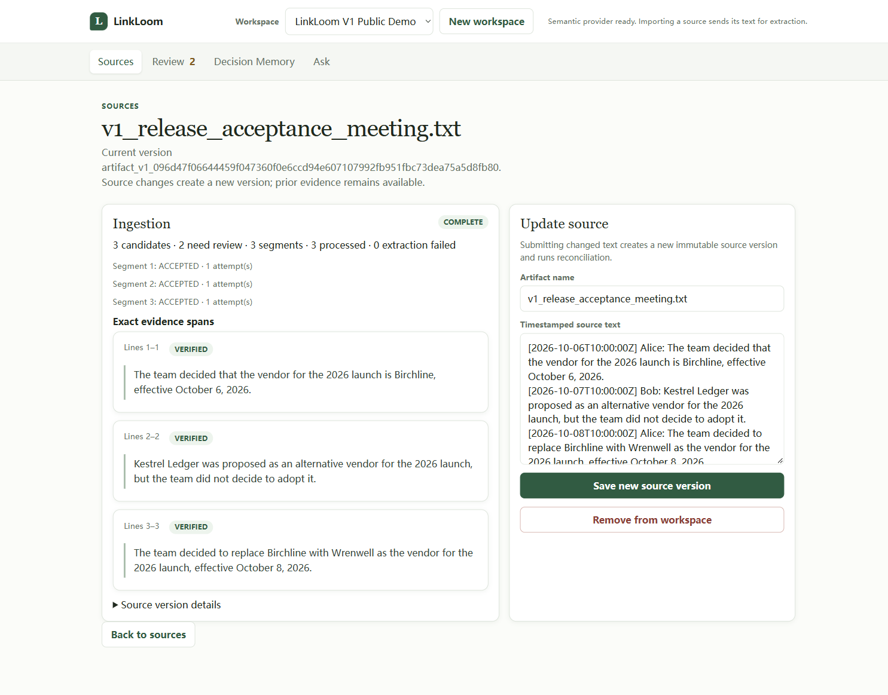
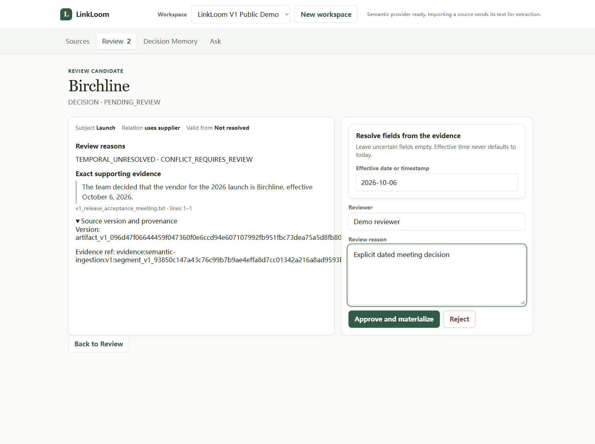
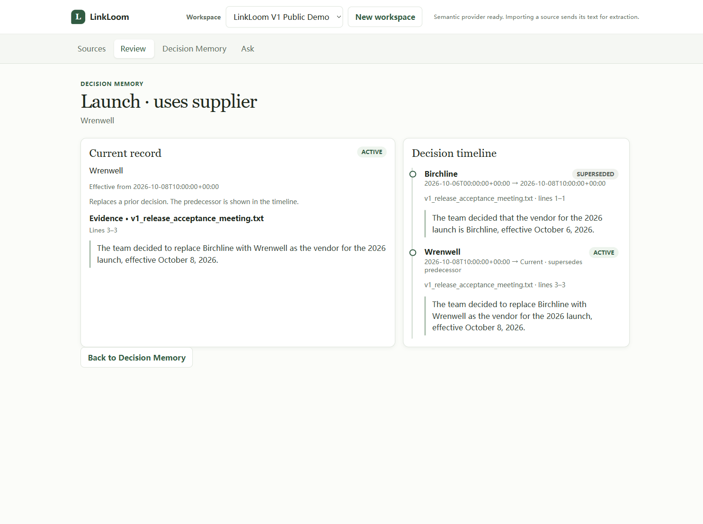
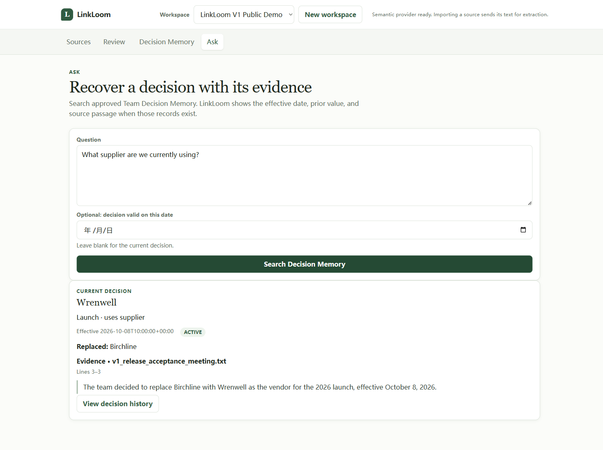
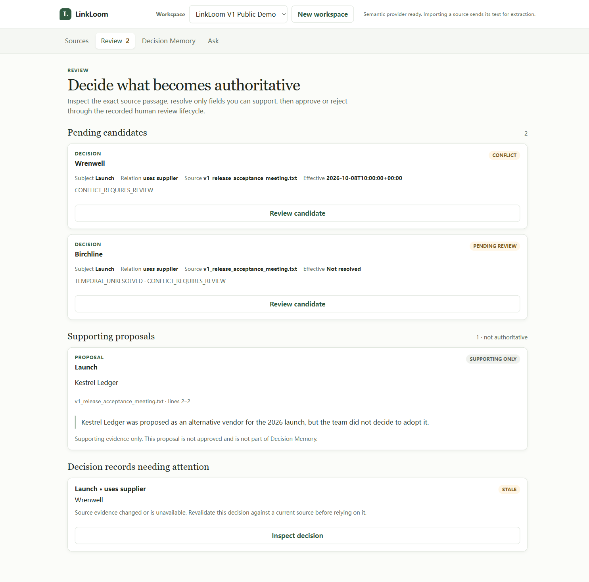
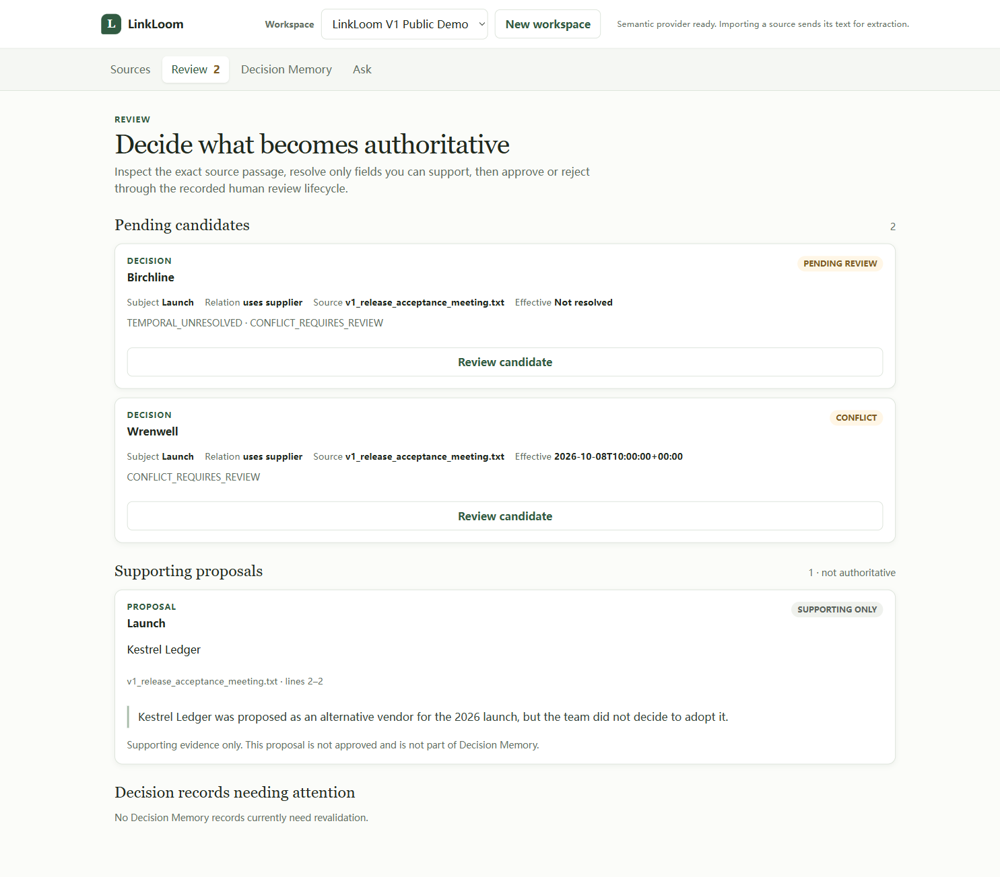

# LinkLoom

[English](README.md) · [简体中文](README.zh-CN.md)

**Team Decision Recovery / Temporal Decision Intelligence**

LinkLoom helps project teams recover the decision that is valid now, what it
replaced, and which source passage supports it. It turns changing meeting
artifacts into an auditable temporal Decision Memory.

The user journey is:

**Sources → Review → Decision Memory → Ask**

For example: **Birchline → replaced by Wrenwell → source evidence changes →
Wrenwell becomes STALE → Review Attention**.

## V1 product screens

These are real LinkLoom product screens captured in a browser with a synthetic
meeting and a deterministic fake provider. They illustrate the UI; the separate
release acceptance used real Gemini.

<table>
  <tr>
    <th>1. Sources</th>
    <th>2. Review</th>
  </tr>
  <tr>
    <td><a href="docs/assets/v1/01-sources.png"></a></td>
    <td><a href="docs/assets/v1/02-review.png"></a></td>
  </tr>
  <tr>
    <th>3. Temporal Decision Memory</th>
    <th>4. Ask</th>
  </tr>
  <tr>
    <td><a href="docs/assets/v1/03-decision-memory.png"></a></td>
    <td><a href="docs/assets/v1/04-ask.png"></a></td>
  </tr>
  <tr>
    <th>5. Source update → Review Attention</th>
    <th>Proposal stays supporting-only</th>
  </tr>
  <tr>
    <td><a href="docs/assets/v1/05-review-attention-stale.png"></a></td>
    <td><a href="docs/assets/v1/02-proposal-safety.png"></a></td>
  </tr>
</table>

A [replacement review](docs/assets/v1/02-review-replacement.png) shows
Wrenwell's dated evidence and approval controls. The [historical Ask
screen](docs/assets/v1/04-ask-as-of.png) returns Birchline for October 7, 2026.

## Why decision recovery needs more than text ranking

Generic retrieval finds passages that look relevant. Recovering a team decision
also requires the system to preserve and expose:

- when the decision became valid;
- which decision it superseded;
- who authorized a candidate to become authoritative;
- the exact source and evidence passage;
- whether a source change made the evidence stale and requires review.

LinkLoom combines retrieval with temporal state and a review lifecycle so an
answer can be traced to a current or historical decision.

## Four product surfaces

- **Sources** imports timestamped artifacts as immutable versions and shows
  exact evidence spans. A user-triggered source update runs reconciliation.
- **Review** presents extracted decisions for human approval. A proposal such
  as Kestrel Ledger remains supporting evidence and does not become authoritative.
- **Decision Memory** shows current and historical records, effective dates,
  supersession, and provenance.
- **Ask** answers current or as-of questions from approved Decision Memory and
  displays the source evidence when available.

## Validation and limits

The V1 release acceptance is bounded to a synthetic meeting workflow:

- the core journey was completed through the real product browser UI;
- a separate acceptance run used real Gemini and made six GenerateContent
  requests, all accepted on the first attempt;
- the deterministic release gate passed 408 tests and an installed-wheel
  no-provider HTTP smoke passed.

These results validate one release workflow, not general extraction accuracy,
universal provider quality, held-out performance, or production readiness.
LinkLoom is not a deployed multi-user service.

## Quickstart

From a LinkLoom checkout:

~~~bash
python -m pip install -e .
python -m linkloom.ui --port 8765
~~~

Open http://127.0.0.1:8765/. The local database defaults to
~/.linkloom/product.sqlite. The UI starts without a provider, but semantic
source extraction cannot complete until the explicit provider path is enabled.

To enable the existing Gemini path, install the repository's smoke extra if
the Google GenAI SDK is not already installed, set GEMINI_API_KEY using your
shell's secret manager, and launch with the explicit opt-in:

~~~bash
python -m pip install -e ".[smoke]"
python -m linkloom.ui --port 8765 --allow-external-provider
~~~

When enabled, imported source text is sent to Gemini for extraction. Provider
configuration is launch-time; the app has no in-product provider settings.

For a key-free deterministic preview, open
http://127.0.0.1:8765/legacy-ask. This replays the older synthetic decision
brief and does not exercise the V1 Sources, Review, Decision Memory, or Ask
workflow.

## Product data flow

~~~text
Raw artifact
  → immutable source version + exact evidence spans
  → semantic candidate
  → human review and authorization
  → Temporal Decision Memory

Ask
  → temporal lookup and bounded retrieval
  → evidence assembly
  → grounded answer

Source update
  → evidence inventory
  → reconciliation
  → STALE record in Review Attention

Runtime Agent result
  → Reviewer PASS
  → AgentMemoryCandidate
  → separate review and authorization
  → DecisionMaterializer
  → Temporal Decision Memory
~~~

Generic Agent Memory remains separate from Temporal Decision Memory. The
[60–90 second demo guide](docs/V1_DEMO.md), [release notes
draft](docs/V1_RELEASE_NOTES_DRAFT.md), [V1.1 backlog](docs/V1_1_BACKLOG.md),
and [product roadmap](docs/PRODUCT_ROADMAP.md) provide the next level of detail.

## Indexing

The indexing layer makes three retrieval indexes explicit, alongside the
separate business-state index:

| Index | Purpose and implementation |
|---|---|
| Lexical | BM25 inverted index for exact names, IDs, dates, and terminology; uses the `rank-bm25` package. |
| Dense | Local multilingual embeddings with exact cosine search behind a `VectorIndex` interface; no ANN system is justified by the current small corpus. |
| Directory-aware | `DirectoryIndex` stores parent/child paths, contained documents, abstracts, overviews, hashes, versions, and dirty-summary state. |
| Temporal decision | SQLite relations and indexes represent current/history, supersession, evidence provenance, actions, and owners. |

Hybrid retrieval fuses up to 20 candidates from BM25 and Dense with reciprocal
rank fusion (`k=60`), stable tie-breaking, and evidence-identity deduplication.
Workspace scope and any requested directory scope are applied before ranking.
Directory-aware scope selection is configurable. The frozen evaluation seed
has flat note directories, so it cannot establish a benefit for deep directory
navigation.

## Incremental Update

`ContextManifest`, `FileChangeEvent`, and `IndexUpdateCoordinator` model
CREATE, MODIFY, DELETE, and MOVE. Hash-identical modifications are no-ops;
changed resources update only their affected lexical, vector, manifest, and
directory representations, while affected ancestor summaries are marked dirty.

```text
File event → manifest/hash check → affected-resource detection
           → update affected indexes → mark ancestor summaries dirty

Periodic reconciliation → compare source inventory, manifest, and indexes
                        → detect missing/stale/orphan/hash drift → repair
```

Index reconciliation is a callable deterministic job, not a deployed
scheduler. In the V1 product UI, an explicit Sources update creates a new
immutable artifact version, resolves affected records through exact evidence
identity, runs Decision Memory reconciliation, and surfaces affected STALE
records in Review Attention. This is a user-triggered product flow; arbitrary
external filesystem edits/deletions are not watched automatically, and there
is no OS-level filesystem watcher.

## Development Evaluation

These bounded development results describe specific frozen runs; they are not
held-out proof, generalization claims, or production success rates:

- V1 Flat BM25 Top-5: 5/92 (5.43%); V1 Temporal: 2/92 (2.17%).
- Fixed lexical multi-hop pilot: 4/16; schema-constrained planner pilot: 12/16.
- V2 development run: 39/92 (42.39%).
- In that V2 setup, Reader context was about 68% smaller than Flat.

Historical V2 run protocols and caveats are preserved in local evaluation
evidence. These figures do not establish clean held-out performance or
universal retrieval improvement.

## Temporal Decision Memory

SQLite separates evolving business state from document organization. A decision
can point to source evidence, supersede a previous decision, and create an
action with an owner. Temporal lookups support current, historical, and
`as_of` questions. A partial unique index prevents two current truths for the
same workspace and subject.

The V1 acceptance example materializes **Birchline → Wrenwell**. Ask returns
Wrenwell for the current decision and Birchline for a date before October 8,
2026; the timeline retains both source passages and the supersession boundary.
A later source edit changes the Wrenwell evidence identity and surfaces that
record as STALE. Candidate writes still require validation, review, and
explicit authorization.

## Runtime V2

The provider-neutral Runtime V2 implementation accepts a host-injected
`RuntimeEngine`. A grounded successful team result can be captured as a durable
AgentMemoryCandidate for later review. Reviewer approval does not by itself
authorize materialization, and candidate capture does not make it authoritative.

```text
Decision question → durable Agent loop → read-only retrieval tools
                  → strict TeamDecisionResult → evidence validation
                  → provider-neutral Decision Brief
```

Each model turn persists one structured proposal: either a final result or an
ordered list of tool calls. The runtime validates and executes those calls in
order, with bounded proposals and checkpoint/resume support. It retains
provider continuation, partial resume, tool ledger, trace, token/cost, and
evidence visibility boundaries. Retrieval mode is configurable and defaults
to Hybrid. The read-only `search_decision_memory` tool is workspace-authorized
and records memory hit count and latency.

## Grounding and Security

Material claims may cite only source evidence the Agent actually observed from
successful retrieval/read tools. Evidence validation checks source identity,
content hash, and quoted text; stale or unavailable evidence fails closed.
Decision Memory can help navigate to likely state but cannot be treated as a
grounded fact without reading and citing source evidence.

Workspace-specific adapters scope document retrieval to their configured
workspace, and decision-memory access checks the authorized workspace before
lookup. LinkLoom stores imported artifacts and decision state in its local
product database; it does not rewrite, rename, move, tag, or delete the original
source files. Real-vault writeback remains outside V1.

## Evaluation and Provider Status

Archived evaluator reports preserve their protocols and historical results.
They are development evidence, not held-out proof or current provider success
rates. The 2026-10-08 V1 browser acceptance recorded six real Gemini
GenerateContent calls, all accepted on the first attempt. This is one synthetic
workflow run, not a general provider-quality or production-readiness claim.

## Governed Learning

LinkLoom's existing Experience/Reflection and governed Strategy mechanisms are
separate from retrieval and decision truth. Experience can inform governed
strategy proposals; approval and rollout remain controlled. The Strategy
effectiveness experiment and later strategy/runtime expansions are frozen or
out of scope here, so this README does not claim measured business
effectiveness. See [portfolio notes](docs/requirements/product_evidence_portfolio_v1/PORTFOLIO_NOTES.md).

## LangGraph Reference

[`examples/langgraph_decision_agent/`](examples/langgraph_decision_agent/)
contains an executable deterministic reference using a typed `StateGraph`, a
reducer, conditional routing, a tool node, an in-memory checkpointer, `thread_id`,
a cross-thread Store, and an interrupt/resume approval. It does not migrate
production Runtime V2 and uses no real model provider or user vault.

The [Runtime V2 ↔ LangGraph mapping](docs/architecture/LANGGRAPH_MAPPING.md)
records the build-versus-buy boundary: LinkLoom's custom runtime was built to
validate multi-action durability, partial resume, provider continuation, and
evidence visibility. Production can re-evaluate whether generic orchestration
belongs in LangGraph without moving LinkLoom's evidence, workspace-security, or
decision contracts out of the application layer.

## Project Status and Verification

The V1 product UI provides Sources, Review, Temporal Decision Memory, and Ask;
explicit source updates trigger exact-evidence reconciliation and Review
Attention. The decision-recovery runtime, retrieval/index lifecycle, SQLite
temporal memory, strict result contract, evidence projection, and provider
adapters are implemented in the current source tree. Provider contract tests
and the bounded live Gemini acceptance evidence are reported separately.
The recorded local release checks are bounded evidence; they do not imply CI acceptance
or deployment.
This is not a deployed multi-user application. The benchmark corpus is small
and synthetic, the retrieval fixtures do not test deep directory topology, and
the deterministic demo does not call a live model.

Useful starting points:

- [Team Decision eval seed](docs/requirements/m1_team_decision_eval_seed/README.md)
- [Golden8 acceptance review](docs/requirements/m1_1_team_decision_action/REVIEW_GATE.md)
- [Real-provider evidence matrix](docs/requirements/product_evidence_portfolio_v1/EVALUATION_MATRIX.md)
- [Portfolio notes](docs/requirements/product_evidence_portfolio_v1/PORTFOLIO_NOTES.md)
- [Integration status](docs/INTEGRATION_STATUS.md)
- [Product roadmap](docs/PRODUCT_ROADMAP.md)

## License

LinkLoom is available under the [MIT License](LICENSE).
