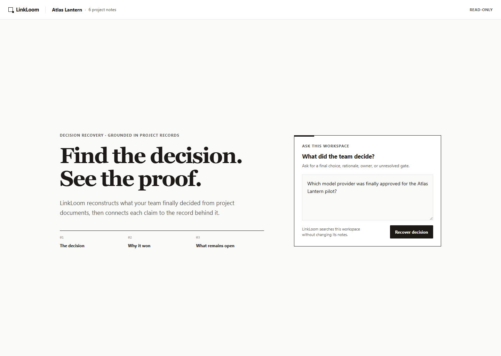
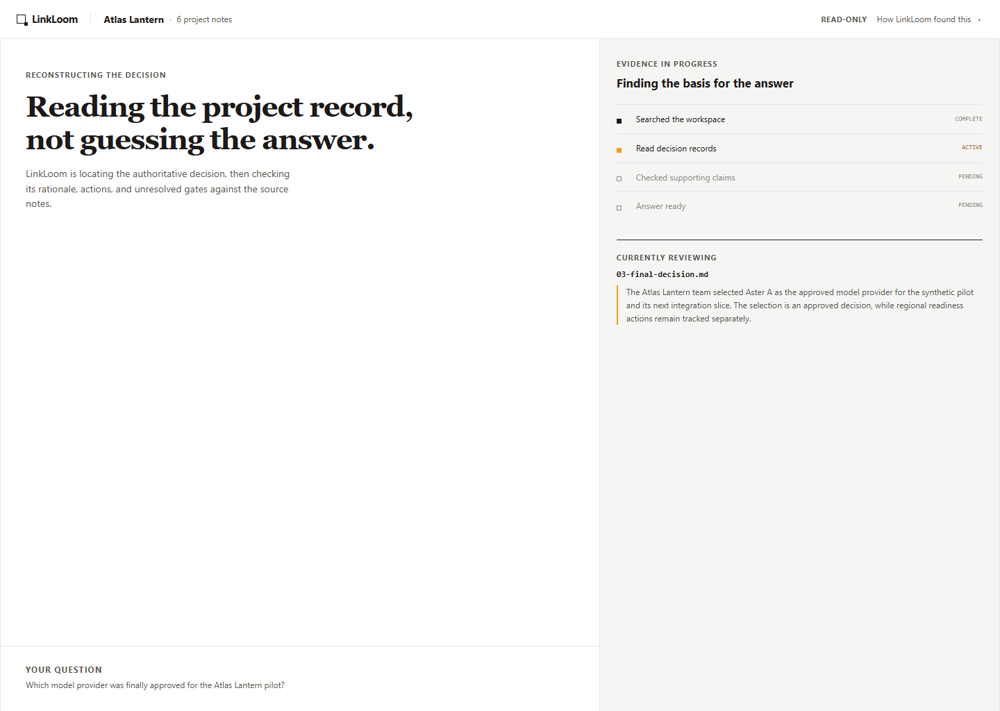
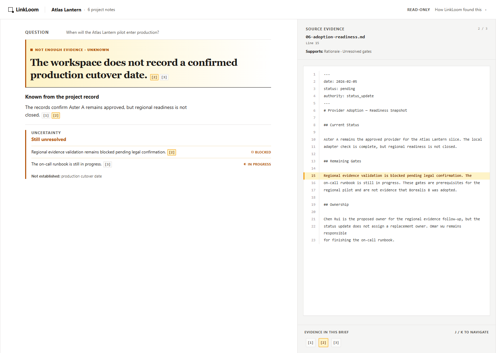
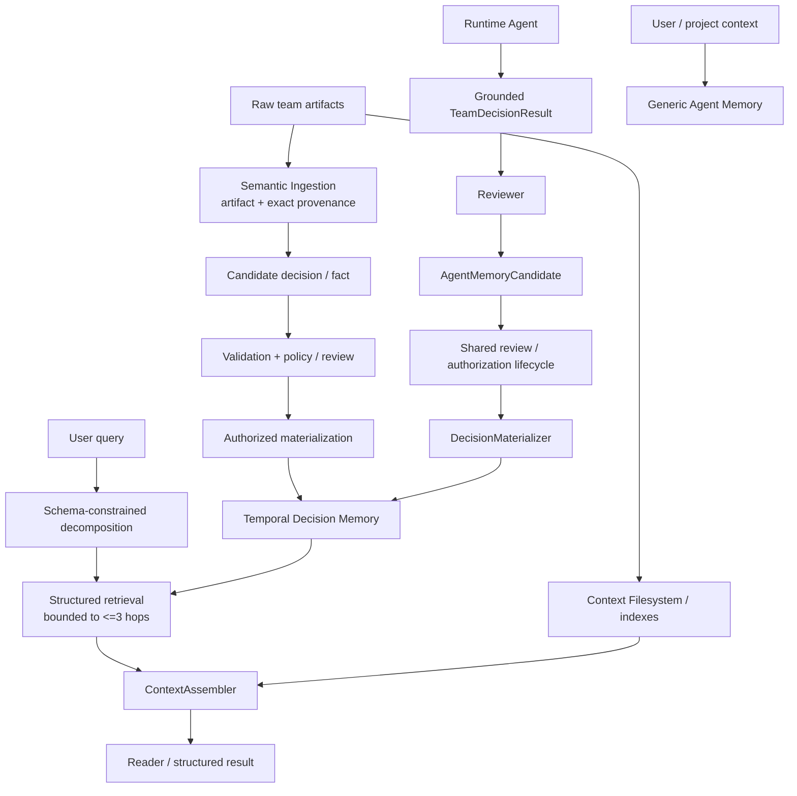

# LinkLoom

[English](README.md) · [简体中文](README.zh-CN.md)

**Recover the decision that is current now, what it replaced, and the evidence.**

LinkLoom is a local-first decision-recovery workspace for project leads, PMs,
PMOs, and team members. It helps answer a practical question from scattered,
changing project records: **“What did we decide, what changed, and what
evidence supports the current answer?”**

## 1. Problem

Project knowledge is spread across meeting notes, requirements, and decision
logs. As decisions evolve, teams need to recover the current choice, its source
evidence, what changed historically, and what is still uncertain—without
turning a plausible summary into false certainty.

## 2. Product: Sources → Review → Temporal Decision Memory → Ask

LinkLoom V1 turns timestamped team artifacts into reviewable, source-bound
decisions. Users import a meeting artifact, review extracted decisions and
supporting proposals, approve the decisions they trust, inspect current and
historical values with effective dates and supersession links, then ask what is
true now or what was true at a chosen date. Proposals remain non-authoritative
unless a user explicitly resolves them through review.

This is different from generic RAG: the answer depends on valid time,
supersession, authorization, provenance, and source lifecycle, not only on which
text passages rank highest.

The core V1 journey was validated in the product browser UI with real Gemini on
one synthetic three-segment meeting artifact. That run verified decision
review, temporal lookup, and a source update that moved the affected record to
STALE and Review Attention. It does not establish general extraction accuracy,
provider quality, or production readiness.

### Run the product UI locally

```bash
python -m pip install -e .
python -m linkloom.ui --database work/linkloom.sqlite --port 8765
```

Open `http://127.0.0.1:8765/` for Sources, Review, Decision Memory, and Ask.
Semantic extraction is disabled by default. To send selected source text to
Gemini, set `GEMINI_API_KEY` in the process environment and add
`--allow-external-provider` to the launch command.

### Deterministic legacy fixture demo

The older `mps-001` decision-brief demo remains available at
`http://127.0.0.1:8765/legacy-ask`. It replays synthetic Atlas Lantern records,
requires no provider key, and does not write to a source workspace. The existing
screenshots below depict this legacy demo, not the V1 Sources/Review workspace.

| Initial question | Searching and reading | Insufficient evidence |
|---|---|---|
|  |  |  |

## 3. Context Architecture

The retrieval layer uses a logical Context Filesystem organized by workspace
and path. It does not rewrite the user's real disk layout. The design is
**OpenViking-inspired** in its filesystem-style organization and progressive
context layers; LinkLoom does not claim to implement or integrate OpenViking,
TrieHI, or VikingRAG.


```mermaid
flowchart TD
    A[Raw team artifacts] --> SI[Semantic Ingestion<br/>artifact + exact provenance]
    SI --> C[Candidate decision / fact]
    C --> P[Validation + policy / review]
    P --> W[Authorized materialization]
    W --> M[Temporal Decision Memory]
    RA[Runtime Agent] --> TD[Grounded TeamDecisionResult]
    TD --> REV[Reviewer]
    REV --> MC[AgentMemoryCandidate]
    MC --> AUTH[Shared review / authorization lifecycle]
    AUTH --> MAT[DecisionMaterializer]
    MAT --> M
    GC[User / project context] --> GM[Generic Agent Memory]
    Q[User query] --> D[Schema-constrained decomposition]
    D --> R[Structured retrieval<br/>bounded to <=3 hops]
    M --> R
    R --> CA[ContextAssembler]
    CA --> RE[Reader / structured result]
    A --> FS[Context Filesystem / indexes]
    FS --> CA
```

The authority boundary is `raw source -> evidence -> candidate -> validation
-> policy/review -> materialization -> Temporal Decision Memory`. Extraction
output alone is never authoritative. A grounded TeamDecisionResult must pass
the Reviewer before it is captured as an AgentMemoryCandidate; the shared
review/authorization lifecycle gates the DecisionMaterializer. Generic Agent
Memory (`src/linkloom/memory/`) remains separate for approved preferences,
terminology, and user/project context. Scanner and indexing remain source
infrastructure, not the product endpoint.

L0 helps decide whether a directory is worth opening; L1 lists its contents
and deterministic metadata summary; L2 remains the original source used for
evidence. Summary generation does not call a paid or live model provider.

## 4. Indexing

The indexing layer makes three retrieval indexes explicit, alongside the
separate business-state index:

| Index | Purpose and implementation |
|---|---|
| Lexical | BM25 inverted index for exact names, IDs, dates, and terminology; uses the `rank-bm25` package. |
| Dense | Local multilingual embeddings with exact cosine search behind a `VectorIndex` interface; no ANN system is justified by the current small corpus. |
| Directory-aware | `DirectoryIndex` stores parent/child paths, contained documents, abstracts, overviews, hashes, versions, and dirty-summary state. |
| Temporal decision | SQLite relations and indexes represent current/history, supersession, evidence provenance, actions, and owners. |

Hybrid retrieval fuses up to 20 candidates from BM25 and Dense with reciprocal
rank fusion (`k=60`), stable tie-breaking, and evidence-identity deduplication.
Workspace scope and any requested directory scope are applied before ranking.
Directory-aware scope selection is configurable. The frozen evaluation seed
has flat note directories, so it cannot establish a benefit for deep directory
navigation.

## 5. Incremental Update

`ContextManifest`, `FileChangeEvent`, and `IndexUpdateCoordinator` model
CREATE, MODIFY, DELETE, and MOVE. Hash-identical modifications are no-ops;
changed resources update only their affected lexical, vector, manifest, and
directory representations, while affected ancestor summaries are marked dirty.

```text
File event → manifest/hash check → affected-resource detection
           → update affected indexes → mark ancestor summaries dirty

Periodic reconciliation → compare source inventory, manifest, and indexes
                        → detect missing/stale/orphan/hash drift → repair
```

Index reconciliation is a callable deterministic job, not a deployed
scheduler. In the V1 product UI, an explicit Sources update creates a new
immutable artifact version, resolves affected records through exact evidence
identity, runs Decision Memory reconciliation, and surfaces affected STALE
records in Review Attention. This is a user-triggered product flow; arbitrary
external filesystem edits/deletions are not watched automatically, and there
is no OS-level filesystem watcher.

## 6. Development Evaluation

These bounded development results describe specific frozen runs; they are not
held-out proof, generalization claims, or production success rates:

- V1 Flat BM25 Top-5: 5/92 (5.43%); V1 Temporal: 2/92 (2.17%).
- Fixed lexical multi-hop pilot: 4/16; schema-constrained planner pilot: 12/16.
- V2 development run: 39/92 (42.39%).
- In that V2 setup, Reader context was about 68% smaller than Flat.

Historical V2 run protocols and caveats are preserved in local evaluation
evidence. These figures do not establish clean held-out performance or
universal retrieval improvement.

## 7. Temporal Decision Memory

SQLite separates evolving business state from document organization. A decision
can point to source evidence, supersede a previous decision, and create an
action with an owner. Temporal lookups support current, historical, and
`as_of` questions. A partial unique index prevents two current truths for the
same workspace and subject.

The demo materializes **Supplier A → Supplier B**: the current answer is B,
the historical answer before the change is A, and the evolution query returns
the change date and source evidence. Candidate writes require the TeamDecision
contract, grounding, and explicit approval. The Agent's memory search is
read-only and returns a navigation hint, not final grounding evidence.

See the [temporal demo output](docs/evaluation/temporal_decision_memory_demo.json)
and [verification report](docs/evaluation/temporal_decision_memory_ag3_report.md).

## 8. Runtime V2

The provider-neutral Runtime V2 implementation accepts a host-injected
`RuntimeEngine`. A grounded successful team result can be captured as a durable
AgentMemoryCandidate for later review. Reviewer approval does not by itself
authorize materialization, and candidate capture does not make it authoritative.

```text
Decision question → durable Agent loop → read-only retrieval tools
                  → strict TeamDecisionResult → evidence validation
                  → provider-neutral Decision Brief
```

Each model turn persists one structured proposal: either a final result or an
ordered list of tool calls. The runtime validates and executes those calls in
order, with bounded proposals and checkpoint/resume support. It retains
provider continuation, partial resume, tool ledger, trace, token/cost, and
evidence visibility boundaries. Retrieval mode is configurable and defaults
to Hybrid. The read-only `search_decision_memory` tool is workspace-authorized
and records memory hit count and latency.

## 9. Grounding and Security

Material claims may cite only source evidence the Agent actually observed from
successful retrieval/read tools. Evidence validation checks source identity,
content hash, and quoted text; stale or unavailable evidence fails closed.
Decision Memory can help navigate to likely state but cannot be treated as a
grounded fact without reading and citing source evidence.

Workspace-specific adapters scope document retrieval to their configured
workspace, and decision-memory access checks the authorized workspace before
lookup. LinkLoom stores imported artifacts and decision state in its local
product database; it does not rewrite, rename, move, tag, or delete the original
source files. Real-vault writeback remains outside V1.

## 10. Evaluation and Provider Status

Archived evaluator reports preserve their protocols and historical results.
They are development evidence, not held-out proof or current provider success
rates. The 2026-10-08 V1 browser acceptance recorded six real Gemini
GenerateContent calls, all accepted on the first attempt. This is one synthetic
workflow run, not a general provider-quality or production-readiness claim.

## 11. Governed Learning

LinkLoom's existing Experience/Reflection and governed Strategy mechanisms are
separate from retrieval and decision truth. Experience can inform governed
strategy proposals; approval and rollout remain controlled. The Strategy
effectiveness experiment and later strategy/runtime expansions are frozen or
out of scope here, so this README does not claim measured business
effectiveness. See [portfolio notes](docs/requirements/product_evidence_portfolio_v1/PORTFOLIO_NOTES.md).

## 12. LangGraph Reference

[`examples/langgraph_decision_agent/`](examples/langgraph_decision_agent/)
contains an executable deterministic reference using a typed `StateGraph`, a
reducer, conditional routing, a tool node, an in-memory checkpointer, `thread_id`,
a cross-thread Store, and an interrupt/resume approval. It does not migrate
production Runtime V2 and uses no real model provider or user vault.

The [Runtime V2 ↔ LangGraph mapping](docs/architecture/LANGGRAPH_MAPPING.md)
records the build-versus-buy boundary: LinkLoom's custom runtime was built to
validate multi-action durability, partial resume, provider continuation, and
evidence visibility. Production can re-evaluate whether generic orchestration
belongs in LangGraph without moving LinkLoom's evidence, workspace-security, or
decision contracts out of the application layer.

## Project Status and Verification

The V1 product UI provides Sources, Review, Temporal Decision Memory, and Ask;
explicit source updates trigger exact-evidence reconciliation and Review
Attention. The decision-recovery runtime, retrieval/index lifecycle, SQLite
temporal memory, strict result contract, evidence projection, and provider
adapters are implemented in the current source tree. Provider contract tests
and the bounded live Gemini acceptance evidence are reported separately.
This describes the current source tree and linked local evidence; it is not a
claim that every Sprint artifact has been committed, CI-verified, or deployed.
This is not a deployed multi-user application. The benchmark corpus is small
and synthetic, the retrieval fixtures do not test deep directory topology, and
the deterministic demo does not call a live model.

Useful starting points:

- [Team Decision eval seed](docs/requirements/m1_team_decision_eval_seed/README.md)
- [Golden8 acceptance review](docs/requirements/m1_1_team_decision_action/REVIEW_GATE.md)
- [Real-provider evidence matrix](docs/requirements/product_evidence_portfolio_v1/EVALUATION_MATRIX.md)
- [Portfolio notes](docs/requirements/product_evidence_portfolio_v1/PORTFOLIO_NOTES.md)
- [Integration status](docs/INTEGRATION_STATUS.md)
- [Product roadmap](docs/PRODUCT_ROADMAP.md)

## License

LinkLoom is available under the [MIT License](LICENSE).
