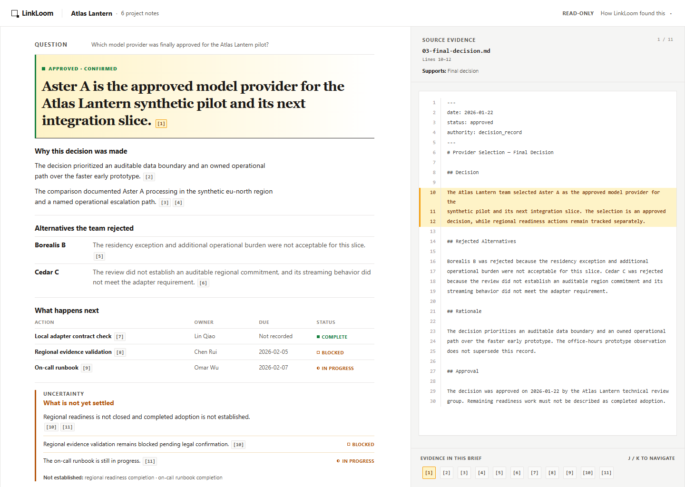
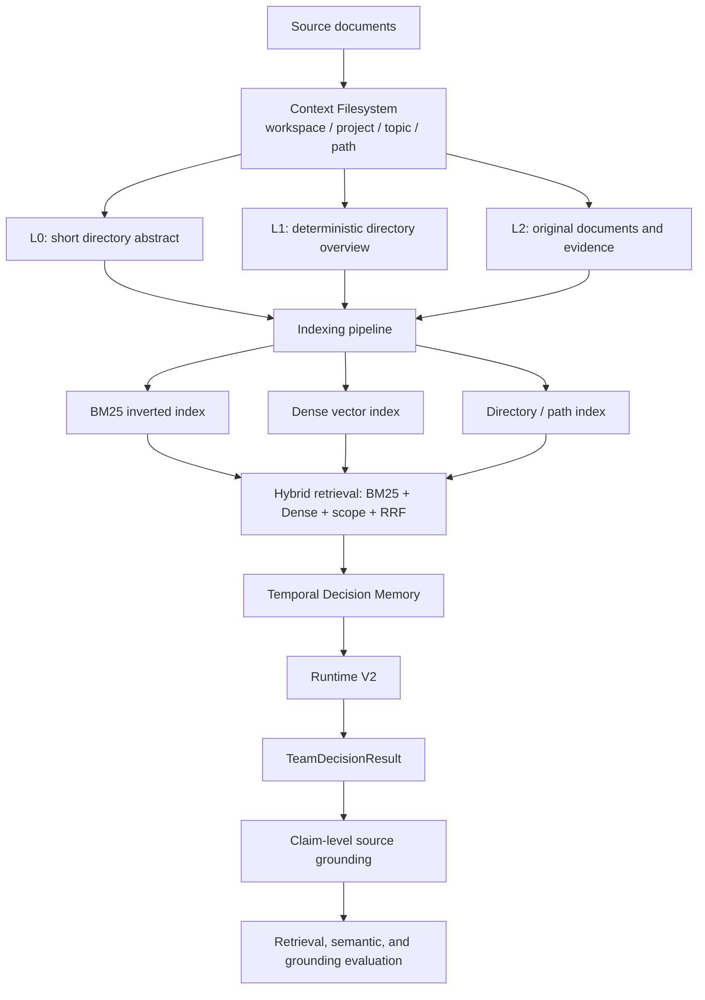

# LinkLoom

[English](README.md) · [简体中文](README.zh-CN.md)

**Recover what the team actually decided—and show why the answer is trustworthy.**

LinkLoom is a local-first decision-recovery workspace for project leads, PMs,
PMOs, and team members. It helps answer a practical question from scattered,
changing project records: **“So what did we finally decide, why, and what
happens next?”**

## 1. Problem

Project knowledge is spread across meeting notes, requirements, decision logs,
and action records. As decisions evolve, teams need to recover the current
choice, its source evidence, what changed historically, the next actions, and
what is still unknown—without turning a plausible summary into false certainty.

## 2. Product: Decision Brief

LinkLoom returns a decision-first brief rather than a chat transcript:

- final decision, rationale, and genuinely rejected alternatives;
- actions, owners, deadlines, unresolved questions, and explicit uncertainty;
- material claims linked to verified source excerpts and exact line ranges;
- separate states for confirmed results, insufficient evidence, and operational
  failure.

The product UI keeps provenance available without making the Agent trace the
main experience.



The deterministic local demo uses frozen synthetic records, requires no
provider key, and does not write to a source workspace:

```bash
python -m pip install -e .
python -m linkloom.ui --port 8765
```

Open `http://127.0.0.1:8765`. The bundled `mps-001` fixture replays a grounded
Atlas Lantern decision and an insufficient-evidence case. Arbitrary questions
fail explicitly instead of receiving a hard-coded answer. The UI supports
English and Simplified Chinese (`?lang=zh`).

| Initial question | Searching and reading | Insufficient evidence |
|---|---|---|
|  |  |  |

## 3. Context Architecture

The retrieval layer uses a logical Context Filesystem organized by workspace
and path. It does not rewrite the user's real disk layout. The design is
**OpenViking-inspired** in its filesystem-style organization and progressive
context layers; LinkLoom does not claim to implement or integrate OpenViking,
TrieHI, or VikingRAG.


```mermaid
flowchart TD
    S[Source documents] --> FS[Context Filesystem<br/>workspace / project / topic / path]
    FS --> L0[L0: short directory abstract]
    FS --> L1[L1: deterministic directory overview]
    FS --> L2[L2: original documents and evidence]
    L0 --> IDX[Indexing pipeline]
    L1 --> IDX
    L2 --> IDX
    IDX --> B[BM25 inverted index]
    IDX --> V[Dense vector index]
    IDX --> D[Directory / path index]
    B --> H[Hybrid retrieval: BM25 + Dense + scope + RRF]
    V --> H
    D --> H
    H --> M[Temporal Decision Memory]
    M --> R[Runtime V2]
    R --> T[TeamDecisionResult]
    T --> G[Claim-level source grounding]
    G --> E[Retrieval, semantic, and grounding evaluation]
```

L0 helps decide whether a directory is worth opening; L1 lists its contents
and deterministic metadata summary; L2 remains the original source used for
evidence. Summary generation does not call a paid or live model provider.

## 4. Indexing

The indexing layer makes three retrieval indexes explicit, alongside the
separate business-state index:

| Index | Purpose and implementation |
|---|---|
| Lexical | BM25 inverted index for exact names, IDs, dates, and terminology; uses the `rank-bm25` package. |
| Dense | Local multilingual embeddings with exact cosine search behind a `VectorIndex` interface; no ANN system is justified by the current small corpus. |
| Directory-aware | `DirectoryIndex` stores parent/child paths, contained documents, abstracts, overviews, hashes, versions, and dirty-summary state. |
| Temporal decision | SQLite relations and indexes represent current/history, supersession, evidence provenance, actions, and owners. |

Hybrid retrieval fuses up to 20 candidates from BM25 and Dense with reciprocal
rank fusion (`k=60`), stable tie-breaking, and evidence-identity deduplication.
Workspace scope and any requested directory scope are applied before ranking.
Directory-aware scope selection is configurable. The frozen evaluation seed
has flat note directories, so it cannot establish a benefit for deep directory
navigation.

## 5. Incremental Update

`ContextManifest`, `FileChangeEvent`, and `IndexUpdateCoordinator` model
CREATE, MODIFY, DELETE, and MOVE. Hash-identical modifications are no-ops;
changed resources update only their affected lexical, vector, manifest, and
directory representations, while affected ancestor summaries are marked dirty.

```text
File event → manifest/hash check → affected-resource detection
           → update affected indexes → mark ancestor summaries dirty

Periodic reconciliation → compare source inventory, manifest, and indexes
                        → detect missing/stale/orphan/hash drift → repair
```

Reconciliation is a callable deterministic job, not a deployed scheduler. This
Sprint defines the event interface and tests but does not install an OS-level
filesystem watcher; production scheduling and watcher integration remain
future work.

## 6. Retrieval Benchmark

The frozen offline benchmark uses 30 queries across 6 workspaces and 36
synthetic notes. Gold is evaluator-side and remained unchanged. Embeddings use
the local `paraphrase-multilingual-MiniLM-L12-v2` model; no paid provider or
network call is part of this benchmark.

| Mode | Recall@1 | Recall@3 | Recall@5 | MRR | nDCG@5 | Failure rate | Evidence availability@5 | Mean latency (ms) |
|---|---:|---:|---:|---:|---:|---:|---:|---:|
| Current | 0.3105 | 0.6750 | 0.9283 | 0.8278 | 0.8245 | 0.0000 | 1.0000 | 3.9559 |
| BM25 | 0.3300 | 0.7233 | 0.9239 | 0.8694 | 0.8537 | 0.0000 | 1.0000 | 0.6118 |
| Dense | 0.3967 | 0.7039 | 0.9378 | 0.9500 | 0.8851 | 0.0000 | 1.0000 | 32.0448 |
| Hybrid | 0.3633 | 0.7456 | 0.9361 | 0.9333 | 0.8895 | 0.0000 | 1.0000 | 31.8911 |
| Directory-aware Hybrid | 0.3633 | 0.7456 | 0.9361 | 0.9333 | 0.8895 | 0.0000 | 1.0000 | 32.3351 |

Directory-aware and plain Hybrid ranked identically because the seed has no
nested note directories. The small frozen corpus is useful for regression and
channel comparison, not enterprise-scale latency claims. See the [full
benchmark report](docs/evaluation/retrieval_v2_ag2_report.md), [ranked result
artifact](docs/evaluation/retrieval_v2_ag2_results.json), and [Current vs.
Hybrid downstream probe](docs/evaluation/retrieval_v2_downstream_comparison.md).

## 7. Temporal Decision Memory

SQLite separates evolving business state from document organization. A decision
can point to source evidence, supersede a previous decision, and create an
action with an owner. Temporal lookups support current, historical, and
`as_of` questions. A partial unique index prevents two current truths for the
same workspace and subject.

The demo materializes **Supplier A → Supplier B**: the current answer is B,
the historical answer before the change is A, and the evolution query returns
the change date and source evidence. Candidate writes require the TeamDecision
contract, grounding, and explicit approval. The Agent's memory search is
read-only and returns a navigation hint, not final grounding evidence.

See the [temporal demo output](docs/evaluation/temporal_decision_memory_demo.json)
and [verification report](docs/evaluation/temporal_decision_memory_ag3_report.md).

## 8. Runtime V2

Production orchestration remains on LinkLoom's existing provider-neutral
Runtime V2; this Sprint does not rewrite it. A host injects a configured
`RuntimeEngine`. The deterministic UI launcher remains a fixture demo.

```text
Decision question → durable Agent loop → read-only retrieval tools
                  → strict TeamDecisionResult → evidence validation
                  → provider-neutral Decision Brief
```

Each model turn persists one structured proposal: either a final result or an
ordered list of tool calls. The runtime validates and executes those calls in
order, with bounded proposals and checkpoint/resume support. It retains
provider continuation, partial resume, tool ledger, trace, token/cost, and
evidence visibility boundaries. Retrieval mode is configurable and defaults
to Hybrid. The read-only `search_decision_memory` tool is workspace-authorized
and records memory hit count and latency.

## 9. Grounding and Security

Material claims may cite only source evidence the Agent actually observed from
successful retrieval/read tools. Evidence validation checks source identity,
content hash, and quoted text; stale or unavailable evidence fails closed.
Decision Memory can help navigate to likely state but cannot be treated as a
grounded fact without reading and citing source evidence.

Workspace-specific adapters scope document retrieval to their configured
workspace, and decision-memory access checks the authorized workspace before
lookup. The current product path is read-only: retrieval cannot rewrite, rename,
move, tag, or delete notes. Real-vault writes remain outside this Sprint.

## 10. Evaluation

Retrieval metrics above measure frozen evaluator-side relevance. The separate
offline downstream comparison checks evidence availability and deterministic
contract/grounding boundaries; it does **not** measure answer quality:

| Mode | Evidence availability@5 | Contract probe | Grounding probe | Mean context (bytes) | Mean latency (ms) | Semantic result |
|---|---:|---:|---:|---:|---:|---|
| Current | 1.000 | 1.000 | 1.000 | 3312.0 | 2.39 | N/E |
| Hybrid | 1.000 | 1.000 | 1.000 | 3360.2 | 609.20 | N/E |

The probes use a synthetic non-business result; context is serialized evidence
bytes, not provider token usage. Latency includes cold index initialization.
The two latency tables come from separate runners and are not directly
comparable. No real provider was run, so this report makes no semantic-accuracy
or real-model-improvement claim. Details are in the [comparison report](docs/evaluation/retrieval_v2_downstream_comparison.md)
and its [case-level JSON artifact](docs/evaluation/retrieval_v2_downstream_comparison.json).

Three frozen synthetic cases have historical first-result DeepSeek evidence.
This is a small engineering evaluation, not a current adapter regression
matrix, benchmark, or production success rate:

| Case | Intended behavior | Infrastructure | Business result |
|---|---|---:|---|
| `mps-001` | Recover approved model provider | PASS | Aster A recovered and grounded; rejected-alternative classification was too broad. |
| `aer-002` | Recover cross-document rollout boundary | FAIL | Not evaluated: first response returned multiple tool calls. |
| `iti-005` | Refuse to invent missing owners/deadlines | FAIL | Not evaluated: first response returned multiple tool calls. |

The blocked cases were sealed as first terminal results and not resampled. At
that evaluation point, the provider/runtime boundary did not accept DeepSeek's
multiple-tool-call response shape; the current Runtime V2 now supports
normalized ordered multi-action proposals. The old outcomes remain historical
evidence, not a claim about current real-provider behavior. Infrastructure
failures are not mislabeled as semantic failures. See the [full real-provider
evidence matrix](docs/requirements/product_evidence_portfolio_v1/EVALUATION_MATRIX.md).

## 11. Governed Learning

LinkLoom's existing Experience/Reflection and governed Strategy mechanisms are
separate from retrieval and decision truth. Experience can inform governed
strategy proposals; approval and rollout remain controlled. The Strategy
effectiveness experiment and later strategy/runtime expansions are frozen or
out of scope here, so this README does not claim measured business
effectiveness. See [portfolio notes](docs/requirements/product_evidence_portfolio_v1/PORTFOLIO_NOTES.md).

## 12. LangGraph Reference

[`examples/langgraph_decision_agent/`](examples/langgraph_decision_agent/)
contains an executable deterministic reference using a typed `StateGraph`, a
reducer, conditional routing, a tool node, an in-memory checkpointer, `thread_id`,
a cross-thread Store, and an interrupt/resume approval. It does not migrate
production Runtime V2 and uses no real model provider or user vault.

The [Runtime V2 ↔ LangGraph mapping](docs/architecture/LANGGRAPH_MAPPING.md)
records the build-versus-buy boundary: LinkLoom's custom runtime was built to
validate multi-action durability, partial resume, provider continuation, and
evidence visibility. Production can re-evaluate whether generic orchestration
belongs in LangGraph without moving LinkLoom's evidence, workspace-security, or
decision contracts out of the application layer.

## Project Status and Verification

The decision-recovery runtime, retrieval/index lifecycle, SQLite temporal
memory, strict result contract, evidence projection, real Gemini/DeepSeek
multi-turn baseline, and Product UI V1 are implemented and locally tested.
This describes the current source tree and linked local evidence; it is not a
claim that every Sprint artifact has been committed, CI-verified, or deployed.
This is not a deployed multi-user application. The benchmark corpus is small
and synthetic, the retrieval fixtures do not test deep directory topology, and
the deterministic demo does not call a live model.

Useful starting points:

- [Team Decision eval seed](docs/requirements/m1_team_decision_eval_seed/README.md)
- [Golden8 acceptance review](docs/requirements/m1_1_team_decision_action/REVIEW_GATE.md)
- [Real-provider evidence matrix](docs/requirements/product_evidence_portfolio_v1/EVALUATION_MATRIX.md)
- [Portfolio notes](docs/requirements/product_evidence_portfolio_v1/PORTFOLIO_NOTES.md)
- [Integration status](docs/INTEGRATION_STATUS.md)
- [Product roadmap](docs/PRODUCT_ROADMAP.md)

## License

LinkLoom is available under the [MIT License](LICENSE).
