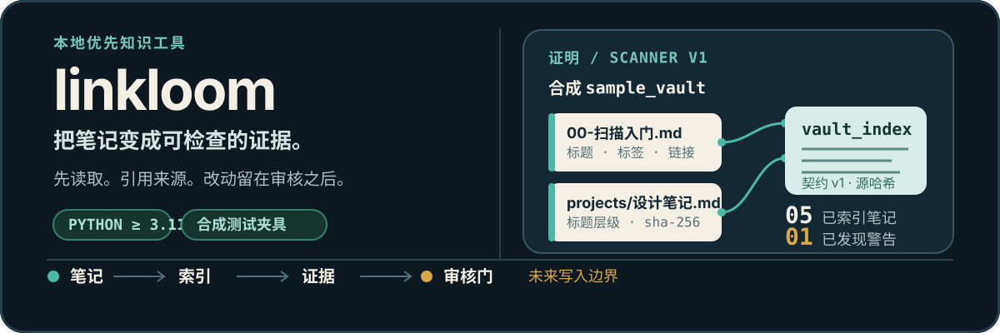

# linkloom

[English](README.md) · [简体中文](README.zh-CN.md)

<p align="center">
  
</p>

Linkloom 是一个本地优先工具，用于把 Markdown 和 Obsidian 笔记转为确定、
可检查的产物——从只读扫描器开始。它面向希望从长期积累的 Vault 中找回
知识、又不愿把重写权限交给不透明系统的人。

> **当前状态 · Scanner v1 已在合成测试夹具上验收。** 第一个面向用户的切片
> 可以发现 Markdown 文件、提取已有结构、输出机器可读索引和摘要，并证明源
> 夹具保持不变。后续搜索、连接、行动和写回流程不作为已完成的产品能力呈现。

## 第一份证明：扫描合成 Vault

最小可用运行方式是本地、确定性的，不需要 provider key 或真实 Vault：

```bash
python -m pip install -e .
python -m linkloom scan tests/fixtures/sample_vault --output .artifacts/readme-demo/scan
```

预期输出：

```text
Indexed notes: 5
Warnings: 1
Index: .../.artifacts/readme-demo/scan/vault_index.json
Summary: .../.artifacts/readme-demo/scan/scan_summary.md
```

这个夹具特意包含一个 frontmatter 损坏案例。Linkloom 会保留该笔记的可见
性并记录警告，而不是中止扫描。

生成的 `vault_index.json` 包含每篇笔记的相对路径、标题、标题层级、已有标签、
WikiLink 目标、字节大小和源 SHA-256。配套的 `scan_summary.md` 提供人类可读的
清单。产物必须位于输入根目录之外。

## 当前真实情况

- **只读 Scanner — Accepted（已验收）。** 基于合成夹具的测试覆盖了文件发现、结构提取、确定性输出、警告、路径安全和输入不可变性。
- **Runtime、provider 与 safety 基础 — Acceptance records exist（存在验收记录）。** M0 和 Gate A/B 记录了有边界的工程证据；这不代表完整助手已经达到生产就绪状态。
- **Team Decision Eval Seed — Accepted as eval seed（作为评测种子已验收）。** 它包含 30 cases、6 workspaces 和 36 notes；Golden 8 已正式冻结。
- **Search、可解释关系、诊断和行动连续性 — Planned / experimental（计划中 / 实验性）。** 存在支持性实验，但还没有完成端到端的用户承诺。
- **Real-vault mutation — Future only（仅未来）。** 当前门槛下真实写入仍然禁止。任何后续写入都需要可见计划、精确批准、源版本检查、备份、审计和回滚。

[`relation_eval/`](relation_eval/README.md) 是独立的合成评测实验室。它的模拟满分
证明的是流水线连接，而不是模型智能或真实模型基准。

## 证据链

Linkloom 的设计是一串逐步提高影响范围的边界：

```text
已批准的 Markdown 根目录
        │
        ▼
只读扫描 ──► 确定性索引 + 摘要
                              │
                              ▼
                 带引用 / 可审核的未来流程
                              │
                              ▼
                 独立变更计划（未来）
                              │
                              ▼
             精确批准 + 备份 + 审计 + 回滚
```

前五个产品里程碑保持只读。没有源文件和段落时，分数、建议或生成的句子都
不会被当作已验证知识。Linkloom 会先观察现有 Vault 结构，再提出组织方式；
它不要求一套固定的文件夹分类。

## 产品路径

规范路线图描述的是知识生命周期，而不是自动重写循环：

```text
可读取 → 可查找 → 可连接 → 可组织 → 可行动
                                  ↘
                      仅在确认后修改
```

当前实现是 **Can Read** 基础。下一个产品边界是独立的规划切片；生产实现必须
等待该切片自己的 SPEC、implementation plan 和明确的人类批准范围。这里不包含
任何 M1 生产业务流程。

## 评测证据

无需网络即可运行仓库中已提交的种子校验器：

```bash
python docs/requirements/m1_team_decision_eval_seed/validate_dataset.py
```

它会校验合成数据集的 schema、证据锚点、轨迹约束、claim 规则和指标注册表。
已有记录如下：

```text
PASS: 30 cases, 6 workspaces, 36 notes
PASS: paths, evidence anchors, trajectory constraints, claims, and metric registry
```

现有 Scanner 验收证据记录为 **8 passed, 1 skipped**。跳过的是需要 Windows
创建链接权限的 symbolic-link 案例。在当前 Windows 环境中，focused pytest
无法重现，因为 pytest 临时目录 ACL 在测试执行前就失败了。仓库级测试套件不
声称已经全绿：历史记录包含 Windows ACL 和旧版绝对路径非通过案例。

## 安全默认值

- **Local-first：** Scanner 路径在用户机器上运行，不需要模型 provider。
- **默认只读：** scanner 命令永远不会写入源笔记，读取工具也与可写工具模块分离。
- **先合成、后私有：** 验收使用 `tests/fixtures/sample_vault/` 和其他已提交的合成资产，而不是个人或雇主 Vault。
- **先证据、后声明：** 未来的答案、关系、诊断和行动都必须保留源引用；置信度本身不是证明。
- **不允许静默改动：** 未经过后续的人类确认门，不得执行删除、合并、重写、重命名、移动或标签操作。

## 开发地图

从项目契约和当前里程碑证据开始：

- [产品路线图](docs/PRODUCT_ROADMAP.md) — 规范的六里程碑用户路径。
- [产品 SPEC](SPEC.md) — 使命、原则、边界和非目标。
- [开发门槛](DEV_SPEC.md) — 映射到路线图的实现状态。
- [集成状态](docs/INTEGRATION_STATUS.md) — 带日期的 M0、Gate A/B 和评测证据，包括历史限制。
- [Scanner SPEC](docs/requirements/read-only-vault-scanner/SPEC.md) 与 [Scanner 任务账本](docs/requirements/read-only-vault-scanner/task.md) — 已验收的第一个切片。
- [Team Decision Eval Seed](docs/requirements/m1_team_decision_eval_seed/README.md) 与 [Golden 8 冻结记录](docs/requirements/m1_team_decision_eval_seed/GOLDEN_8_FREEZE.md) — 合成评测契约。
- [文档索引](docs/README.md) — 架构、角色和实现笔记的导航。

## 安全地贡献

修改产品行为前，请阅读 [`AGENTS.md`](AGENTS.md)，找出负责的 SPEC 和
implementation plan，并保持 Planner → Worker → Reviewer 角色分离。优先使用
合成夹具，声明精确文件边界，并留下可运行的检查或其他客观证据。在早期开发
中不要访问或修改真实 Vault。

## 许可证

本项目使用 [MIT License](LICENSE)。它允许使用、复制、修改、合并、发布、分发、
再许可和销售副本，但必须保留版权声明和许可声明。软件按“现状”提供，不附带
任何保证。
