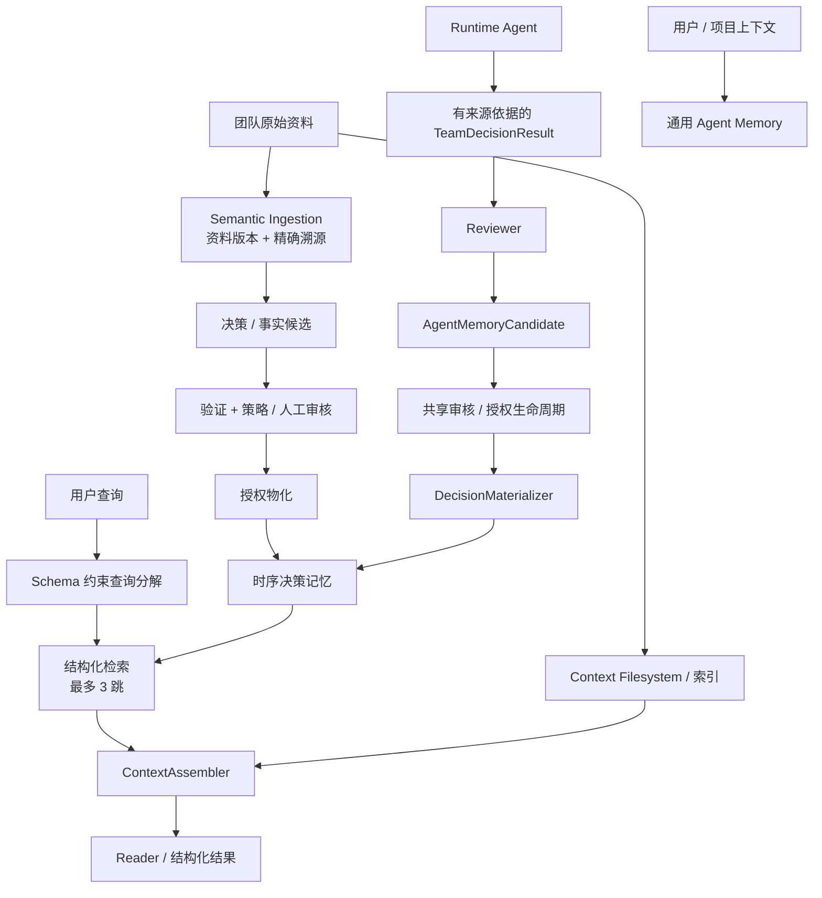

# LinkLoom

[English](README.md) · [简体中文](README.zh-CN.md)

**找回当前有效的决定、它替代了什么，以及支持答案的证据。**

LinkLoom 是面向项目负责人、PM、PMO 和团队成员的本地优先决策恢复工作区，帮助
团队从不断变化的项目资料中找回当前决定、支持证据、历史变化和仍未确定的信息。

## 1. 问题

会议记录、需求文档和决策日志分散在不同文件里。决策变化后，团队需要知道
当前选择是什么、依据是什么、何时变化，以及哪些信息仍然未知；一个
听起来合理的摘要不能代替真实证据。

## 2. 产品：Sources → Review → 时序决策记忆 → Ask

LinkLoom V1 将带时间戳的团队资料转为可审核、绑定来源的决定。用户导入会议资料，
审核抽取出的决定与 supporting proposal，批准可信的决定，在时序记忆中查看当前值、历史值、
有效时间和 supersession，再通过 Ask 查询当前状态或指定日期的状态。Proposal 保持非权威，
只有经过用户审核授权才会进入权威记忆。

这与通用 RAG 的差异在于：答案取决于 valid time、supersession、授权、来源溯源和资料生命周期，
不能只看排名最高的文本片段。

2026-10-08，V1 核心旅程通过真实产品浏览器 UI 和真实 Gemini，在一份三段式合成会议资料上完成验证：
审核决定、时序查询、更新来源后将受影响记录标记为 STALE 并显示在 Review Attention。该运行只证明
这个有界工作流，不代表普遍抽取准确率、Provider 质量或生产就绪。

### 本地启动产品 UI

```bash
python -m pip install -e .
python -m linkloom.ui --database work/linkloom.sqlite --port 8765
```

打开 `http://127.0.0.1:8765/` 使用 Sources、Review、Decision Memory 和 Ask。
默认关闭语义抽取。若要把选中的来源文本发送给 Gemini，请先在进程环境中设置 `GEMINI_API_KEY`，
再添加 `--allow-external-provider` 启动参数。

### 确定性旧版合成 Demo

旧版 `mps-001` 决策简报 Demo 保留在 `http://127.0.0.1:8765/legacy-ask`。它回放合成的
Atlas Lantern 记录，无需 Provider Key，也不会写入来源工作区。以下已有截图展示的是这个旧版 Demo，
不是 V1 的 Sources/Review 产品工作区。

| 初始问题 | 搜索与读取中 | 证据不足 |
|---|---|---|
|  |  |  |

## 3. Context Architecture 上下文架构

检索层使用逻辑 Context Filesystem 按 workspace 和路径组织资源，不改写用户真实磁盘
目录。设计借鉴 filesystem-style context 与渐进式加载，称为 **OpenViking-inspired**；
本项目没有集成或完整实现 OpenViking、TrieHI 或 VikingRAG。


```mermaid
flowchart TD
    A[团队原始资料] --> SI[Semantic Ingestion<br/>资料版本 + 精确溯源]
    SI --> C[决策 / 事实候选]
    C --> P[验证 + 策略 / 人工审核]
    P --> W[授权物化]
    W --> M[时序决策记忆]
    RA[Runtime Agent] --> TD[有来源依据的 TeamDecisionResult]
    TD --> REV[Reviewer]
    REV --> MC[AgentMemoryCandidate]
    MC --> AUTH[共享审核 / 授权生命周期]
    AUTH --> MAT[DecisionMaterializer]
    MAT --> M
    GC[用户 / 项目上下文] --> GM[通用 Agent Memory]
    Q[用户查询] --> D[Schema 约束查询分解]
    D --> R[结构化检索<br/>最多 3 跳]
    M --> R
    R --> CA[ContextAssembler]
    CA --> RE[Reader / 结构化结果]
    A --> FS[Context Filesystem / 索引]
    FS --> CA
```

权威边界为 `原始资料 -> 证据 -> 候选 -> 验证 -> 策略/审核 -> 物化 -> 时序决策记忆`。
抽取输出本身永远不等同于权威事实。有来源依据的 TeamDecisionResult 必须先通过 Reviewer，
再捕获为 AgentMemoryCandidate；共享审核/授权生命周期通过后，DecisionMaterializer 才能物化。
通用 Agent Memory（`src/linkloom/memory/`）独立保存获批的偏好、术语及用户/项目上下文。
Scanner 和索引是资料基础设施，不是产品终点。

L0 判断目录是否值得展开；L1 用确定性元数据概览目录内容；L2 是用于证据的原始来源。
摘要生成不调用付费或实时模型 Provider。

## 4. Indexing 索引

| 索引 | 用途与实现 |
|---|---|
| Lexical | BM25 倒排索引，匹配精确名称、ID、日期和术语；复用 `rank-bm25`。 |
| Dense | 本地多语言 embedding，`VectorIndex` 接口后使用 exact cosine；当前小数据集不引入 ANN。 |
| Directory-aware | `DirectoryIndex` 保存父子路径、目录文档、摘要/概览、hash、版本和 summary dirty 状态。 |
| Temporal Decision | SQLite 保存当前/历史决定、supersession、证据来源、action 与 owner 关系。 |

Hybrid 固定融合 BM25 与 Dense 各自最多 20 个候选，使用 RRF（`k=60`）、稳定排序和
证据身份去重。workspace 和可选 directory scope 在排序前应用。目录 scope 选择可配置；
当前冻结评测语料只有平铺目录，不能证明深层目录导航的效果。

## 5. Incremental Update 增量更新

`ContextManifest`、`FileChangeEvent` 和 `IndexUpdateCoordinator` 定义 CREATE、MODIFY、
DELETE、MOVE。hash 未变化的修改是 no-op；内容变化时只更新受影响索引，并将祖先摘要
标记为 dirty。

```text
文件事件 → Manifest / Hash 检查 → 定位受影响资源
         → 更新受影响索引 → 标记祖先摘要 dirty

周期性 Reconcile → 对比 source inventory、manifest 和 indexes
                 → 检测缺失/过期/orphan/hash drift → 修复
```

索引 Reconciliation 是可调用的确定性任务，不是已部署的 scheduler。V1 产品 UI 支持用户主动更新
Sources：创建新的不可变资料版本，通过 exact evidence identity 找出受影响记录，执行 Decision Memory
reconciliation，并在 Review Attention 显示 STALE 记录。这是用户触发的产品流程；任意外部文件系统修改或删除
不会被自动监听，当前没有 OS 级 filesystem watcher。

## 6. Development Evaluation 开发评测

以下有界开发结果只描述对应的冻结运行，不是 held-out 证明、泛化结论或生产成功率：

- V1 Flat BM25 Top-5：5/92（5.43%）；V1 Temporal：2/92（2.17%）。
- 固定 lexical multi-hop pilot：4/16；schema-constrained planner pilot：12/16。
- V2 development run：39/92（42.39%）。
- 在该 V2 设置中，Reader context 比 Flat 少约 68%。

历史 V2 运行协议与限制保存在本地评测证据中。这些数字不证明干净 held-out 表现或普遍检索提升。

## 7. Temporal Decision Memory 时序决策记忆

SQLite 将业务状态演化与文档组织分开：决定记录可关联来源证据、前序决定以及由该决定
创建且有负责人的行动项；按 subject 支持 current、历史和 `as_of` 查询。部分唯一索引防止
同一 workspace/subject 出现两个 current truth。

演示跑通 **Supplier A → Supplier B**：查询当前决定、变化前历史决定，以及变化时间与证据。
只有 TeamDecision contract PASS、Grounding PASS 且有明确批准，才能 materialize。记忆搜索
只读并标记为导航提示，不作为最终 Grounding 证据。

查看[时序记忆 Demo 结果](docs/evaluation/temporal_decision_memory_demo.json)和
[验证报告](docs/evaluation/temporal_decision_memory_ag3_report.md)。

## 8. Runtime V2

provider-neutral Runtime V2 实现由宿主程序注入配置好的 `RuntimeEngine`。有来源依据且成功的团队结果可捕获为
持久化 AgentMemoryCandidate，供后续审核。Reviewer PASS 本身不等于物化授权；候选捕获也不会使其成为权威记忆。

每个 model turn 持久化一个结构化 proposal：最终结果，或有序的 tool-call list。Runtime 会
校验并按序执行调用，支持有界 proposal、checkpoint 和 resume，同时保留 provider continuation、
tool ledger、trace、token/cost 和 evidence visibility。检索 backend 可配置，默认 Hybrid；只读
`search_decision_memory` 先校验 workspace 授权，再查记忆并记录命中数和延迟。

## 9. Grounding 与安全

关键 claim 只能引用 Agent 已通过成功检索/读取工具实际观察到的来源证据。验证会检查证据
身份、source hash 和 quote；过期或不可用的 evidence fail closed。Decision Memory 可以帮助
定位当前状态，但不能替代原始来源成为 Grounded Fact。

LinkLoom 将导入资料和决定状态写入本地产品数据库，不会重写、重命名、移动、打标签或删除原始来源文件。
workspace 专属 adapter 在检索前固定 workspace 范围；记忆工具在查询前校验授权 workspace。真实 Vault 写回和多人部署
不属于 V1 范围。

## 10. Evaluation 与 Provider 状态

归档评测报告保留各自协议与历史结果。这些是开发证据，不是 held-out 证明或当前 Provider 成功率。
2026-10-08 的 V1 浏览器验收记录了 6 次真实 Gemini GenerateContent 调用，6 次均首次成功；这只是一个合成
工作流运行，不代表普遍 Provider 质量或生产就绪。

## 11. Governed Learning 治理式学习

现有 Experience / Reflection 与受治理的 Strategy 机制和 Retrieval、Decision Truth 分离。
Experience 可为策略提案提供上下文；策略审批和 rollout 仍受控制。Strategy effectiveness
实验及后续扩展在本 Sprint 冻结或不属于范围，因此不宣称已测得业务效果。参见
[Portfolio Notes](docs/requirements/product_evidence_portfolio_v1/PORTFOLIO_NOTES.md)。

## 12. LangGraph Reference

[`examples/langgraph_decision_agent/`](examples/langgraph_decision_agent/) 提供真实可执行的
确定性参考：typed `StateGraph`、reducer、conditional routing、tool node、内存 checkpointer、
`thread_id`、跨 thread Store 和 interrupt/resume 人工审批。它不迁移生产 Runtime V2，不调用真实
模型或用户 Vault。

[Runtime V2 ↔ LangGraph 映射](docs/architecture/LANGGRAPH_MAPPING.md)记录了 build-vs-buy 边界：
自研 Runtime 用于验证 multi-action durability、partial resume、provider continuation 和
evidence visibility。未来可重新评估是否把通用编排交给 LangGraph，同时将 evidence、workspace
security 和 decision semantics 留在应用层。

## 当前状态与验证

V1 产品 UI 提供 Sources、Review、时序决策记忆和 Ask；用户主动更新来源会触发 exact-evidence reconciliation，
并将受影响决定显示在 Review Attention。以下描述对应当前源码树和关联的本地测试/评测证据，不表示全部改动都已
commit、经 CI 验证或部署。产品尚未部署为多人服务。语料是小规模合成数据，不验证深层目录 topology；确定性旧版
Demo 不调用实时模型。

- [Team Decision eval seed](docs/requirements/m1_team_decision_eval_seed/README.md)
- [Golden8 合成验收记录](docs/requirements/m1_1_team_decision_action/REVIEW_GATE.md)
- [Portfolio Notes](docs/requirements/product_evidence_portfolio_v1/PORTFOLIO_NOTES.md)
- [集成状态](docs/INTEGRATION_STATUS.md)
- [产品路线图](docs/PRODUCT_ROADMAP.md)

## 许可证

LinkLoom 使用 [MIT License](LICENSE)。
