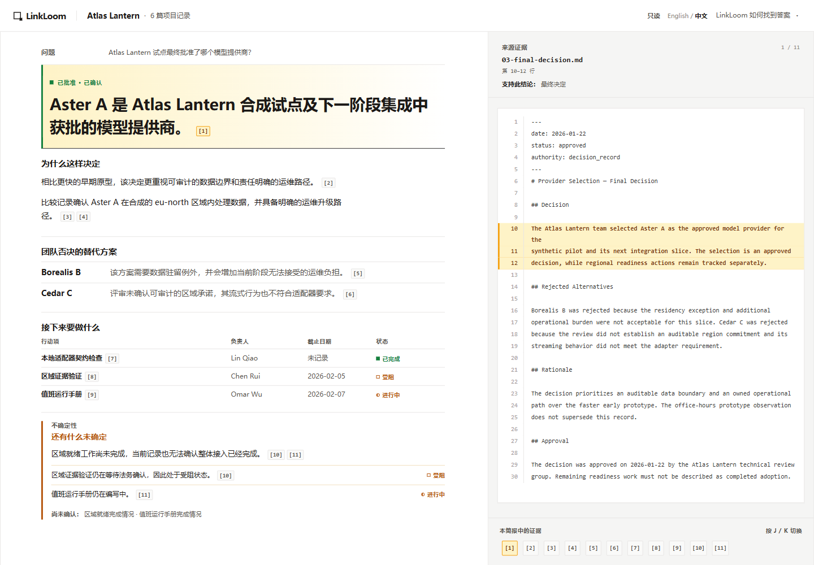
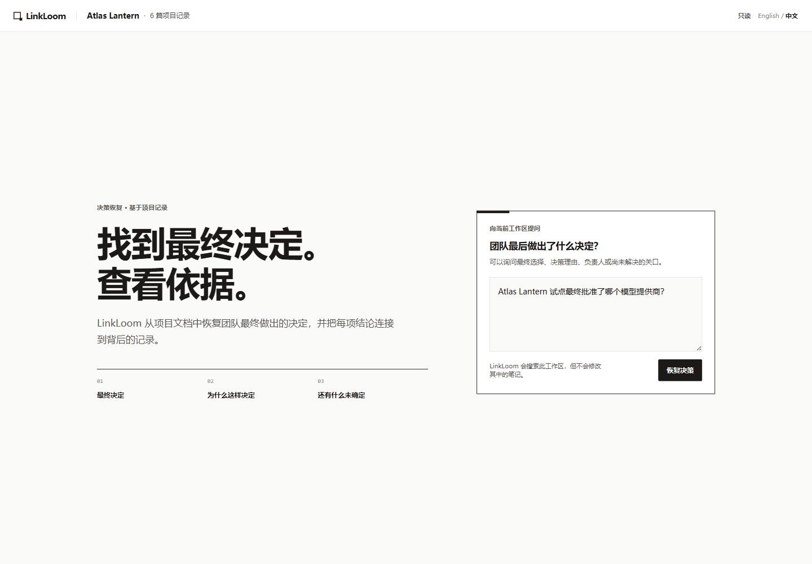
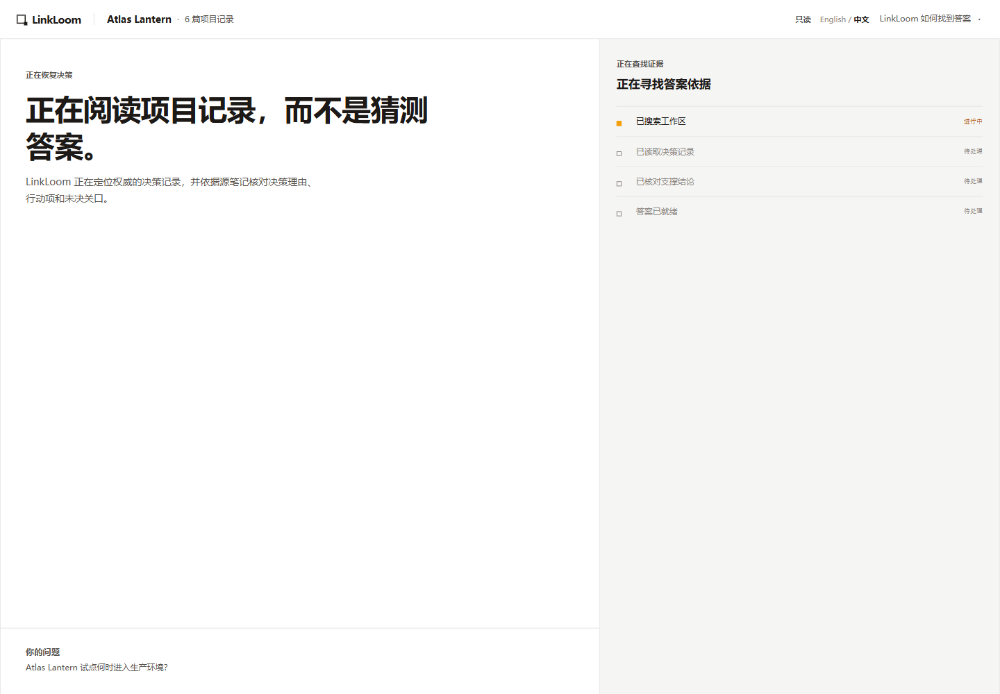
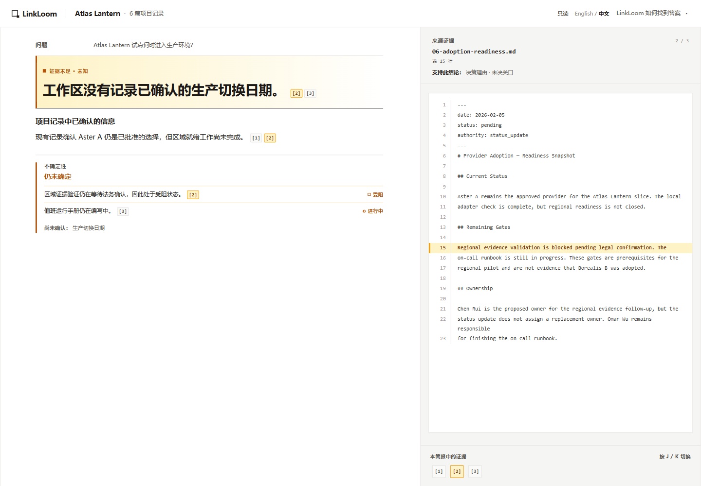
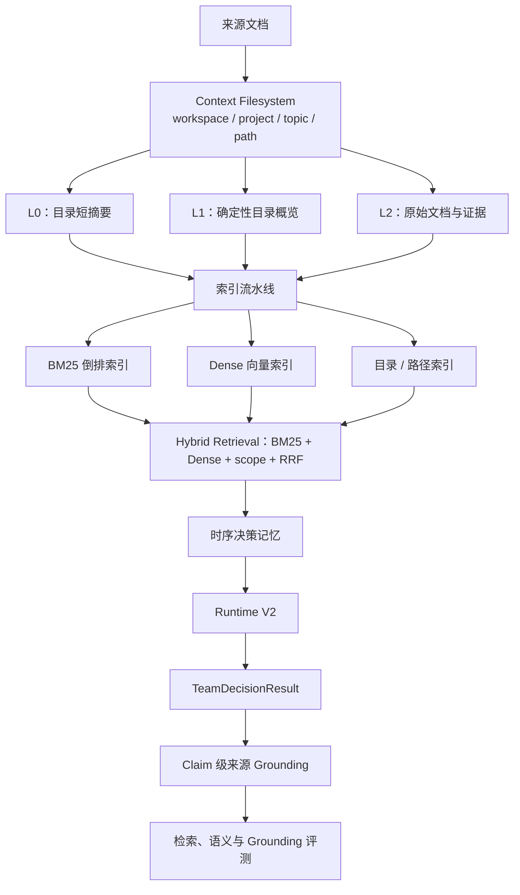

# LinkLoom

[English](README.md) · [简体中文](README.zh-CN.md)

**恢复团队真正做出的决定，并说明为什么答案值得相信。**

LinkLoom 是面向项目负责人、PM、PMO 和团队成员的本地优先决策恢复工作区，帮助
团队从不断变化的项目资料中找回最终决定、依据、历史变化、后续行动和未决问题。

## 1. 问题

会议记录、需求文档、决策日志和行动项分散在不同文件里。决策变化后，团队需要知道
当前选择是什么、为什么、何时变化、下一步由谁推进，以及哪些信息仍然未知；一个
听起来合理的摘要不能代替真实证据。

## 2. 产品：Decision Brief 决策简报

LinkLoom 返回以决策为中心的简报，而不是聊天记录：

- 最终决定、理由、被否决的备选方案；
- 行动、负责人、截止日期、未决问题与明确的不确定性；
- 关键结论关联到已验证的原文摘录和精确行号；
- 明确区分已确认、证据不足和运行失败。



运行确定性的本地 Demo：

```bash
python -m pip install -e .
python -m linkloom.ui --port 8765
```

打开 `http://127.0.0.1:8765/?lang=zh`。内置 `mps-001` 合成夹具展示一个有证据的
Atlas Lantern 决策案例和一个证据不足案例；任意其他问题会明确失败，不会返回硬编码
答案。无需 Provider Key，也不会写入源工作区。

| 初始问题 | 搜索与读取中 | 证据不足 |
|---|---|---|
|  |  |  |

## 3. Context Architecture 上下文架构

检索层使用逻辑 Context Filesystem 按 workspace 和路径组织资源，不改写用户真实磁盘
目录。设计借鉴 filesystem-style context 与渐进式加载，称为 **OpenViking-inspired**；
本项目没有集成或完整实现 OpenViking、TrieHI 或 VikingRAG。


```mermaid
flowchart TD
    S[来源文档] --> FS[Context Filesystem<br/>workspace / project / topic / path]
    FS --> L0[L0：目录短摘要]
    FS --> L1[L1：确定性目录概览]
    FS --> L2[L2：原始文档与证据]
    L0 --> IDX[索引流水线]
    L1 --> IDX
    L2 --> IDX
    IDX --> B[BM25 倒排索引]
    IDX --> V[Dense 向量索引]
    IDX --> D[目录 / 路径索引]
    B --> H[Hybrid Retrieval：BM25 + Dense + scope + RRF]
    V --> H
    D --> H
    H --> M[时序决策记忆]
    M --> R[Runtime V2]
    R --> T[TeamDecisionResult]
    T --> G[Claim 级来源 Grounding]
    G --> E[检索、语义与 Grounding 评测]
```

L0 判断目录是否值得展开；L1 用确定性元数据概览目录内容；L2 是用于证据的原始来源。
摘要生成不调用付费或实时模型 Provider。

## 4. Indexing 索引

| 索引 | 用途与实现 |
|---|---|
| Lexical | BM25 倒排索引，匹配精确名称、ID、日期和术语；复用 `rank-bm25`。 |
| Dense | 本地多语言 embedding，`VectorIndex` 接口后使用 exact cosine；当前小数据集不引入 ANN。 |
| Directory-aware | `DirectoryIndex` 保存父子路径、目录文档、摘要/概览、hash、版本和 summary dirty 状态。 |
| Temporal Decision | SQLite 保存当前/历史决定、supersession、证据来源、action 与 owner 关系。 |

Hybrid 固定融合 BM25 与 Dense 各自最多 20 个候选，使用 RRF（`k=60`）、稳定排序和
证据身份去重。workspace 和可选 directory scope 在排序前应用。目录 scope 选择可配置；
当前冻结评测语料只有平铺目录，不能证明深层目录导航的效果。

## 5. Incremental Update 增量更新

`ContextManifest`、`FileChangeEvent` 和 `IndexUpdateCoordinator` 定义 CREATE、MODIFY、
DELETE、MOVE。hash 未变化的修改是 no-op；内容变化时只更新受影响索引，并将祖先摘要
标记为 dirty。

```text
文件事件 → Manifest / Hash 检查 → 定位受影响资源
         → 更新受影响索引 → 标记祖先摘要 dirty

周期性 Reconcile → 对比 source inventory、manifest 和 indexes
                 → 检测缺失/过期/orphan/hash drift → 修复
```

Reconciliation 是可调用的确定性任务，不是已部署的 scheduler。本 Sprint 提供事件接口和
测试，没有加入 OS 级文件 watcher；生产调度仍属后续集成。

## 6. Retrieval Benchmark 检索评测

离线冻结评测包含 30 个问题、6 个 workspace、36 篇合成笔记。Gold 由 evaluator 使用，
评测前后未改变；embedding 使用本地 `paraphrase-multilingual-MiniLM-L12-v2`，不调用
付费 Provider 或网络服务。

| 模式 | Recall@1 | Recall@3 | Recall@5 | MRR | nDCG@5 | Failure | Evidence availability@5 | 平均延迟 ms |
|---|---:|---:|---:|---:|---:|---:|---:|---:|
| Current | 0.3105 | 0.6750 | 0.9283 | 0.8278 | 0.8245 | 0.0000 | 1.0000 | 3.9559 |
| BM25 | 0.3300 | 0.7233 | 0.9239 | 0.8694 | 0.8537 | 0.0000 | 1.0000 | 0.6118 |
| Dense | 0.3967 | 0.7039 | 0.9378 | 0.9500 | 0.8851 | 0.0000 | 1.0000 | 32.0448 |
| Hybrid | 0.3633 | 0.7456 | 0.9361 | 0.9333 | 0.8895 | 0.0000 | 1.0000 | 31.8911 |
| Directory-aware Hybrid | 0.3633 | 0.7456 | 0.9361 | 0.9333 | 0.8895 | 0.0000 | 1.0000 | 32.3351 |

Directory-aware 与 Hybrid 排序一致，因为合成语料没有嵌套目录。该小语料适合回归和
检索通道对比，不代表企业规模延迟。[完整评测报告](docs/evaluation/retrieval_v2_ag2_report.md)、
[逐 case 结果](docs/evaluation/retrieval_v2_ag2_results.json)和
[Current vs. Hybrid 下游探针](docs/evaluation/retrieval_v2_downstream_comparison.md)。

## 7. Temporal Decision Memory 时序决策记忆

SQLite 将业务状态演化与文档组织分开：决定记录可关联来源证据、前序决定以及由该决定
创建且有负责人的行动项；按 subject 支持 current、历史和 `as_of` 查询。部分唯一索引防止
同一 workspace/subject 出现两个 current truth。

演示跑通 **Supplier A → Supplier B**：查询当前决定、变化前历史决定，以及变化时间与证据。
只有 TeamDecision contract PASS、Grounding PASS 且有明确批准，才能 materialize。记忆搜索
只读并标记为导航提示，不作为最终 Grounding 证据。

查看[时序记忆 Demo 结果](docs/evaluation/temporal_decision_memory_demo.json)和
[验证报告](docs/evaluation/temporal_decision_memory_ag3_report.md)。

## 8. Runtime V2

生产编排仍使用现有 provider-neutral Runtime V2；本 Sprint 不重写 Runtime。宿主程序注入
配置好的 `RuntimeEngine`，确定性 UI 入口仍是 fixture Demo。

每个 model turn 持久化一个结构化 proposal：最终结果，或有序的 tool-call list。Runtime 会
校验并按序执行调用，支持有界 proposal、checkpoint 和 resume，同时保留 provider continuation、
tool ledger、trace、token/cost 和 evidence visibility。检索 backend 可配置，默认 Hybrid；只读
`search_decision_memory` 先校验 workspace 授权，再查记忆并记录命中数和延迟。

## 9. Grounding 与安全

关键 claim 只能引用 Agent 已通过成功检索/读取工具实际观察到的来源证据。验证会检查证据
身份、source hash 和 quote；过期或不可用的 evidence fail closed。Decision Memory 可以帮助
定位当前状态，但不能替代原始来源成为 Grounded Fact。

当前产品路径只读：检索不能重写、重命名、移动、打标签或删除笔记。workspace 专属 adapter
在检索前固定 workspace 范围；记忆工具在查询前校验授权 workspace。真实 Vault 写入和多人部署
不属于当前范围。

## 10. Evaluation 评测

检索 benchmark 衡量冻结 evaluator-side relevance。单独的 Current-vs-Hybrid 下游报告用确定性
探针检查 evidence availability、contract 与 grounding 边界，不衡量答案质量：

| 模式 | Evidence availability@5 | Contract probe | Grounding probe | 平均上下文 bytes | 平均延迟 ms | Semantic result |
|---|---:|---:|---:|---:|---:|---|
| Current | 1.000 | 1.000 | 1.000 | 3312.0 | 2.39 | N/E |
| Hybrid | 1.000 | 1.000 | 1.000 | 3360.2 | 609.20 | N/E |

探针使用非业务合成结果；上下文是序列化 evidence 字节数而不是 token；延迟包含每个
workspace 首次索引初始化。两张表来自不同 runner，延迟不可直接比较。没有运行真实模型，
因此不能据此声称语义准确率或真实模型答案质量提升。

另有三条历史 DeepSeek 首次结果。这是小型工程评测，不是当前 adapter 回归矩阵、benchmark
或生产成功率：

| Case | 产品行为 | Infrastructure | 业务结果 |
|---|---|---:|---|
| `mps-001` | 恢复已批准的模型 Provider | PASS | 找到并锚定 Aster A；rejected alternative 分类偏宽。 |
| `aer-002` | 跨文档恢复 rollout 边界 | FAIL | 未进入语义评测：首轮返回多工具调用。 |
| `iti-005` | 不编造负责人/截止日期 | FAIL | 未进入语义评测：首轮返回多工具调用。 |

这些首轮结果已封存，没有重采样。该评测当时的 Provider/Runtime 边界尚不兼容多工具调用；
当前 Runtime V2 已支持有序多动作 proposal。历史结果不能代表当前真实 Provider 行为，也不能
把基础设施失败标成语义失败。详见[真实 Provider 证据矩阵](docs/requirements/product_evidence_portfolio_v1/EVALUATION_MATRIX.md)。

## 11. Governed Learning 治理式学习

现有 Experience / Reflection 与受治理的 Strategy 机制和 Retrieval、Decision Truth 分离。
Experience 可为策略提案提供上下文；策略审批和 rollout 仍受控制。Strategy effectiveness
实验及后续扩展在本 Sprint 冻结或不属于范围，因此不宣称已测得业务效果。参见
[Portfolio Notes](docs/requirements/product_evidence_portfolio_v1/PORTFOLIO_NOTES.md)。

## 12. LangGraph Reference

[`examples/langgraph_decision_agent/`](examples/langgraph_decision_agent/) 提供真实可执行的
确定性参考：typed `StateGraph`、reducer、conditional routing、tool node、内存 checkpointer、
`thread_id`、跨 thread Store 和 interrupt/resume 人工审批。它不迁移生产 Runtime V2，不调用真实
模型或用户 Vault。

[Runtime V2 ↔ LangGraph 映射](docs/architecture/LANGGRAPH_MAPPING.md)记录了 build-vs-buy 边界：
自研 Runtime 用于验证 multi-action durability、partial resume、provider continuation 和
evidence visibility。未来可重新评估是否把通用编排交给 LangGraph，同时将 evidence、workspace
security 和 decision semantics 留在应用层。

## 当前状态与验证

以下描述对应当前源码树和关联的本地测试/评测证据，不表示全部改动都已 commit、经 CI 验证
或部署。产品尚未部署为多人服务。语料是小规模合成数据，不验证深层目录 topology；确定性
Demo 不调用实时模型。

- [Team Decision eval seed](docs/requirements/m1_team_decision_eval_seed/README.md)
- [Golden8 合成验收记录](docs/requirements/m1_1_team_decision_action/REVIEW_GATE.md)
- [Portfolio Notes](docs/requirements/product_evidence_portfolio_v1/PORTFOLIO_NOTES.md)
- [集成状态](docs/INTEGRATION_STATUS.md)
- [产品路线图](docs/PRODUCT_ROADMAP.md)

## 许可证

LinkLoom 使用 [MIT License](LICENSE)。
