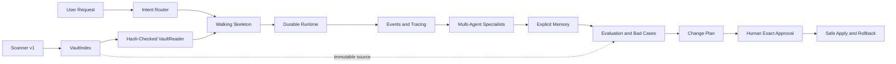

# Linkloom Anti-Gravity 分层施工总图

> 文档包版本：AG-PLAN-1.0  
> 生成日期：2026-08-16  
> 目标仓库：`yefuyou/linkloom`  
> 本次核对基线：远端浅克隆 `HEAD=5cab199`  
> 安装位置：建议复制到仓库 `docs/implementation/`

## 0. 这套文档解决什么问题

这不是一份让 Anti-Gravity 自由发挥的“大而全需求”。它是一套逐层施工包：

1. 先用最小复杂度打通一条能运行、能观察、能验收的 Walking Skeleton。
2. 每次只进入一个 Phase；每个 Phase 只有一个主目标。
3. 每个阶段把事实、边界、字段、文件范围、命令和完成证据写死。
4. 复杂 Agent 机制只有在前一层已经产生真实产品需求时才加入。
5. 任何写回、真实 Vault、远程凭据和 GitHub 操作都必须停在门禁处。

这套文档从属于仓库现有的 `SPEC.md`、`DEV_SPEC.md`、`AGENTS.md` 和
`docs/PRODUCT_ROADMAP.md`，不取代它们，也不重命名产品路线图。它把
“如何让一个执行能力一般的 Agent 逐层施工”补成可执行的工程手册。

## 1. Anti-Gravity 的阅读与执行顺序

不要把整个目录一次性当成开发任务。每次只给 Worker 当前 Phase 文件，外加下列固定上下文：

```text
1. AGENTS.md
2. SPEC.md
3. DEV_SPEC.md
4. docs/PRODUCT_ROADMAP.md
5. docs/implementation/01_ARCHITECTURE_CONTRACTS.md
6. docs/implementation/02_RUNTIME_MODEL.md
7. docs/implementation/handoff/CURRENT_STATE.md
8. 当前 Phase 文件
```

Worker 每次开始必须先输出 current-state acknowledgement，至少包含：

- 已实现事实；
- 仅实验资产；
- 当前 Phase 唯一目标；
- 明确不做的内容；
- 当前阻塞和需要人类确认的事项。

如果没有人类对当前 Phase 的明确批准，Worker 只能做只读盘点和文档一致性检查，不能写业务代码。

## 2. 当前仓库真实状态

以下内容来自本次对仓库文件、测试、提交和现有规划文档的核对，不是目标状态：

| 项目 | 当前事实 | 对施工的含义 |
|---|---|---|
| 正式包 | `src/linkloom/` 目前以 `scanner.py`、`cli.py`、包入口为主 | 不假设已有 Ask、Connect、Runtime、Memory 或 Writer 服务 |
| Scanner | `src/linkloom/scanner.py` 已实现 Scanner v1 | 冻结；它是唯一的 `VaultIndex` 生产者和第一道信任边界 |
| CLI | 源码 CLI 当前只实现 `scan INPUT --output OUTPUT` | 后续 `ask/connect/run/eval/plan/apply` 都是待建能力，不得把其他已安装包的命令当成仓库现状 |
| Scanner 测试 | `tests/unit/test_scanner.py` 与 `tests/fixtures/sample_vault/` 存在 | 继续作为回归测试；不得混入语义推理要求 |
| 关系评测 | `relation_eval/` 是实验区，不是正式 `src/linkloom` 产品模块 | 可以迁移经测试的行为，但不能直接 import 成生产合同 |
| 关系夹具 | `tests/fixtures/relation_vault/` 与 `tests/eval/relation_gold.yaml` 已冻结为 v1 | Evaluator 只读使用；不得为了提分改 Gold |
| 依赖 | `pyproject.toml` 正式依赖主要为 `PyYAML`，开发依赖为 `pytest` | 不把实验环境中偶然存在的 Pydantic、模型 SDK 当成正式依赖 |
| 写回 | 当前没有正式 Writer；根 SPEC 禁止真实 Vault 写回 | P1–P6 不得建立隐式写入口；P7 也只能先做 synthetic fixture |
| GitHub | 本次只读获取仓库，没有 push、commit、PR 或远端修改 | Anti-Gravity 的全局规则仍然是禁止 GitHub 写操作 |

### 2.1 当前基线的环境陷阱

本次环境中直接执行 `python -m linkloom --help` 可能命中机器上已安装的其他
`linkloom` 包，并显示仓库源码尚未实现的命令。Worker 必须先确认：

```powershell
python -c "import linkloom; print(linkloom.__file__)"
```

输出必须指向当前 checkout 的 `src/linkloom`，或者先使用本项目虚拟环境/可编辑安装。
任何显示 `ask/organize/progress/ui` 等非本 checkout 源码命令的结果，都不能作为本仓库验收证据。

本次全量 `pytest -q` 也没有被记为通过：环境对临时目录和生成目录出现
`PermissionError`，并且部分子进程受到已安装包路径影响。详见
`handoff/CURRENT_STATE_TEMPLATE.md` 的填写规则。失败必须修正环境或明确记录，不能靠重复执行伪造通过。

## 3. 总体目标：从事实索引到受控行动



“复杂”不是让 Agent 多循环几次，而是让每一步都有可解释的责任、状态、证据和失败恢复路径。

## 4. Phase 依赖与真实产品价值

| Phase | 唯一目标 | 用户能看到的结果 | 面试可追问点 | 依赖 |
|---|---|---|---|---|
| P1 | 打通最小只读纵向链路 | 从 synthetic Vault 得到带路径/hash/原文片段的 Ask 或 Connect 结果 | 为什么 Scanner、Reader、Retriever、Answer 要分层；如何证明不写源文件 | Scanner v1 |
| P2 | 让一次运行可 checkpoint、pause、resume | 进程中断后可用同一 `thread_id` 恢复 | durable execution、可序列化状态、幂等与重放 | P1 |
| P3 | 让每一步有结构化事件和追踪 | 能解释卡在哪一步、用了哪些证据、为什么失败 | event log、trace/span、脱敏和可观测性 | P2 |
| P4 | 引入受控的多 Agent 专业分工 | Retrieval、Curator、Reviewer 各自负责且可审计 | manager-as-controller、handoff、工具白名单、循环上限 | P3 |
| P5 | 引入可编辑、可撤销的长期记忆 | 用户确认的偏好/规则能跨 run 使用 | checkpoint 与 memory 的区别、候选记忆、冲突和过期 | P4 |
| P6 | 证明系统变好而不是“看起来会答” | 指标、Bad Case、轨迹恢复、安全零写入证据 | gold 隔离、Ragas 的边界、领域指标和回归集 | P1–P5 |
| P7 | 把建议转成可回滚的精确写入 | synthetic fixture 上完成 preview/approve/apply/rollback | stale hash、事务边界、权限、审计、回滚 | P6 + 人类批准 |

P6 可以与 P4/P5 的局部测试并行设计，但不能在没有 P1 输出合同的情况下先造一套“通用 Agent 评测平台”。

## 5. 全局施工铁律

### Always Do

- 先读当前 Phase 的“当前事实”，再读代码。
- 只修改 Phase 允许的文件。
- 所有跨模块输入输出先写 schema，再写实现。
- 让 `VaultIndex`、`NoteDocument`、`EvidenceRef` 带来源路径和 hash。
- 在 synthetic fixture 上先跑单测、集成测试和 demo。
- 把失败分成输入错误、路径安全、schema、provider、预算、运行时、评测和写入错误。
- 在 `CURRENT_STATE.md` 中记录命令原文、结果、未运行检查和下一步。

### Ask First

- 添加新第三方依赖；
- 修改 Scanner v1 字段或排序；
- 修改 `relation_vault_v1` 或 Gold v1；
- 访问真实 Vault；
- 引入远程模型、真实 API key 或新网络端点；
- 让任何读命令加载写能力；
- 改变当前 Phase 唯一目标或验收条件。

### Never Do

- 不重写 `src/linkloom/scanner.py` 来“顺手解决”新需求。
- 不创建第二套 Scanner、第二套 Gold、第二套 scorer 或隐藏的平行 Runtime。
- 不把 `perfect Mock` 的满分写成真实模型能力。
- 不把模型生成文本、关系分数或记忆候选当成已验证事实。
- 不把绝对私人路径、API key、原始整库内容写入可提交 artifact。
- 不执行 GitHub push、commit、PR、issue、release 或其他远端写操作。
- 不执行真实 Vault 的 rename、move、rewrite、delete、merge、tag 或 link 写回。

## 6. 每个 Phase 的统一交付模板

Anti-Gravity 只要缺少下列任一项，就不能声称 Phase 完成：

1. 当前事实；
2. 唯一目标；
3. 非目标；
4. 必须阅读文件；
5. `CREATE / MODIFY / DO NOT MODIFY`；
6. 字段级数据合同；
7. 编号实现步骤；
8. 一条从输入到输出的执行路径；
9. 采用模式与参考来源；
10. 单测、集成测试、失败场景；
11. 验收命令和 demo 命令；
12. 完成证据格式；
13. scope guardrails；
14. `CURRENT_STATE.md` 更新。

## 7. 成熟项目参考总表

这些项目只提供“已经被别人踩过的模式”。Linkloom 不复制它们的完整技术栈，也不因此自动增加依赖。

| 来源 | 借鉴的模式 | Linkloom 的取舍 |
|---|---|---|
| [QMD](https://github.com/tobi/qmd) | 本地 Markdown 索引、BM25 + 向量 + rerank 的分层检索 | P1 先用可解释的 lexical baseline；embedding/rerank 只有在 P6 证明需要时再加 |
| [Second Brain](https://github.com/arkangelai/second-brain) | Markdown 作为 source of truth、QMD/Obsidian/Agent 分层、MOC breadcrumbs | 借鉴“文件是事实、Agent 是辅助”；不复制其写入和外部集成 |
| [Obsidian Copilot](https://github.com/logancyang/obsidian-copilot) | 面向 Vault 的问答、上下文选择和用户工作流 | 借鉴 evidence UX；不把插件 UI 作为核心依赖 |
| [Smart Connections](https://github.com/brianpetro/obsidian-smart-connections) | 本地优先、相关笔记、独立索引环境 | 借鉴索引与连接的分离；不把 embedding 结果当事实 |
| [Open Notebook](https://github.com/lfnovo/open-notebook) | 来源、对话、研究结果的可追踪组织 | 借鉴 provenance 和可审阅产物；不引入其整套应用栈 |
| [Vaultkeeper AI](https://github.com/andy-stack/vaultkeeper-ai) | Obsidian 内的 AI 辅助与用户控制边界 | 只作为写回风险和用户确认的对照案例，不把插件能力视作 Linkloom 已有能力 |
| [LangGraph](https://docs.langchain.com/oss/python/langgraph/overview) | 有状态图、durable execution、persistence、interrupt | P2 才引入；状态必须是可序列化、可审计的 Linkloom 合同 |
| [OpenHands Agent SDK](https://docs.openhands.dev/sdk/arch/agent) | stateless/event-driven loop、tool orchestration、security validation | P3/P4 借鉴事件与安全分层，不复制其 workspace/runtime 规模 |
| [Letta](https://docs.letta.com/) | context hierarchy、memory blocks、archival memory | P5 借鉴“记忆是独立层”；所有长期记忆必须可编辑、可撤销 |
| [OpenAI Agents SDK](https://openai.github.io/openai-agents-python/) | agents-as-tools、handoffs、guardrails、tracing、sessions | P4 作为模式参考；先用单一控制器，避免 peer-to-peer 失控 |
| [Ragas](https://docs.ragas.io/en/stable/) | RAG/LLM 应用的组件评估与测试集思路 | P6 作为可选 judge/辅助指标；领域确定性指标和证据校验优先 |

## 8. 完成证据的统一格式

每个 Phase 的最终交接必须在 `handoff/CURRENT_STATE.md` 按以下结构填写：

```text
Phase: P?
Status: COMPLETE | BLOCKED | IN_PROGRESS
Baseline revision: <commit or local revision>
Changed files: <exact relative paths>
Commands:
  - <copyable command>
Results:
  - <exit code and important output>
Artifacts:
  - <artifact path + schema/version/hash if applicable>
Tests:
  - passed: <...>
  - failed: <...>
  - skipped/unavailable: <...>
Safety:
  - real vault touched: NO
  - source notes changed: NO
  - GitHub write performed: NO
Known risks: <...>
Next candidate: <one task only>
```

“文档写完”“代码看起来合理”“测试应该能过”都不是完成证据。

## 9. 推荐施工顺序

### Slice 0：先恢复可验证环境

- 确认 Python 解释器和 `linkloom.__file__`；
- 使用项目自己的虚拟环境或可编辑安装；
- 将 pytest 临时目录和 artifact 输出指向仓库内允许目录；
- 只读记录基线，不能为了绿灯修改测试断言。

### Slice 1：P1 Reader → Retrieval → Result

- 先做 `VaultReader` 和 hash 校验；
- 再做最小 lexical retrieval；
- 最后接 Ask/Connect 结果和 CLI；
- 每一步都保留可运行的中间状态。

### Slice 2：P2 Runtime

- 先用内存 checkpointer 验证 pause/resume；
- 再接本地 SQLite durable checkpointer；
- 再加入故障注入和重启测试。

### Slice 3：P3 Trace

- 先定义 event schema；
- 再让每个 runtime 节点发事件；
- 最后做 trace summary 和敏感信息脱敏。

### Slice 4：P4–P6

每次只引入一个新的 Agent/Memory/Eval 机制；机制必须能被一个真实 demo 和一个失败测试解释。

### Slice 5：P7

只在 P6 通过、合成写回 fixture 通过、且人类明确批准时进入。真实 Vault 仍然是另一个单独审批边界。

## 10. 反向追问清单

面试官可以从任意 Phase 追问：

1. 如果 hash 在推理前变化，你让系统做什么？
2. 为什么 checkpoint 不是 memory？
3. Agent 为什么不能自己读文件或写 Vault？
4. `perfect Mock` 为什么不能证明模型好？
5. 如何证明 resume 没有重复副作用？
6. 为什么先用 manager-as-tools 而不是多个 Agent 自由 handoff？
7. 如果用户在 preview 后手改了笔记，apply 如何拒绝？
8. 如果 apply 执行到第 3 个文件进程崩溃，如何恢复并说明状态？

每个问题都必须能指向一个字段、一个测试或一条 trace，而不是只背概念。

## 11. 本文档的停止条件

Anti-Gravity 遇到以下情况立即停止当前施工，只更新交接报告：

- 需要改 Scanner v1；
- 需要读写真实 Vault；
- 需要 API key、外部网络或未批准的模型；
- 发现当前代码与 Phase 事实不一致；
- 需要改变 Gold 或 synthetic fixture；
- 需要引入第二个控制平面或第二套 schema；
- 验收证据无法客观产生；
- 需要执行任何 GitHub 写操作。

