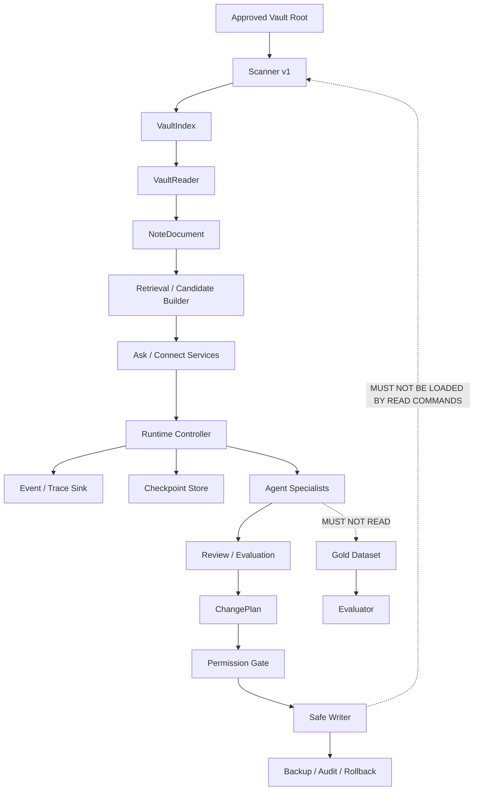

# LinkLoom 架构合同与不可越过的边界

> 合同版本：ARCH-CONTRACT-1.0  
> 适用范围：P1–P7  
> 权威关系：从属于根目录 `SPEC.md`、`DEV_SPEC.md`、`AGENTS.md`；与它们冲突时以根目录合同为准。

## 1. 设计原则

LinkLoom 的核心不是“让模型看到更多文件”，而是让每一条事实、每一个建议、每一个状态变化都能回答：

1. 它来自哪一个文件或运行步骤？
2. 文件在读取时是否仍然是预扫描版本？
3. 是确定性事实、模型建议、人工决定，还是已经执行的副作用？
4. 谁拥有修改它的权限？
5. 失败后能否停止、恢复、重放和解释？

## 2. 分层总图



箭头表示允许的数据流，不表示每个模块都可以调用下游所有接口。尤其是：

- Scanner 不能调用 LLM、Provider、Gold 或 Writer；
- Reader 只能读经过 Index 允许的相对路径，并重新校验 raw-byte hash；
- Agent 只能调用白名单工具，不能直接访问文件系统；
- Evaluator 可以读 Gold，但 Inference/Agent 不能读 Gold；
- ChangePlan 只是计划，不是写入命令；
- Read-only CLI 不能 import 或注册写工具。

## 3. 模块责任合同

| 模块 | 允许做什么 | 禁止做什么 | 主要输入 | 主要输出 |
|---|---|---|---|---|
| `scanner.py` | 扫描批准根目录、解析 Markdown 结构、生成稳定 Index | LLM、Gold、正文语义判断、写源文件 | `input_root`, `output_root` | `vault_index.json`, `scan_summary.md` |
| `VaultReader` | 根据 Index 读取正文、路径和 hash 校验 | fallback 到其他路径、读越界、写源文件 | `VaultIndex`, `vault_root` | `NoteDocument` 或显式失败 |
| Retrieval | 产生候选、排序、返回证据位置 | 代替模型决定事实、写文件 | `NoteDocument[]`, query/pair | `EvidenceRef[]`, candidate pairs |
| Ask/Connect Service | 组织只读结果，区分事实、建议和不确定性 | 直接持久化记忆、改 Vault | request + retrieved evidence | typed result envelope |
| Provider | 把受限上下文转换成结构化预测 | 读文件、读 Gold、评测、审批、写回 | typed provider input | typed prediction |
| Runtime | 管理状态、步骤、checkpoint、interrupt、resume | 绕过权限、隐藏失败 | request + services | `RunStatus`, `RuntimeState` |
| Event/Trace | 记录可审计事件、脱敏和耗时 | 改变业务结果、写秘密 | runtime event | JSONL/trace sink |
| Agent | 在允许的工具和输入内完成专项判断 | 直接 FS、Gold、Writer、无限循环 | `AgentTask` | `AgentResult`/handoff |
| Memory | 保存已确认或待确认的用户上下文 | 默认保存全部对话/原文、自动写 Vault | `MemoryCandidate` | `MemoryItem` |
| Evaluator | 读取 Gold 对 prediction/trace 评分并归因 | 修改 prediction/Gold、参与推理 | dataset + predictions | metrics/bad cases |
| Review/Plan | 生成可人工审阅的建议和 ChangePlan | 执行写入 | predictions + evidence | ReviewItem/ChangePlan |
| Safe Writer | 仅按 exact approved plan 写 synthetic fixture 或未来批准路径 | 自主选择文件、扩大操作、隐式写 | approved plan + hash | ApplyResult/Audit/Rollback |

## 4. Scanner v1 冻结合同

`src/linkloom/scanner.py` 是唯一的 VaultIndex 生产者。P1–P7 不得改变其行为来适配新需求。

### 4.1 Index 顶层字段

```json
{
  "schema_version": 1,
  "note_count": 1,
  "notes": [],
  "warnings": []
}
```

| 字段 | 类型 | 必填 | 约束 |
|---|---|---:|---|
| `schema_version` | integer | 是 | 固定为 `1`；非 1 的输入必须显式拒绝 |
| `note_count` | integer | 是 | 必须等于 `len(notes)` |
| `notes` | array<NoteIndexRecord> | 是 | 按 `relative_path` 排序，不能有重复路径 |
| `warnings` | array<ScanWarning> | 是 | 按 path、code、line 排序 |

### 4.2 NoteIndexRecord 字段

```json
{
  "relative_path": "projects/design.md",
  "title": "Design",
  "headings": [{"level": 1, "text": "Design", "line": 1}],
  "tags": ["agent"],
  "wikilinks": ["intro"],
  "size_bytes": 128,
  "content_sha256": "<64 lowercase hex>"
}
```

| 字段 | 类型 | 约束 |
|---|---|---|
| `relative_path` | string | POSIX 风格、相对 Vault root、非空、无 `..` 越界、非 symlink |
| `title` | string | Scanner 的确定性标题候选；不得在后续模块静默改写 |
| `headings` | array<object> | 每项仅含 `level: 1..6`, `text: string`, `line: positive integer` |
| `tags` | array<string> | 去重、排序；只表示 Scanner 识别到的 tag |
| `wikilinks` | array<string> | 去重、排序；不等于已解析存在的目标文件 |
| `size_bytes` | integer | 原始字节长度 |
| `content_sha256` | string | 原始字节的 SHA-256，小写 64 hex |

### 4.3 ScanWarning 字段

```json
{
  "relative_path": "broken.md",
  "code": "FRONTMATTER_PARSE_ERROR",
  "message": "...",
  "line": 1
}
```

`line` 可缺省；`relative_path`、`code`、`message` 必填。Scanner 现有的
`SYMLINK_SKIPPED`、`FILE_READ_ERROR`、`UTF8_DECODE_ERROR`、
`FRONTMATTER_PARSE_ERROR` 语义不得在新模块中被重命名或吞掉。

## 5. 共享身份与证据合同

### 5.1 NoteRef

```json
{
  "relative_path": "projects/design.md",
  "content_sha256": "<64 lowercase hex>",
  "index_schema_version": 1
}
```

规则：所有跨模块引用都使用 `NoteRef` 或包含 `NoteRef`，不得只传一个裸文件名。

### 5.2 EvidenceRef

```json
{
  "evidence_id": "ev_01J...",
  "note": {
    "relative_path": "projects/design.md",
    "content_sha256": "<64 lowercase hex>",
    "index_schema_version": 1
  },
  "line_start": 12,
  "line_end": 16,
  "quote": "原文中的连续片段",
  "quote_sha256": "<64 lowercase hex>",
  "reason": "为什么这段支持当前结果",
  "status": "verified"
}
```

| 字段 | 约束 |
|---|---|
| `evidence_id` | 在一个 run 内唯一；不能由模型任意伪造后不校验 |
| `note` | 必须指向通过 Reader hash 校验的 NoteDocument |
| `line_start`, `line_end` | 正整数且 `line_start <= line_end` |
| `quote` | 必须是源正文的 exact substring；不允许只存模型改写 |
| `quote_sha256` | 对 UTF-8 quote 字节计算；用于追踪引用变化 |
| `reason` | 可由模型生成，但必须标记为解释，不是事实本身 |
| `status` | `verified`、`stale`、`invalid` 之一；非 verified 不得进入最终 grounded answer |

### 5.3 ProvenanceLabel

所有用户可见文本都必须至少带一个：

- `source_fact`：直接来自源文件或确定性 Scanner/Reader；
- `model_inference`：模型或规则基于证据推导的建议；
- `human_decision`：用户确认、拒绝或编辑的决定；
- `system_observation`：运行时、成本、错误、trace 等系统事实。

## 6. 路径与文件安全合同

1. 输入根目录必须是存在的真实目录，根目录本身不得是 symlink。
2. 所有外部传入路径先 `resolve`，再检查位于批准 root 内。
3. Index 中的 `relative_path` 只能用 POSIX 表示；禁止驱动器号、UNC、绝对路径和 `..`。
4. Reader 每次读文件前都重新检查 symlink 和 root containment。
5. Reader 读取 raw bytes，先计算 hash，再 decode UTF-8；hash 不一致时返回 `CONTENT_CHANGED`，不降级读取。
6. 输出 artifact 必须位于 input root 之外；不得把生成目录放入 Vault。
7. 所有目录遍历默认不跟随 symlink。
8. 日志、trace、checkpoint 默认不记录绝对私人路径；必要时只记录 path fingerprint。

## 7. Inference 与 Gold 的硬隔离

```text
Inference inputs: NoteDocument / EvidenceRef / Request
Inference forbidden: Gold Dataset / scorer / expected label / evaluator output

Evaluator inputs: Gold Dataset / Predictions / Evidence validation result
Evaluator forbidden: modifying predictions, feeding expected labels into provider
```

允许 `perfect Mock` 在专门的 plumbing test 中读取 Gold，但必须：

- provider 名称明确带 `oracle_mock`；
- report 明确写“只证明评测管线接通”；
- 不将其结果放入真实模型 baseline；
- 生产 Inference 包的 import 检查不得出现 Gold loader。

## 8. Provider 合同

Provider 输入不得携带任意文件句柄、`Path`、绝对路径或 Gold 字段；输出必须先通过 schema 验证。

```json
{
  "provider_request_id": "req_01J...",
  "task_type": "ask | topic | relation | review",
  "prompt_version": "ask_v1",
  "model": "mock-or-provider-model",
  "input_refs": ["ev_01J..."],
  "input_text": "受限上下文；必要时脱敏",
  "max_output_tokens": 512,
  "temperature": 0.0
}
```

```json
{
  "provider_request_id": "req_01J...",
  "status": "ok | schema_error | provider_error | budget_exceeded",
  "output": {},
  "usage": {
    "input_tokens": 0,
    "output_tokens": 0,
    "estimated_cost_usd": 0.0
  },
  "error": null
}
```

Provider 不拥有重试、预算或审批的最终决策；这些由 Runtime/Policy 层控制。

## 9. Read/Write 物理隔离合同

| 区域 | 允许 import | 禁止 import |
|---|---|---|
| `src/linkloom/read/`、Scanner、Reader、Retrieval | schemas、read services、trace | `mutations`、Writer、apply side effect |
| `src/linkloom/runtime/` | read services、providers、checkpointer、trace | 任意未批准 Writer |
| `src/linkloom/evaluation/` | predictions、Gold、metrics、reports | Provider secret、Writer |
| `src/linkloom/mutations/` | plan、permission、backup、audit | 被 read-only CLI 默认加载 |

`linkloom scan`、`linkloom ask`、`linkloom connect`、`linkloom eval` 不能因为导入顶层包而注册写工具。

## 10. 状态、错误和版本合同

### 10.1 结果状态

统一使用：`accepted`、`running`、`paused`、`completed`、`rejected`、`failed`、`stale`。

### 10.2 错误字段

```json
{
  "code": "CONTENT_CHANGED",
  "category": "path | input | schema | provider | budget | runtime | evaluation | permission | write",
  "message": "面向用户的可修复说明",
  "retryable": false,
  "affected_refs": [],
  "details": {},
  "safe_to_expose": true
}
```

错误必须是结构化结果或明确异常，不能只打印堆栈后让 Agent 猜下一步。

### 10.3 版本规则

- 确定性事实合同改变时递增 schema version，不静默兼容语义变化。
- prompt、provider、model、config、code revision 都写进 RunManifest。
- `run_id`、timestamp、成本只属于运行记录，不得改变 VaultIndex 或 Gold。
- artifact 文件按 schema version 和 run_id 组织，不覆盖历史证据。

## 11. 变更范围合同

### 全局允许新增

- 当前 Phase 明确列出的 `src/linkloom/**` 模块；
- 对应 `tests/unit/**`、`tests/integration/**`、`tests/e2e/**`、`tests/eval/**`；
- 当前 Phase 的文档和 synthetic fixture（只有文档明确允许时）。

### 全局可修改

- 当前 Phase 明确列出的文件；
- `pyproject.toml` 仅在 Phase 文档明确列出依赖、版本和验证命令时。

### 全局禁止修改

- `src/linkloom/scanner.py`、Scanner fixture、Scanner schema；
- `tests/eval/relation_gold.yaml` 和 `tests/fixtures/relation_vault/`；
- 真实 Vault、凭据、`.env`、用户文件；
- 现有验收断言来“适应”新实现；
- GitHub 远端任何资源。

## 12. Reviewer 的合同验收问题

Reviewer 必须逐项回答：

1. Changed files 是否全部在 Phase 范围内？
2. 是否有 import 绕过 Reader、Gold 隔离或写权限边界？
3. 是否能用字段和 hash 追踪每条 evidence？
4. 是否存在未记录的时间戳、绝对路径、secret 或随机行为？
5. 失败是否产生可重试/不可重试分类？
6. 测试是否覆盖正常、边界、失败和无写入？
7. 是否有可复制命令和原始结果？
8. 是否仍然满足“不做 GitHub 写操作”？

任何一项没有证据，状态只能是 `BLOCKED` 或 `IN_PROGRESS`。

