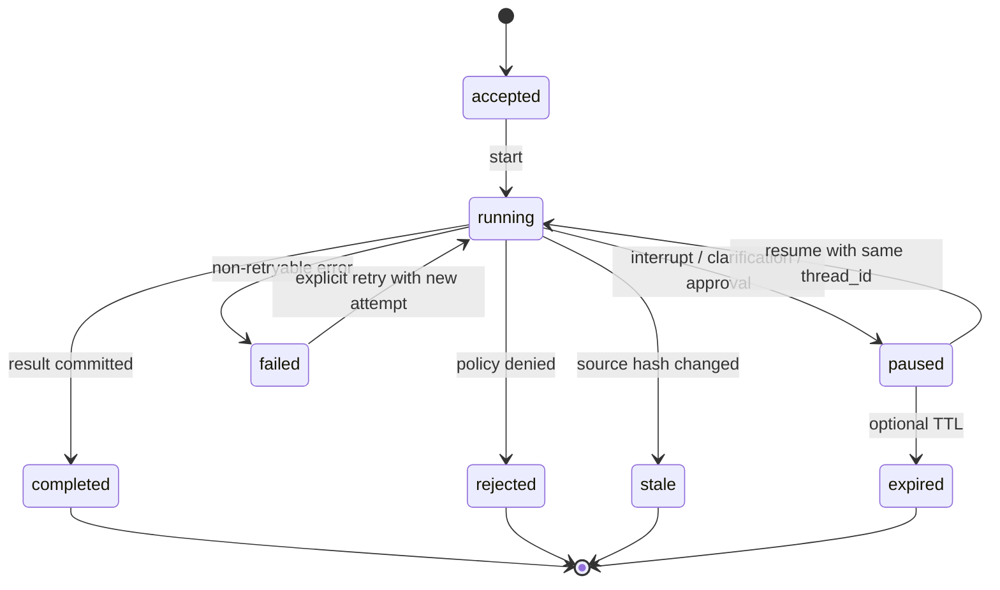

# LinkLoom Runtime Model

> 模型版本：RUNTIME-MODEL-1.0  
> 主要落地 Phase：P1–P4  
> 长期扩展：P5 Memory、P6 Evaluation、P7 Safe Writeback

## 1. 为什么需要单独的 Runtime Model

Scanner、Reader、Retrieval 和 Agent 都是能力；Runtime 是把能力组织成一次可追踪运行的控制平面。

如果没有 Runtime，系统会出现四类无法回答的问题：

- 进程死了以后，系统知道自己做到哪了吗？
- 用户确认或补充信息以后，能否从原位置继续？
- 同一个工具是否因为重试被执行两次？
- 面试或线上排错时，能否证明某个结果是由哪个节点、哪个证据、哪个版本产生的？

Runtime 不拥有 Vault 真相，也不决定模型语义；它只负责状态、调度、checkpoint、事件、错误和恢复。

## 2. 术语边界

| 术语 | 定义 | 不等于 |
|---|---|---|
| Request | 用户本次输入的意图和参数 | 一次模型调用 |
| Run | 从 Request 到结果/失败/暂停的一个执行实例 | 永久记忆 |
| Thread | 可持续恢复的逻辑执行游标；通常对应 `thread_id` | 用户身份 |
| Step | Runtime 图中的一个确定节点，如 `load_context` | 任意 Python 函数调用 |
| Attempt | 某个 Step 的一次实际执行尝试 | 成功结果 |
| Checkpoint | 可序列化的 RuntimeState 快照 | trace 或 memory |
| Event | 状态变化或外部动作的不可变记录 | 当前状态 |
| Evidence | 来自已验证 NoteDocument 的原文引用 | 模型理由 |
| Memory | 跨 Run 的、可审阅的用户上下文 | 本次 Run 的 checkpoint |
| ChangePlan | 未来可能写入的精确计划 | apply 命令 |

## 3. Run 生命周期



状态转换必须由 Runtime 控制，不能让 Provider 或 Agent 直接写 `status`。

## 4. RuntimeState 字段级合同

RuntimeState 必须可 JSON 序列化。不得放入文件句柄、线程锁、模型 client、`Path` 对象或任意不可重放对象。

```json
{
  "schema_version": 1,
  "run_id": "run_01J...",
  "thread_id": "thread_01J...",
  "parent_run_id": null,
  "workflow": "ask | connect | organize | evaluate | plan",
  "status": "accepted | running | paused | completed | failed | rejected | stale",
  "current_step": "retrieve_context",
  "step_seq": 3,
  "request": {},
  "intent": null,
  "source": {},
  "evidence_refs": [],
  "agent_tasks": [],
  "pending_interrupt": null,
  "result_ref": null,
  "error": null,
  "usage": {},
  "policy": {},
  "created_at": "2026-08-16T00:00:00Z",
  "updated_at": "2026-08-16T00:00:01Z"
}
```

### 4.1 顶层字段

| 字段 | 类型 | 必填 | 约束 |
|---|---|---:|---|
| `schema_version` | integer | 是 | 从 1 开始；无法迁移时拒绝 resume |
| `run_id` | string | 是 | 单次执行唯一；不能由用户任意复用 |
| `thread_id` | string | 是 | pause/resume 的稳定游标；同一 thread 只允许一个活动分支 |
| `parent_run_id` | string/null | 是 | 多 Agent 子任务或重试的父 run；根 run 为 null |
| `workflow` | enum | 是 | `ask`, `connect`, `organize`, `evaluate`, `plan` |
| `status` | enum | 是 | 只能由允许的状态图转换产生 |
| `current_step` | string/null | 是 | 当前或下一节点的稳定名称 |
| `step_seq` | integer | 是 | 非负单调计数；resume 不倒退 |
| `request` | RequestEnvelope | 是 | 不保存 secret；保留原始 query hash |
| `intent` | IntentEnvelope/null | 是 | P1 可由规则产生，P4 可由 RouterAgent 产生 |
| `source` | SourceContext | 是 | Index schema/hash、root fingerprint、fixture/dataset 标签 |
| `evidence_refs` | array<EvidenceRef> | 是 | 只引用已通过 Reader 的证据 |
| `agent_tasks` | array<AgentTaskRef> | 是 | 只保存 id、状态和引用，不保存 client |
| `pending_interrupt` | InterruptEnvelope/null | 是 | paused 时必填；其他状态必须为 null |
| `result_ref` | ResultRef/null | 是 | 指向 artifact，不在 state 中重复整份输出 |
| `error` | ErrorEnvelope/null | 是 | failed/rejected/stale 时必填 |
| `usage` | UsageEnvelope | 是 | 请求、token、成本、步数上限 |
| `policy` | PolicySnapshot | 是 | 当次 run 使用的安全策略 hash/版本 |
| `created_at`, `updated_at` | RFC3339 string | 是 | 只用于运行记录，不影响确定性结果 |

### 4.2 RequestEnvelope

```json
{
  "request_id": "req_01J...",
  "mode": "ask | connect | organize | eval | plan",
  "query": "用户原始问题",
  "query_sha256": "<64 lowercase hex>",
  "vault_root_fingerprint": "root_...",
  "max_results": 5,
  "dry_run": true,
  "caller": "cli | test | api",
  "received_at": "2026-08-16T00:00:00Z"
}
```

`query` 是否进入远程 Provider 由 PrivacyPolicy 决定；checkpoint 可以只保留 hash 和脱敏版本。

### 4.3 SourceContext

```json
{
  "index_path": ".artifacts/scan/vault_index.json",
  "index_sha256": "<64 lowercase hex>",
  "index_schema_version": 1,
  "vault_root_fingerprint": "root_...",
  "fixture_id": "sample_vault_v1 | relation_vault_v1 | null",
  "document_count": 5
}
```

绝对路径只允许在本机进程内部短暂使用，artifact 和 trace 采用相对路径或 fingerprint。

### 4.4 InterruptEnvelope

```json
{
  "interrupt_id": "int_01J...",
  "kind": "clarification_required | human_review | budget_exceeded | provider_auth",
  "message": "需要用户提供的最小信息",
  "payload": {},
  "allowed_responses": ["resume", "edit", "reject"],
  "created_at": "2026-08-16T00:00:02Z",
  "expires_at": null
}
```

P2 的 `human_review` 只用于读取结果或澄清，不授予写入权限；P7 才定义 mutation approval。

## 5. Runtime 节点合同

P1 的同步 walking skeleton 也必须按这些逻辑节点组织，即使还没有 LangGraph：

```text
accept_request
  -> resolve_source
  -> load_index
  -> read_notes
  -> retrieve_context
  -> build_candidate_or_answer
  -> validate_evidence
  -> emit_result
```

P2 以后每个节点有：

```json
{
  "node_name": "retrieve_context",
  "input_state_keys": ["request", "source"],
  "output_state_keys": ["evidence_refs"],
  "side_effect_class": "none | local_cache | provider_call | human_wait | mutation",
  "idempotency_key_fields": ["run_id", "step_seq", "node_name", "input_hash"],
  "retry_policy": "none | bounded_exponential | manual",
  "checkpoint_before": true,
  "checkpoint_after": true
}
```

任何 `provider_call` 或未来副作用必须包在可记录、可重试、可去重的 task 内。

## 6. Checkpoint 合同

### 6.1 存什么

- RuntimeState 的 JSON-safe 快照；
- 当前 step、step seq、input hash、output reference；
- `thread_id`、`checkpoint_id`、`parent_checkpoint_id`；
- schema/version、policy snapshot、source hash；
- pending interrupt；
- 失败和重试次数。

### 6.2 不存什么

- 模型 client、文件句柄、连接池、线程对象；
- 未脱敏的 API key、Authorization header；
- 没有 provenance 的模型长文本；
- 任何未经过 Reader 校验的 source content；
- 未来 Writer 的“已批准”状态（批准必须由 P7 的独立合同产生）。

### 6.3 存储策略

| 环境 | Checkpointer | 目的 |
|---|---|---|
| 单测 | 内存实现 | 快、确定、隔离 |
| 本地 demo | SQLite 文件，例如 `.artifacts/runtime/checkpoints.sqlite` | 重启后 resume、可展示 |
| 未来部署 | 经过评估的 durable backend | 只有在并发和可靠性需求被证明后再引入 |

P2 可以采用 LangGraph 的 checkpointer；但 Linkloom 的 `RuntimeState` 仍是业务合同，不能直接把框架内部对象当 API。

## 7. Resume 与重放规则

1. 使用相同 `thread_id` 才能 resume；新 `thread_id` 必须创建新 Run。
2. Resume 前重新验证 `source.index_sha256` 和所有 evidence 的 content hash。
3. 被中断节点必须从稳定边界重新进入；不能假设 Python 进程从中断行继续。
4. 随机、模型调用和外部 I/O 必须封装成 task，并记录输入 hash/输出 artifact ref。
5. 非幂等调用必须有 idempotency key 或持久结果缓存；无法保证时禁止自动 retry。
6. Resume 如果发现节点代码/schema 版本不兼容，返回 `RUNTIME_SCHEMA_INCOMPATIBLE`，不要猜测迁移。
7. 同一 thread 的并发 resume 必须被拒绝或串行化，不能让两个分支同时推进同一状态。

## 8. 事件与 Runtime 的关系

Checkpoint 表示“当前能从哪里继续”；Event 表示“发生过什么”；Trace 表示“如何观察和分析”。

```text
RuntimeState -> checkpoint store  (可恢复当前状态)
RuntimeEvent -> append-only log  (不可变历史)
RunManifest -> run metadata       (版本、成本、配置、时间)
MemoryItem -> cross-run context   (用户确认的长期信息)
```

四者不能互相替代。特别是：

- 不能用 trace 推断当前状态；
- 不能把 checkpoint 当长期记忆；
- 不能把 memory 当源笔记事实；
- 不能把 RunManifest 当证据正文。

## 9. 运行时错误合同

| 错误 | 是否自动重试 | 处理 |
|---|---:|---|
| `SOURCE_NOT_FOUND` | 否 | 用户修正根目录或 index |
| `INDEX_SCHEMA_UNSUPPORTED` | 否 | 升级 Reader/明确迁移 |
| `CONTENT_CHANGED` | 否 | 结束为 stale，重新 scan |
| `PROVIDER_TIMEOUT` | 有上限 | 记录 attempt；超过上限暂停或失败 |
| `PROVIDER_SCHEMA_ERROR` | 有上限 | 只允许受控 repair；仍失败则 bad case |
| `BUDGET_EXCEEDED` | 否 | paused，要求用户减少范围或明确继续 |
| `CHECKPOINT_WRITE_FAILED` | 否 | 不声称可恢复；保留失败证据 |
| `INTERRUPT_RESPONSE_INVALID` | 否 | 保持 paused，返回字段级校验错误 |
| `AGENT_CYCLE_DETECTED` | 否 | 终止当前多 Agent run，回退单控制器结果 |
| `PERMISSION_DENIED` | 否 | 永不自动升级权限 |

## 10. 采用模式与参考来源

### LangGraph：P2 的 durable state

[LangGraph persistence](https://docs.langchain.com/oss/python/langgraph/persistence) 将 checkpoint、thread、state history 和 fault tolerance 作为一等能力；
[interrupts](https://docs.langchain.com/oss/python/langgraph/interrupts) 明确 pause 后依赖持久化状态 resume，且被中断节点可能从节点开头重跑。
这正好对应 LinkLoom 的“可恢复但必须幂等”问题。我们采用状态和规则，不把框架内部类型暴露给产品层。

### OpenHands：事件驱动与安全验证

[OpenHands Agent architecture](https://docs.openhands.dev/sdk/arch/agent) 把 reasoning-action loop、tool orchestration、context management 和 security validation 分层。
LinkLoom 只借鉴职责拆分，不复制 sandbox/workspace 的规模。

### OpenAI Agents SDK：sessions、tracing、guardrails

[OpenAI Agents SDK](https://openai.github.io/openai-agents-python/) 把 runner、tools、guardrails、handoffs、sessions 和 tracing 组合成轻量 runtime。
它帮助面试解释“控制平面不是 prompt”；但 LinkLoom 仍需自己的 read/write boundary 和 evidence contract。

## 11. Runtime 单测与集成测试

### 单测

- `RuntimeState` JSON round-trip；
- 合法/非法状态转换；
- 同一 `thread_id` resume，新 `thread_id` 不串状态；
- checkpoint 不包含 `Path`、client、secret；
- step seq 单调；
- retry 次数和 idempotency key 稳定；
- source hash 变化返回 `stale`；
- interrupt payload 和 resume response 字段级校验。

### 集成测试

- synthetic Vault 上运行 Ask，注入进程前暂停，再重启 resume；
- provider 在同一个 step 第一次超时、第二次成功，结果只产生一个逻辑 output；
- checkpoint store 损坏时不伪造 completed；
- trace、checkpoint、result artifact 的 `run_id` 和 schema version 一致；
- 读命令全过程不创建 mutation artifact、不改变源文件 hash。

## 12. Runtime 验收命令与 demo 形状

P2 代码落地后，至少提供以下命令（具体 CLI 参数以实现为准，但不得缺少同等能力）：

```powershell
python -m pytest tests/unit/test_runtime_state.py tests/integration/test_runtime_resume.py -q
python -m linkloom run ask tests/fixtures/sample_vault --query "Scanner 做了什么" --checkpoint .artifacts/runtime
python -m linkloom run inspect --thread-id <thread_id> --checkpoint .artifacts/runtime
python -m linkloom run resume --thread-id <thread_id> --interrupt-id <interrupt_id> --input "继续读取"
```

正常 demo 必须显示：

- `run_id`、`thread_id`；
- 当前 step 和 checkpoint 序号；
- pause 原因；
- resume 后没有重复的逻辑写入；
- evidence path/hash；
- 最终结果和 trace artifact 路径。

## 13. Runtime 完成证据格式

```text
Runtime phase: P2
State schema: runtime_state.v1
Checkpointer: in-memory tests + SQLite local demo
Injected failure: <exact failure>
Before pause: step=<...>, checkpoint=<...>
After resume: step=<...>, checkpoint=<...>, status=completed
Duplicate side effects: 0
Source hash before/after: identical
Tests: <commands and exit codes>
Artifacts: <checkpoint/manifest/trace paths>
Known limitations: <...>
```

## 14. Scope guardrails

- P2 不做多 Agent；
- P2 不做长期 Memory；
- P2 不做真实 Provider baseline；
- P2 不做 Writer 或批准机制；
- P2 不用 checkpoint 代替 evidence；
- P2 不因为引入 LangGraph 就重写 P1 service；
- P2 不把 SQLite 当未来分布式数据库承诺；
- P2 只在当前批准 Phase 内添加依赖和文件。

