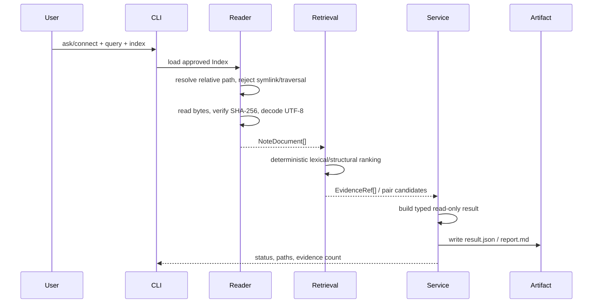

# P1：Walking Skeleton（只读 Ask / Connect）

> Phase ID：P1  
> 唯一目标：从冻结的 Scanner Index 出发，安全读取 synthetic Vault，完成一条可运行、可引用、可测试的只读 Ask/Connect 纵向链路。  
> 允许状态：只有人类明确批准 P1 后，Worker 才能修改代码。

## 1. 当前事实

先不要假设“项目已经有 Agent”。当前仓库事实是：

- `src/linkloom/scanner.py` 已实现 Scanner v1；它输出 `vault_index.json` 和 `scan_summary.md`，必须冻结。
- `src/linkloom/cli.py` 的源码只提供 `scan INPUT --output OUTPUT`。
- `tests/fixtures/sample_vault/` 是 Scanner 的 synthetic fixture；它不是用户真实 Vault。
- `relation_eval/` 是关系/主题评测实验区，不能成为 P1 的正式 service 依赖。
- 当前没有正式 `VaultReader`、Retriever、AskService、ConnectService、Provider 或 Runtime。
- 根目录 `SPEC.md` 要求 local-first、read-only、evidence before claims；P1 不产生任何 Vault 写入。
- `pyproject.toml` 目前没有正式的 LLM/Agent framework 依赖。

P1 的工作不是“把所有未来模块先建出来”，而是把最小产品路径跑通。

## 2. 唯一目标

给定：

1. 一个由 Scanner v1 生成的 `VaultIndex`；
2. 一个仍然没有变化的 synthetic Vault；
3. 一个用户问题或一个连接候选请求；

系统必须能够：

- 通过相对路径和 `content_sha256` 读取正文；
- 产生可解释的 lexical retrieval 或结构连接候选；
- 返回带文件路径、hash、行号和 exact quote 的结果；
- 明确区分“源事实”“确定性检索信号”和“尚未验证的建议”；
- 在任何路径、hash、UTF-8 或输出目录问题上安全失败；
- 证明整个过程没有修改输入 Vault。

P1 不要求模型回答复杂问题。它要求产品和信任边界真实存在。

## 3. 产品作用与面试作用

### 产品作用

用户第一次能看到：

- “我问的内容在这些笔记的这些行里”；
- “这两篇笔记为什么被认为可能相关”；
- “没有证据时系统会说没有证据，而不是编一个答案”。

### 面试作用

面试官可以从 P1 追问：

- 为什么不直接把 Vault 整个目录交给模型？
- Scanner Index 和正文读取为什么分开？
- hash 校验具体防什么问题？
- 为什么 P1 先用 lexical baseline，而不是一开始上向量数据库？
- 如何证明 read-only 命令没有写入源文件？

这些问题都能指向代码、schema、测试和命令，不靠口号回答。

## 4. 明确非目标

- 不改 `src/linkloom/scanner.py` 的解析逻辑、字段、排序或版本。
- 不实现 LangGraph、checkpoint、interrupt、resume。
- 不实现多 Agent、handoff、长期 Memory 或自动调度。
- 不调用远程 LLM，不读取 API key，不新增云服务。
- 不迁移 `relation_eval` 的整套实验包；只保留未来可复用的观察，不在 P1 复制 scorer/schema。
- 不做 embedding、vector DB、GraphRAG、rerank 或复杂 query expansion。
- 不做真实 Vault 读取，不做任何 Markdown 写回。
- 不把 heuristic score 说成语义事实或模型置信度。
- 不新增 FastAPI、MCP、Web UI、Docker 或数据库。

## 5. 必须阅读文件

Worker 按以下顺序阅读，读完才开始实现：

```text
AGENTS.md
SPEC.md
DEV_SPEC.md
docs/PRODUCT_ROADMAP.md
docs/requirements/read-only-vault-scanner/SPEC.md
docs/requirements/read-only-vault-scanner/implementation_plan.md
src/linkloom/scanner.py
src/linkloom/cli.py
tests/unit/test_scanner.py
tests/fixtures/sample_vault/**
docs/implementation/01_ARCHITECTURE_CONTRACTS.md
docs/implementation/02_RUNTIME_MODEL.md
```

如果文件不存在或和本文件的当前事实冲突，先更新交接报告，不要自行改合同。

## 6. 文件范围

### CREATE

```text
src/linkloom/schemas.py
src/linkloom/loader.py
src/linkloom/retrieval.py
src/linkloom/services/__init__.py
src/linkloom/services/ask.py
src/linkloom/services/connect.py
tests/unit/test_loader.py
tests/unit/test_retrieval.py
tests/integration/test_walking_skeleton.py
tests/e2e/test_cli_readonly.py
```

允许按现有命名习惯拆分，但不得把 P1 拆成第二套 parallel architecture。

### MODIFY

```text
src/linkloom/cli.py
```

只添加 read-only `ask` 和 `connect` 入口，保留原 `scan` 行为和错误码。

如仓库现有测试/入口需要最小导出变更，可修改 `src/linkloom/__init__.py`，但必须在完成证据中写明。

### DO NOT MODIFY

```text
src/linkloom/scanner.py
tests/unit/test_scanner.py
tests/fixtures/sample_vault/**
relation_eval/**
tests/fixtures/relation_vault/**
tests/eval/relation_gold.yaml
configs/eval.openai.yaml
real vault paths
```

不允许顺手“清理”无关代码、升级依赖或重排现有测试。

## 7. P1 数据合同（字段级）

### 7.1 ScanArtifactRef

```json
{
  "index_path": ".artifacts/p1/scan/vault_index.json",
  "index_sha256": "<64 lowercase hex>",
  "schema_version": 1,
  "vault_root_fingerprint": "root_..."
}
```

| 字段 | 类型 | 约束 |
|---|---|---|
| `index_path` | string | 只作为本地输入引用；artifact 中不得暴露私人绝对路径 |
| `index_sha256` | string | 对 index 原始 bytes 计算，64 位小写 hex |
| `schema_version` | integer | 必须是 Scanner v1 的 `1` |
| `vault_root_fingerprint` | string | 由批准根目录产生的稳定 fingerprint；不是原始绝对路径 |

### 7.2 NoteDocument

```json
{
  "relative_path": "00-扫描入门.md",
  "title": "扫描入门",
  "content": "# Scanner Overview\n...",
  "headings": [{"level": 1, "text": "Scanner Overview", "line": 7}],
  "tags": ["agent", "scanner"],
  "wikilinks": ["projects/设计笔记"],
  "size_bytes": 221,
  "content_sha256": "<64 lowercase hex>",
  "line_count": 18
}
```

字段规则：

- `relative_path`、`title`、`headings`、`tags`、`wikilinks`、`size_bytes`、`content_sha256` 必须来自 Index 或由 Reader 校验得到；
- `content` 是按 UTF-8 解码后的正文，不能来自其他路径；
- `line_count` 只用于行号验证，不改变 Scanner 合同；
- Reader 读取前必须检查 root containment 和 symlink；
- Reader 读取 raw bytes 后先 hash，再 decode；
- hash 不一致必须返回 `CONTENT_CHANGED`，不能“先用新内容继续”；
- 不把 YAML frontmatter 重新解析成一个 P1 新的事实合同。

### 7.3 EvidenceRef

```json
{
  "evidence_id": "ev_p1_0001",
  "relative_path": "00-扫描入门.md",
  "content_sha256": "<64 lowercase hex>",
  "line_start": 7,
  "line_end": 7,
  "quote": "# Scanner Overview",
  "quote_sha256": "<64 lowercase hex>",
  "source_kind": "note_body | heading | tag | wikilink",
  "reason": "命中用户查询词 scanner",
  "status": "verified"
}
```

`quote` 必须是源正文的连续 exact substring；只有 `status=verified` 才能进入 Ask/Connect 的最终输出。

### 7.4 AskResult

```json
{
  "schema_version": 1,
  "result_type": "ask",
  "request_id": "req_p1_0001",
  "run_id": "run_p1_0001",
  "status": "completed | no_evidence | failed",
  "query": "Scanner 做了什么？",
  "answer": {
    "text": "找到 2 条相关证据；请根据引用查看原文。",
    "kind": "extractive_summary",
    "provenance": "system_observation"
  },
  "evidence": [],
  "warnings": [],
  "source": {
    "index_sha256": "<64 lowercase hex>",
    "index_schema_version": 1,
    "vault_root_fingerprint": "root_..."
  }
}
```

P1 的 `answer.text` 可以是确定性模板或抽取式拼接，不得伪装成 LLM 深度理解。没有证据时 `status=no_evidence`，`evidence=[]`，并给出用户可修复说明。

### 7.5 ConnectResult

```json
{
  "schema_version": 1,
  "result_type": "connect",
  "request_id": "req_p1_0002",
  "run_id": "run_p1_0002",
  "status": "completed | no_candidates | failed",
  "query": "找和 Scanner 最可能相关的笔记",
  "candidates": [
    {
      "candidate_id": "pair_p1_0001",
      "left": {"relative_path": "00-扫描入门.md", "content_sha256": "..."},
      "right": {"relative_path": "projects/设计笔记.md", "content_sha256": "..."},
      "rank_score": 3.0,
      "score_breakdown": [
        {"kind": "wikilink", "value": "projects/设计笔记", "weight": 2.0},
        {"kind": "shared_tag", "value": "agent", "weight": 1.0}
      ],
      "evidence": ["ev_p1_0001"],
      "reason": "存在显式 WikiLink 或共享结构信号",
      "provenance": "system_observation",
      "status": "candidate"
    }
  ],
  "evidence": [
    {
      "evidence_id": "ev_p1_0001",
      "relative_path": "projects/design.md",
      "content_sha256": "<64 lowercase hex>",
      "line_start": 12,
      "line_end": 12,
      "quote": "原文中的连续片段",
      "quote_sha256": "<64 lowercase hex>",
      "source_kind": "wikilink",
      "reason": "支持候选的结构信号",
      "status": "verified"
    }
  ],
  "warnings": []
}
```

`ConnectResult.evidence` 是本 Phase 的全局 `EvidenceRef` 注册表：每个 candidate 的 `evidence` ID 必须能在此注册表中解析；注册表中的 quote、行号、路径和 hash 必须通过 Reader 校验。候选的至少一条证据必须来自其左右笔记，并且 exact quote 能直接支持该候选的 WikiLink、共享 tag 或共享 heading token 结构信号；只有查询词命中、但不能解释候选结构信号的证据不能单独满足该要求。

`rank_score` 只能用于排序；P1 不输出 `confidence`，也不宣称“语义上一定相关”。没有候选时不要填充随机结果。

### 7.6 WalkingSkeletonRun

```json
{
  "schema_version": 1,
  "run_id": "run_p1_0001",
  "mode": "ask | connect",
  "started_at": "2026-08-16T00:00:00Z",
  "finished_at": "2026-08-16T00:00:01Z",
  "source": {},
  "result_ref": "artifacts/p1/run_p1_0001/result.json",
  "source_files_changed": false
}
```

时间戳、run id 可以变化；result payload 在相同 fixture、query、配置下必须稳定。

## 8. 实现步骤（逐步执行）

### Step 0：恢复并记录环境

1. 确认 `python -c "import linkloom; print(linkloom.__file__)"` 指向当前 checkout。
2. 运行现有 Scanner 单测；如果临时目录被系统拒绝，配置项目内的临时目录并把失败原文写入交接。
3. 用 Scanner 生成 P1 输入 artifact；不要手改 `vault_index.json`。

### Step 1：实现 VaultReader

1. 解析 `schema_version=1` 的 Index。
2. 建立 `relative_path -> NoteIndexRecord` 映射并拒绝重复路径。
3. 对每个请求路径做 root containment、symlink 和 `.md` 约束。
4. 读取 bytes，校验 SHA-256，解码 UTF-8，计算行边界。
5. 任何失败返回字段齐全的结构化错误；不 fallback 到 glob 或标题搜索。

### Step 2：实现最小 lexical Retrieval

1. 只使用标准库或已批准的轻量实现。
2. 对 query 做可解释的 token normalization，不做隐式语义扩展。
3. 在 title、heading、tag、wikilink 和正文 exact token 上分别计分。
4. 输出 `EvidenceRef`，保留命中行和 quote。
5. 排序 tie-breaker 固定为 `relative_path`、line、evidence id，保证重复运行稳定。

### Step 3：实现 AskService

1. 调用 Reader 和 Retrieval，不直接读文件系统。
2. 没有 evidence 时返回 `no_evidence`。
3. 有 evidence 时生成“找到相关证据”的 extractive summary，并列出证据。
4. 不将 `reason` 写成事实；按 provenance label 输出。

### Step 4：实现 ConnectService

1. 产生确定性的无序 note pair；`left.relative_path < right.relative_path`。
2. 只利用现有 WikiLink、共享 tag、标题/正文 token overlap 等可解释信号。
3. 每个候选至少有一个 score breakdown 和一条 evidence。
4. 不输出关系类型、语义 confidence 或写入建议；那是后续 P4/P6/P7 的职责。

### Step 5：接入 CLI

1. 保留 `scan` 的参数、输出和错误码。
2. 添加 `ask VAULT --query QUERY --index INDEX --output OUTPUT`。
3. 添加 `connect VAULT --query QUERY --index INDEX --output OUTPUT`。
4. 两个命令只能生成 artifact 和 stdout 结果，不加载 `mutations`。
5. 输出 artifact 不能位于输入 Vault 内。

### Step 6：测试和 demo

先单测 Reader，再单测 Retrieval，再跑 Walking Skeleton 集成测试，最后跑 CLI。

## 9. 执行路径



## 10. 成熟项目参考与采用理由

| 参考 | P1 借鉴点 | 为什么采用 | 明确不复制 |
|---|---|---|---|
| [QMD](https://github.com/tobi/qmd) | Markdown 本地索引、先 lexical 后 semantic/rerank 的分层思想 | 先建立可比较、可调试的 retrieval baseline | 不在 P1 引入 embedding、SQLite-vec 或 LLM rerank |
| [Second Brain](https://github.com/arkangelai/second-brain) | Markdown source of truth、Agent 通过检索读取 | 让 Vault 仍然是事实源，服务只产建议 | 不复制自动建 MOC、外部 AI agent 写入 |
| [Obsidian Copilot](https://github.com/logancyang/obsidian-copilot) | 用户查询时选择上下文、回答带 note context | 说明用户价值是“能找到并引用”，不是只展示聊天 | 不绑定 Obsidian plugin 或其 UI |
| [Smart Connections](https://github.com/brianpetro/obsidian-smart-connections) | 相关内容和本地索引分离 | P1 的 Connect 用结构信号演示价值 | 不把相似度当 verified relation |
| [Open Notebook](https://github.com/lfnovo/open-notebook) | 来源、笔记、研究结果可追踪 | 帮助设计 provenance 和 result artifact | 不复制完整 NotebookLM 产品 |
| [Vaultkeeper AI](https://github.com/andy-stack/vaultkeeper-ai) | Vault 助手必须面对用户控制和写入风险 | 为后续安全边界提供对照 | P1 绝不做插件式 writeback |

## 11. 单测要求

### `tests/unit/test_loader.py`

- 正确读取 Scanner fixture，并精确保留 `content_sha256`；
- Index schema 不是 1 时拒绝；
- 缺失路径、重复路径、绝对路径、`..`、symlink 被拒绝或明确跳过；
- source file 变更后返回 `CONTENT_CHANGED`；
- 非 UTF-8 文件不进入 NoteDocument；
- Reader 不暴露绝对路径到结果 artifact；
- 读取前后 fixture snapshot 字节完全相同。

### `tests/unit/test_retrieval.py`

- title/heading/tag/wikilink/body 命中各自产生正确 breakdown；
- query 无命中返回空结果而非随机 top-k；
- 同分结果按固定 tie-breaker 排序；
- evidence quote 是 exact substring，行号正确；
- Connect pair 无序、无重复、自连接被排除。

## 12. 集成测试要求

`tests/integration/test_walking_skeleton.py` 至少覆盖：

1. scan → read → ask 的完整链路；
2. scan → read → connect 的完整链路；
3. 输入 fixture snapshot 前后相同；
4. Index hash、NoteDocument hash、EvidenceRef hash 能闭合；
5. Connect candidate 的 evidence ID 能解析到全局 EvidenceRef 注册表，且结构信号证据来自 candidate 两侧笔记；
6. 改动一篇 note 后旧 Index 被拒绝，不产生旧内容答案；
7. 输出目录位于 Vault 内时整个命令失败且不创建该目录；
8. 不 import `relation_eval`、Gold loader 或 mutation module。

## 13. 失败场景与处理

| 场景 | 预期 | 不允许 |
|---|---|---|
| Index 不存在 | `SOURCE_NOT_FOUND`，提示先 scan | 自动扫描另一个目录 |
| Index schema=2 | `INDEX_SCHEMA_UNSUPPORTED` | 猜测字段含义 |
| 文件 hash 改变 | `CONTENT_CHANGED`，结果 stale/failed | 使用新内容继续回答 |
| 相对路径越界 | `PATH_OUTSIDE_ROOT` | resolve 后继续读取 |
| symlink note | `SYMLINK_REJECTED` 或显式 skipped | 跟随链接读取外部文件 |
| 无 UTF-8 | `UTF8_DECODE_ERROR`，其余 note 继续 | 替换字符后当正常正文 |
| 无证据 | `no_evidence` | 编造答案或给空引用 |
| 输出在 Vault 内 | `OUTPUT_INSIDE_INPUT` | 创建生成目录 |
| 第三方包 import 污染 | 交接阻塞 | 把别的 `linkloom` CLI 当成通过 |

## 14. 验收命令

下面命令是 P1 完成后必须提供的最小检查；路径可按仓库实际测试布局调整，但能力不能删：

```powershell
python -m pytest tests/unit/test_scanner.py -q
python -m pytest tests/unit/test_loader.py tests/unit/test_retrieval.py -q
python -m pytest tests/integration/test_walking_skeleton.py tests/e2e/test_cli_readonly.py -q
python -m linkloom scan tests/fixtures/sample_vault --output .artifacts/p1/scan
python -m linkloom ask tests/fixtures/sample_vault --index .artifacts/p1/scan/vault_index.json --query "Scanner" --output .artifacts/p1/ask
python -m linkloom connect tests/fixtures/sample_vault --index .artifacts/p1/scan/vault_index.json --query "Scanner" --output .artifacts/p1/connect
```

验收还必须比较：

```powershell
Get-FileHash .artifacts/p1/scan/vault_index.json
Get-FileHash .artifacts/p1/ask/result.json
Get-Content .artifacts/p1/ask/report.md
```

不同 run 的 `run_id`/时间戳可以不同；相同输入、配置和 query 的确定性 result 内容必须相同。

## 15. Demo 命令与应看到的结果

### Ask demo

```powershell
python -m linkloom ask tests/fixtures/sample_vault `
  --index .artifacts/p1/scan/vault_index.json `
  --query "Scanner 做了什么" `
  --output .artifacts/p1/ask-demo
```

应看到：

- `status=completed` 或明确 `no_evidence`；
- `evidence_count > 0` 时显示相对路径、行号、exact quote、hash；
- 不显示绝对 Vault 路径；
- 输入文件 hash 没有变化。

### Connect demo

```powershell
python -m linkloom connect tests/fixtures/sample_vault `
  --index .artifacts/p1/scan/vault_index.json `
  --query "Scanner" `
  --output .artifacts/p1/connect-demo
```

应看到候选对、结构信号、证据和排序理由；不应看到“已建立关系”或“已修改 WikiLink”。

## 16. 完成证据格式

```text
Phase: P1
Status: COMPLETE | BLOCKED
Exact changed files: <list>
Scanner files changed: NO
relation_eval changed: NO
Input fixture: tests/fixtures/sample_vault
Index schema/hash: <value>
Ask command + exit code: <...>
Connect command + exit code: <...>
Unit tests: <passed/failed/skipped>
Integration tests: <passed/failed/skipped>
Source snapshot before/after: identical | mismatch
Evidence sample: <path:line + quote + hash>
Real vault touched: NO
GitHub write performed: NO
Known limitations: <...>
Next candidate: P2 only after explicit approval
```

## 17. Scope guardrails

- 只允许一个 `VaultReader`、一个 lexical retrieval baseline、一个 AskService、一个 ConnectService。
- 不要因为未来要用 LangGraph 就在 P1 创建 graph、node registry 或 checkpoint 表。
- 不要把 `rank_score` 命名为 `confidence`。
- 不要把 `reason` 当成证据；证据必须是 exact quote。
- 不要修改现有 Scanner 测试来匹配新结果。
- P1 完成后只能提出 P2，不能自动进入 P2。
