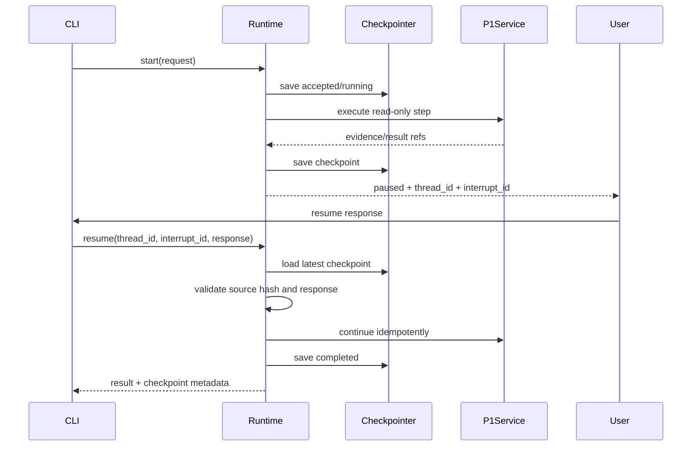

# P2：Durable Runtime（Checkpoint / Interrupt / Resume）

> Phase ID：P2  
> 唯一目标：在不改变 P1 Ask/Connect 业务合同的前提下，让一次只读执行拥有可持久化状态、可中断、可恢复和可检查的 Runtime。  
> 前置：P1 已有可运行结果，且人类明确批准 P2。

## 1. 当前事实

- P1 之前，正式包没有 Runtime、checkpoint、thread 或 resume。
- P1 的 Ask/Connect service 应该是同步、可测试、没有隐式写入的业务能力。
- 当前 `pyproject.toml` 没有 LangGraph 依赖；引入它必须在本 Phase 的变更记录中说明版本和原因。
- `relation_eval` 的运行器带时间戳输出，但它不是可复用的 durable runtime。
- 根目录安全合同允许在 synthetic fixture 上做运行时实验，但不允许借此打开真实 Vault 或写权限。

如果 P1 没有留下稳定的 `AskResult`、`ConnectResult` 和 evidence hash，P2 不能开始。

## 2. 唯一目标

把 P1 的同步路径包装成：

```text
start(request) -> running -> checkpoint
                              -> interrupt / process stop
resume(thread_id, response) -> running -> completed / failed / stale
```

最小可演示故障是：在 `retrieve_context` 之后、`emit_result` 之前暂停或杀掉进程，重新启动后用相同
`thread_id` 恢复，并得到与未中断路径相同的逻辑结果，同时证明没有重复不可幂等副作用。

## 3. 产品作用与面试作用

### 产品作用

用户可以：

- 看见一次长运行查询当前停在哪一步；
- 处理需要澄清的问题后继续，而不是从头再跑；
- 在 provider 暂时失败或预算用尽时安全暂停；
- 看到 stale source 后重新 scan，而不是读取旧答案。

### 面试作用

可以解释：

- checkpoint、event、memory 的区别；
- 为什么状态必须 JSON-serializable；
- 为什么 interrupt 后节点可能从开头重跑；
- 如何设计 idempotency key；
- 进程崩溃和 source hash 变化为什么是两种不同失败。

## 4. 非目标

- 不新增多 Agent；
- 不做长期 Memory；
- 不引入分布式队列、Redis、Postgres、Temporal 或后台 scheduler；
- 不把 Runtime 状态暴露为稳定公共 API；
- 不改变 P1 的结果 schema、Reader 语义或 Scanner v1；
- 不把 checkpoint 当作用户记忆或事实源；
- 不在 checkpoint 中保存 API key、模型 client、未脱敏整篇笔记或绝对私人路径；
- 不实现写入 approval、Safe Writer 或真实 Vault apply。

## 5. 必须阅读文件

```text
AGENTS.md
SPEC.md
DEV_SPEC.md
docs/implementation/00_MASTER_PLAN.md
docs/implementation/01_ARCHITECTURE_CONTRACTS.md
docs/implementation/02_RUNTIME_MODEL.md
phases/P1_WALKING_SKELETON.md
src/linkloom/schemas.py
src/linkloom/loader.py
src/linkloom/services/ask.py
src/linkloom/services/connect.py
tests/integration/test_walking_skeleton.py
```

还必须阅读并记录采用的框架文档：

- [LangGraph persistence](https://docs.langchain.com/oss/python/langgraph/persistence)
- [LangGraph interrupts](https://docs.langchain.com/oss/python/langgraph/interrupts)
- [LangGraph functional API](https://docs.langchain.com/oss/python/langgraph/functional-api)
- [OpenHands Agent architecture](https://docs.openhands.dev/sdk/arch/agent)

## 6. 文件范围

### CREATE

```text
src/linkloom/runtime/__init__.py
src/linkloom/runtime/models.py
src/linkloom/runtime/graph.py
src/linkloom/runtime/checkpoint.py
src/linkloom/runtime/policy.py
src/linkloom/runtime/errors.py
tests/unit/test_runtime_models.py
tests/unit/test_runtime_checkpoint.py
tests/integration/test_runtime_resume.py
tests/integration/test_runtime_failure_injection.py
```

如果采用 LangGraph 的官方 checkpointer adapter，可在 `src/linkloom/runtime/checkpoint.py` 内封装，不把框架对象泄漏到 service 层。

### MODIFY

```text
src/linkloom/cli.py
src/linkloom/services/ask.py
src/linkloom/services/connect.py
pyproject.toml                 # only if dependency approval exists
```

CLI 只添加 `run`, `inspect`, `resume` 只读运行命令；P2 不添加 `apply`。

### DO NOT MODIFY

```text
src/linkloom/scanner.py
tests/unit/test_scanner.py
tests/fixtures/sample_vault/**
relation_eval/**
tests/eval/relation_gold.yaml
src/linkloom/mutations/**       # if a future branch already exists, do not load it
```

## 7. P2 数据合同（字段级）

### 7.1 RunRequest

```json
{
  "schema_version": 1,
  "request_id": "req_p2_0001",
  "thread_id": null,
  "workflow": "ask | connect",
  "vault_root": "<process-only input>",
  "index_path": ".artifacts/p1/scan/vault_index.json",
  "query": "Scanner 做了什么？",
  "max_steps": 12,
  "max_provider_requests": 0,
  "interrupt_policy": "clarify_only",
  "dry_run": true
}
```

规则：

- `vault_root` 可以存在于进程内，但不得进入 artifact、trace 或 checkpoint 的公共字段；
- `thread_id=null` 表示创建新 thread；resume 必须传原 thread；
- `max_steps`、`max_provider_requests` 必须真正执行；
- P2 `interrupt_policy` 不能授予 mutation approval。

### 7.2 RuntimeState

```json
{
  "schema_version": 1,
  "run_id": "run_p2_0001",
  "thread_id": "thread_p2_0001",
  "parent_run_id": null,
  "workflow": "ask",
  "status": "running",
  "current_step": "retrieve_context",
  "step_seq": 3,
  "request_ref": "req_p2_0001",
  "source": {
    "index_sha256": "<64 lowercase hex>",
    "index_schema_version": 1,
    "vault_root_fingerprint": "root_...",
    "fixture_id": "sample_vault_v1"
  },
  "evidence_refs": ["ev_p1_0001"],
  "pending_interrupt": null,
  "result_ref": null,
  "attempts": [],
  "usage": {
    "step_count": 3,
    "provider_requests": 0,
    "input_tokens": 0,
    "output_tokens": 0,
    "estimated_cost_usd": 0.0
  },
  "policy": {
    "policy_version": "p2-readonly-v1",
    "write_capability": false,
    "network_capability": false
  },
  "error": null,
  "created_at": "2026-08-16T00:00:00Z",
  "updated_at": "2026-08-16T00:00:01Z"
}
```

字段规则：

| 字段 | 必填 | 约束 |
|---|---:|---|
| `schema_version` | 是 | 固定 `1`；不兼容版本禁止 resume |
| `run_id` | 是 | 单次执行唯一；retry 创建新 attempt，不覆盖历史 |
| `thread_id` | 是 | pause/resume 的稳定游标 |
| `parent_run_id` | 是 | root 为 null；P2 可只用于 retry lineage |
| `workflow` | 是 | `ask` 或 `connect`，不得偷偷增加 `write` |
| `status` | 是 | 状态图允许的值；禁止节点直接任意设置 |
| `current_step` | 是 | 稳定节点名；不是 Python 行号 |
| `step_seq` | 是 | 非负且单调递增 |
| `request_ref` | 是 | 指向脱敏 Request artifact |
| `source` | 是 | Index hash/schema/root fingerprint/fixture id |
| `evidence_refs` | 是 | 只能是已验证 evidence id |
| `pending_interrupt` | paused 必填 | 其它状态必须 null |
| `result_ref` | completed 必填 | 只指向 immutable result artifact |
| `attempts` | 是 | 每次 retry 记录 node、input hash、result/error、started/finished |
| `usage` | 是 | 限额必须执行，不只是展示 |
| `policy` | 是 | 明确没有 write/network capability |
| `error` | failed/stale/rejected 必填 | 结构化错误，不吞掉堆栈摘要 |

### 7.3 AttemptRecord

```json
{
  "attempt_id": "attempt_p2_0001",
  "node_name": "retrieve_context",
  "step_seq": 3,
  "input_sha256": "<64 lowercase hex>",
  "idempotency_key": "run_p2_0001:3:retrieve_context:<input_hash>",
  "status": "started | completed | failed | skipped",
  "retry_index": 0,
  "output_ref": null,
  "error_code": null,
  "started_at": "2026-08-16T00:00:01Z",
  "finished_at": null
}
```

### 7.4 InterruptEnvelope

```json
{
  "interrupt_id": "int_p2_0001",
  "kind": "clarification_required | human_review | budget_exceeded",
  "message": "查询过于宽泛，请提供一个主题词",
  "payload": {
    "question": "你想查哪个主题？",
    "options": ["Scanner", "relation_eval"]
  },
  "allowed_responses": ["resume", "reject"],
  "checkpoint_id": "cp_p2_0003",
  "created_at": "2026-08-16T00:00:02Z"
}
```

P2 的 `human_review` 只能改变 read-only 分支输入或拒绝结果，不能批准文件写入。

### 7.5 RunStatus

```json
{
  "run_id": "run_p2_0001",
  "thread_id": "thread_p2_0001",
  "status": "paused",
  "current_step": "clarify_request",
  "checkpoint_id": "cp_p2_0003",
  "interrupt": {},
  "result_ref": null,
  "error": null
}
```

CLI 只能通过这个摘要展示状态，不把整个 checkpoint 原样打印到终端。

## 8. 实现步骤

### Step 0：验证 P1 contract 不变

运行 P1 全部测试，保存 result schema 和 evidence sample。若 P1 结果需要改字段，先回到 P1，不在 P2 偷改。

### Step 1：实现 JSON-safe state models

1. 只使用 dict/list/string/number/bool/null 或明确可序列化模型。
2. 增加 schema validation，拒绝缺少 `thread_id`、`source`、`policy` 的状态。
3. 实现 `to_checkpoint()` / `from_checkpoint()`，round-trip 后字节级或结构级一致。
4. 对 query、path、quote 按合同做脱敏/引用化。

### Step 2：先用 InMemoryCheckpointer 验证状态图

1. 逻辑节点按 `02_RUNTIME_MODEL.md` 的固定顺序注册。
2. 每个节点前后产生 checkpoint。
3. 在 `clarify_request` 或测试 hook 上调用 interrupt。
4. 测试同一 thread resume；新 thread 不得拿到旧 evidence。

### Step 3：接本地 SQLite Durable Checkpointer

1. 存储文件默认位于 `.artifacts/runtime/`，不位于 Vault root。
2. SQLite adapter 只能存 schema 允许的 RuntimeState 和 checkpoint metadata。
3. 为 checkpoint 建唯一约束：`thread_id + checkpoint_id`。
4. 写入失败必须返回 `CHECKPOINT_WRITE_FAILED`，不能标记 completed。
5. 不把 SQLite 作为“未来一定分布式”的承诺。

### Step 4：实现 pause/resume API

```text
start(request) -> RunStatus
inspect(thread_id) -> RuntimeSnapshot
resume(thread_id, interrupt_id, response) -> RunStatus
retry(run_id, failed_attempt_id) -> RunStatus  # explicit, bounded
```

`resume` 必须：

- 检查 thread、interrupt、checkpoint 存在；
- 校验 response 字段和允许值；
- 重新验证 source index hash；
- 继续当前逻辑边界，不从一个新 run 假装恢复；
- 在结果 artifact 中记录 `resumed_from_checkpoint_id`。

### Step 5：故障注入与幂等

1. 在节点边界注入一次异常、超时、checkpoint 写失败和 source 改动。
2. 为每个外部动作计算 idempotency key；P2 只有 read/provider mock 动作。
3. 验证失败重试不会产生两份逻辑结果或两次不可幂等动作。
4. 记录 attempt lineage，不覆盖第一次失败。

### Step 6：接 CLI

保留 P1 `ask/connect` 入口；增加：

```text
linkloom run ask ...
linkloom run connect ...
linkloom run inspect --thread-id ...
linkloom run resume --thread-id ... --interrupt-id ... --input ...
```

所有运行命令继续 read-only；不添加 `apply`、`write`、`approve-plan`。

## 9. 执行路径



## 10. 采用模式与成熟项目参考

### LangGraph：持久化和 interrupt

[Persistence](https://docs.langchain.com/oss/python/langgraph/persistence) 展示了按 thread 保存 checkpoint、读取 state history、故障恢复和 time travel；
[Interrupts](https://docs.langchain.com/oss/python/langgraph/interrupts) 强调 interrupt 依赖持久化、resume 需要同一 `thread_id`，且恢复时节点可能从头重新执行。
P2 采用这个成熟模型，因为它直接解决“长运行/人工补充/进程重启”的真实问题。

### OpenHands：不要把 Agent loop 等同于业务服务

[OpenHands Agent](https://docs.openhands.dev/sdk/arch/agent) 将 loop、tool、context 和 security validation 分层。P2 只借鉴“运行时是控制层，业务服务是被调度能力”，不引入 OpenHands workspace。

### OpenAI Agents SDK：sessions 和 guardrails 的对照

[Agents SDK](https://openai.github.io/openai-agents-python/) 的 runner/session/guardrail 说明了 agent runtime 的常见职责。P2 先只实现 LinkLoom 自己的 typed state 和 read-only policy，避免同时引入两个 runtime。

## 11. 单测

### `tests/unit/test_runtime_models.py`

- 合法 RuntimeState round-trip；
- 缺字段、错误 enum、paused 无 interrupt、completed 无 result 的校验；
- `Path`、client、secret 不能序列化进 checkpoint；
- source hash、policy version、step seq 必须保留；
- 状态转换只允许白名单边。

### `tests/unit/test_runtime_checkpoint.py`

- InMemory 和 SQLite adapter 写入/读取一致；
- 相同 thread 的 checkpoint 顺序稳定；
- 重复 checkpoint id 被拒绝；
- checkpoint 写失败不会返回 completed；
- artifact 路径不在 Vault root；
- 绝对路径和敏感字段在持久化前被脱敏或替换为 fingerprint。

## 12. 集成测试

`tests/integration/test_runtime_resume.py`：

1. P1 Ask 正常完成；
2. 在 `retrieve_context` 后 pause；
3. 关闭 Runtime 实例；
4. 新实例用相同 `thread_id` inspect；
5. 用合法 response resume；
6. 比较未中断和 resume 结果的业务字段一致；
7. source fixture snapshot 不变。

`tests/integration/test_runtime_failure_injection.py`：

- provider mock timeout 一次后成功；
- checkpoint 写失败；
- index hash 改变；
- response 不符合 schema；
- 同一 thread 双 resume；
- resume schema version 不兼容。

## 13. 失败场景

| 场景 | 预期状态/错误 | 不允许 |
|---|---|---|
| 找不到 thread | `SOURCE_NOT_FOUND` 或 `THREAD_NOT_FOUND` | 新建一个看似恢复的 thread |
| interrupt id 不匹配 | `INTERRUPT_NOT_FOUND` | 忽略 id 直接执行 |
| index hash 变化 | `stale` + `CONTENT_CHANGED` | 使用旧 evidence |
| checkpoint 损坏 | `CHECKPOINT_CORRUPT` | 从部分 JSON 猜状态 |
| checkpoint 写失败 | `failed` | 打印“完成” |
| response 非法 | 保持 `paused` | 默认接受任意字符串 |
| retry 超上限 | `failed` 或再次 `paused` | 无限重试 |
| 同一 thread 并发 resume | `THREAD_BUSY` | 让两个分支覆盖 checkpoint |
| 运行时 import mutation | 阻塞/测试失败 | 依赖 import 顺序隐藏写能力 |

## 14. 验收命令

```powershell
python -m pytest tests/unit/test_runtime_models.py tests/unit/test_runtime_checkpoint.py -q
python -m pytest tests/integration/test_runtime_resume.py tests/integration/test_runtime_failure_injection.py -q
python -m linkloom run ask tests/fixtures/sample_vault `
  --index .artifacts/p1/scan/vault_index.json `
  --query "Scanner" `
  --checkpoint .artifacts/p2/runtime `
  --pause-after retrieve_context
python -m linkloom run inspect --thread-id <thread_id> --checkpoint .artifacts/p2/runtime
python -m linkloom run resume --thread-id <thread_id> --interrupt-id <interrupt_id> --input "继续" --checkpoint .artifacts/p2/runtime
```

如果当前实现没有 `--pause-after`，必须提供等价的测试 hook 或 deterministic failure injection；不能删掉可复现暂停证据。

## 15. Demo 命令与应看到的结果

Demo 应展示一张短状态表：

```text
run_id       run_p2_0001
thread_id    thread_p2_0001
status       paused -> completed
paused_at    retrieve_context
checkpoint   cp_p2_0003 -> cp_p2_0004
resumed_from cp_p2_0003
stale_source no
source_write 0
```

不得只打印“resume success”；必须能看到 thread、checkpoint、source hash 和结果引用。

## 16. 完成证据格式

```text
Phase: P2
State schema: runtime_state.v1
Framework/version: <if any>
Checkpointer: in-memory + local SQLite
Pause injection: <node and command>
Resume command: <exact command>
Result equivalence: <business-field comparison>
Failure tests: <list and exit codes>
Thread safety: <duplicate/concurrent resume result>
Source hash before/after: identical
Mutation capability loaded: NO
Real vault touched: NO
GitHub write performed: NO
Known limitations: <...>
```

## 17. Scope guardrails

- P2 只增加 Runtime，不把 P1 service 改成一套全新的业务层。
- 一次只引入一个 durable runtime 方案；禁止同时接 LangGraph、OpenAI Agents SDK 和自研 graph。
- 不把重启恢复误称为 exactly-once；只能声称在测试覆盖的幂等边界内没有重复副作用。
- 不把 checkpoint 历史当作用户 Memory。
- 不自动进入 P3；P3 需要基于 P2 trace 需求单独批准。

