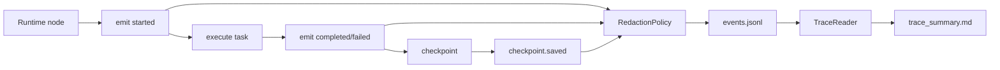

# P3：Event and Tracing（事件流、Span、脱敏和可回放证据）

> Phase ID：P3  
> 唯一目标：让每一次 Runtime 执行都产生结构化、可排序、可脱敏、可关联到 run/checkpoint/evidence 的事件与追踪产物。  
> 前置：P2 已能 pause/resume，且 RuntimeState 合同稳定。

## 1. 当前事实

- P1 目前只有 CLI 输出和结果 artifact，没有统一事件合同。
- P2 预计拥有 `run_id`、`thread_id`、step、attempt、checkpoint 和 error，但还没有 append-only event log。
- `relation_eval` 的历史输出包含时间戳和报告，但不等于正式 Runtime trace，也没有统一的事件生命周期。
- OpenHands、OpenAI Agents SDK 和 LangGraph 都把运行过程的可观察性作为 Agent 工程的重要部分；LinkLoom 需要先解决本地、可验证、低泄露的版本。
- 真实 Vault 和远程 provider 仍然不是 P3 的默认输入。

## 2. 唯一目标

对 P2 的每一个逻辑 step 产生可追踪的事件：

```text
run.accepted
step.started
tool.called
tool.completed / tool.failed
checkpoint.saved
interrupt.raised / interrupt.resumed
step.completed
run.completed / run.failed / run.stale
```

用户和 Reviewer 能用 `run_id` 找到：

- 哪个节点先执行；
- 哪个输入引用和 source hash 被使用；
- 哪个工具/Provider 失败；
- checkpoint 是否保存成功；
- pause/resume 是否发生；
- 最终结果和 evidence artifact 在哪里。

事件只描述发生过什么，不改变业务结果、不替代 checkpoint、不赋予写权限。

## 3. 产品作用与面试作用

### 产品作用

当 Scanner/Reader/Provider “跑着不动”时，用户能看到是在扫描、读取、检索、等待 provider、等待确认还是写 trace 失败；系统能显示最后一个安全 checkpoint，而不是让用户盲目重跑。

### 面试作用

可以展示：

- 一条真实的 event timeline；
- 一次 provider timeout 和 retry 的 span；
- 一次 source stale 的失败轨迹；
- 一次 interrupt/resume 的父子事件；
- 如何防止 trace 把 API key 和整库正文泄露出去。

## 4. 非目标

- 不引入远程 observability SaaS、LangSmith、Datadog、Kafka 或 OpenTelemetry Collector 作为运行前提。
- 不把完整 prompt、完整 note content、Authorization header 或 API key 写入 trace。
- 不为了“有 trace”重写 P1/P2 业务逻辑。
- 不把日志字符串正则解析成结构化事件；事件必须在代码边界显式发出。
- 不实现 metrics dashboard、分布式 tracing、跨服务 trace propagation。
- 不在 P3 引入多 Agent、长期 Memory 或 Safe Writer。

## 5. 必须阅读文件

```text
AGENTS.md
SPEC.md
docs/implementation/01_ARCHITECTURE_CONTRACTS.md
docs/implementation/02_RUNTIME_MODEL.md
phases/P1_WALKING_SKELETON.md
phases/P2_DURABLE_RUNTIME.md
src/linkloom/runtime/models.py
src/linkloom/runtime/graph.py
src/linkloom/runtime/checkpoint.py
src/linkloom/runtime/errors.py
tests/integration/test_runtime_resume.py
```

参考来源：

- [OpenHands Agent architecture](https://docs.openhands.dev/sdk/arch/agent)
- [OpenAI Agents SDK](https://openai.github.io/openai-agents-python/)
- [LangGraph persistence](https://docs.langchain.com/oss/python/langgraph/persistence)
- [LangGraph interrupts](https://docs.langchain.com/oss/python/langgraph/interrupts)

## 6. 文件范围

### CREATE

```text
src/linkloom/observability/__init__.py
src/linkloom/observability/events.py
src/linkloom/observability/redaction.py
src/linkloom/observability/sinks.py
src/linkloom/observability/reader.py
src/linkloom/observability/summary.py
tests/unit/test_events.py
tests/unit/test_trace_redaction.py
tests/integration/test_runtime_trace.py
tests/integration/test_trace_resume.py
```

### MODIFY

```text
src/linkloom/runtime/graph.py
src/linkloom/runtime/checkpoint.py
src/linkloom/runtime/errors.py
src/linkloom/cli.py
```

只在节点边界加事件发射和 trace artifact，不改变 P2 的状态转换语义。

### DO NOT MODIFY

```text
src/linkloom/scanner.py
tests/unit/test_scanner.py
tests/fixtures/sample_vault/**
relation_eval/**
tests/eval/relation_gold.yaml
src/linkloom/mutations/**
```

## 7. P3 数据合同（字段级）

### 7.1 TraceEvent

```json
{
  "schema_version": 1,
  "event_id": "evt_p3_0007",
  "run_id": "run_p2_0001",
  "thread_id": "thread_p2_0001",
  "seq": 7,
  "parent_event_id": "evt_p3_0006",
  "event_type": "tool.completed",
  "node_name": "read_notes",
  "actor": "runtime | service | provider | agent | human",
  "status": "ok",
  "started_at": "2026-08-16T00:00:02Z",
  "finished_at": "2026-08-16T00:00:02Z",
  "duration_ms": 12,
  "input_ref": {
    "kind": "hash_only",
    "sha256": "<64 lowercase hex>"
  },
  "output_ref": {
    "kind": "artifact",
    "path": ".artifacts/p3/run_p2_0001/evidence.json",
    "sha256": "<64 lowercase hex>"
  },
  "attributes": {
    "note_count": 5,
    "content_hash_verified": true
  },
  "error": null,
  "redaction": {
    "policy_version": "trace-redaction-v1",
    "raw_content_included": false,
    "secrets_detected": 0,
    "truncated_fields": []
  }
}
```

| 字段 | 类型 | 约束 |
|---|---|---|
| `schema_version` | integer | 当前为 1 |
| `event_id` | string | 全局/文件内唯一；不可因 summary 重建而变化 |
| `run_id`, `thread_id` | string | 必须和 RuntimeState 一致 |
| `seq` | integer | 同一 run 内从 0 或 1 开始单调递增；不可重复 |
| `parent_event_id` | string/null | 表达 step/attempt/handoff 关系；找不到父事件时记录错误 |
| `event_type` | enum | 见下方白名单；不得使用自由文本替代 |
| `node_name` | string/null | 对应 Runtime 节点或 `system` |
| `actor` | enum | `runtime`, `service`, `provider`, `agent`, `human` |
| `status` | enum | `started`, `ok`, `paused`, `failed`, `rejected`, `stale` |
| `started_at`, `finished_at` | RFC3339/null | 只用于运行记录 |
| `duration_ms` | integer/null | 非负；不能用字符串 |
| `input_ref`, `output_ref` | ref/null | 默认 hash/artifact 引用，不存整段原文 |
| `attributes` | object | 只放非敏感、可审计的结构化字段 |
| `error` | ErrorEnvelope/null | 失败事件必须有 |
| `redaction` | object | 必须记录脱敏策略版本和是否截断 |

### 7.2 Event type 白名单

```text
run.accepted
run.started
run.completed
run.failed
run.stale
step.started
step.completed
step.failed
tool.called
tool.completed
tool.failed
provider.requested
provider.completed
provider.failed
checkpoint.saved
checkpoint.failed
interrupt.raised
interrupt.resumed
retry.scheduled
retry.exhausted
policy.rejected
artifact.written
```

增加事件类型必须修改 schema、reader、summary 和测试，不能在业务代码中随意拼字符串。

### 7.3 SpanRecord

Span 是同一个逻辑操作的开始/结束视图，可由事件计算得到，也可在内存中暂存：

```json
{
  "span_id": "span_p3_0003",
  "run_id": "run_p2_0001",
  "parent_span_id": "span_p3_0001",
  "name": "retrieve_context",
  "kind": "internal | tool | provider | human_wait",
  "start_event_id": "evt_p3_0003",
  "end_event_id": "evt_p3_0004",
  "status": "ok | error | paused",
  "duration_ms": 8,
  "input_sha256": "<64 lowercase hex>",
  "output_sha256": "<64 lowercase hex>"
}
```

P3 不需要完整 OpenTelemetry wire format；如果未来接 OTEL，必须通过 adapter 映射，不能让外部 SDK 成为业务合同。

### 7.4 TraceManifest

```json
{
  "trace_schema_version": 1,
  "run_id": "run_p2_0001",
  "event_count": 18,
  "first_seq": 1,
  "last_seq": 18,
  "event_log": "events.jsonl",
  "summary": "trace_summary.md",
  "source_index_sha256": "<64 lowercase hex>",
  "redaction_policy_version": "trace-redaction-v1",
  "complete": true,
  "incomplete_reason": null
}
```

如果进程崩溃导致 event log 末尾不完整，`complete=false`，不能生成假装完整的 summary。

### 7.5 RedactionPolicy

```json
{
  "policy_version": "trace-redaction-v1",
  "include_relative_paths": true,
  "include_absolute_paths": false,
  "include_quotes": false,
  "quote_max_chars": 0,
  "include_prompt_text": false,
  "include_secret_values": false,
  "hash_algorithm": "sha256",
  "max_attribute_bytes": 4096
}
```

调试 demo 可通过 synthetic-only 显式选项显示短 quote，但不能修改默认安全策略。

## 8. 实现步骤

### Step 0：冻结 event schema 和 sequence 规则

1. 明确 seq 起点、同一 run 的并发写入规则和文件格式。
2. 采用 JSONL，每行一个完整 `TraceEvent`，不允许多行 JSON。
3. 事件写入按 append-only 语义；summary 只读事件生成。

### Step 1：实现 EventEmitter 和 sink

```text
EventEmitter.emit(event_type, node_name, status, refs, attributes, error)
EventSink.append(event)
EventReader.iter_events(run_id)
```

默认 sink 写到 `.artifacts/traces/<run_id>/events.jsonl`；P3 不写 Vault。

### Step 2：接 Runtime 节点

在 P2 的以下边界发事件：

- start/accept；
- load index；
- read notes；
- retrieve context；
- result build；
- checkpoint save；
- interrupt/resume；
- retry；
- completed/failed/stale。

每个 started 事件必须有对应 completed/failed/paused；异常路径也必须由 finally/guard 关闭 span。

### Step 3：实现脱敏

1. 先按字段白名单输出，而不是先写全量再 regex 清理。
2. 绝对路径只转 fingerprint；query 只存 hash 或脱敏摘要；quote 默认不存。
3. 对 key/token/password/Authorization 等字段做二次检测。
4. 超过属性大小上限时截断并记录 `truncated_fields`。
5. 脱敏失败应阻止 event 写入或降级为最小安全事件，不允许写原值。

### Step 4：实现 TraceReader 和 summary

summary 至少展示：

- run/thread/status；
- step 时间线；
- tool/provider 调用数、重试数、耗时；
- checkpoint 和 interrupt；
- source index hash；
- evidence/artifact 引用；
- 错误 code 和 affected refs；
- trace 是否完整。

### Step 5：实现 resume trace 关联

resume 不新建孤立 trace；它应复用同一 `run_id/thread_id` 或明确记录 parent run（合同二选一并冻结），并写 `interrupt.resumed`、`checkpoint.saved` 和后续 step seq。

### Step 6：CLI inspect

增加只读命令：

```text
linkloom trace show --run-id ... --root .artifacts/traces
linkloom trace summary --run-id ... --root .artifacts/traces
```

CLI 只读取 trace，不执行任何被 trace 记录的工具。

## 9. 执行路径



## 10. 采用模式与成熟项目参考

### OpenHands：event-driven agent loop

[OpenHands Agent](https://docs.openhands.dev/sdk/arch/agent) 强调 reasoning/action/tool/context/security 的分工。P3 借鉴“事件是运行过程的可观察接口”，以便解释为什么 Agent 卡住；不复制它的远程 workspace 和服务集群。

### OpenAI Agents SDK：tracing 是 runner 的一等能力

[OpenAI Agents SDK](https://openai.github.io/openai-agents-python/) 将 tracing 与 agent loop、tools、guardrails、handoffs 放在同一套运行观察模型里。P3 借鉴 span 与 tool/guardrail 关联，先以本地 JSONL 保证可复现和隐私。

### LangGraph：checkpoint history 和 interrupt

[Persistence](https://docs.langchain.com/oss/python/langgraph/persistence) 和
[Interrupts](https://docs.langchain.com/oss/python/langgraph/interrupts) 说明状态历史、checkpoint、暂停和恢复需要关联的 thread/context。P3 用事件补齐“发生过什么”，不让 event log 代替 state。

## 11. 单测

### `tests/unit/test_events.py`

- event type 不在白名单时拒绝；
- seq 单调且重复 seq 被拒绝；
- started/finished 事件字段组合合法；
- parent event 不存在时返回结构化错误；
- JSONL 每行可独立解析；
- 同一输入事件排序稳定；
- `run_id/thread_id` 和 RuntimeState 一致。

### `tests/unit/test_trace_redaction.py`

- 绝对路径被 fingerprint 或删除；
- API key、Authorization、password 不出现在输出；
- quote/prompt 默认不写；
- 大 attributes 按上限截断并留下标记；
- 脱敏失败不回退到原始值；
- synthetic debug 选项仍然不能显示 secret。

## 12. 集成测试

`tests/integration/test_runtime_trace.py`：

1. 跑一条 P2 Ask；
2. 读取 `events.jsonl`；
3. 验证 accepted → started → checkpoint → completed 的顺序；
4. 验证 event refs 能找到 result/evidence artifact；
5. 验证 source file snapshot 不变；
6. 验证 trace 不含绝对 root 和 secret。

`tests/integration/test_trace_resume.py`：

- pause 后有 `interrupt.raised`；
- resume 后有 `interrupt.resumed`；
- checkpoint id 和 event seq 有闭合关系；
- 重试/失败能在 summary 中区分，而不是只显示最终成功。

## 13. 失败场景

| 场景 | 预期 | 不允许 |
|---|---|---|
| sink 写失败 | `checkpoint/trace` 错误分开报告；按 policy 停止 | 继续并声称完整可审计 |
| event seq 冲突 | 拒绝冲突、保留原记录 | 覆盖历史 event |
| process 中断 | manifest `complete=false` 或明确缺口 | 生成完整假 summary |
| secret 检测到 | 删除/阻止写入并计数 | 在 message/error 中打印原 secret |
| event schema 版本未知 | Reader 明确不兼容 | 忽略字段继续渲染 |
| parent event 缺失 | trace summary 标红关系缺口 | 静默重排伪造父子关系 |
| source hash stale | 记录 stale error，停止后续 read | 把 stale result 当成功 |
| 大输出 | 引用 artifact + hash + truncated | 把全正文塞进事件 |

## 14. 验收命令

```powershell
python -m pytest tests/unit/test_events.py tests/unit/test_trace_redaction.py -q
python -m pytest tests/integration/test_runtime_trace.py tests/integration/test_trace_resume.py -q
python -m linkloom run ask tests/fixtures/sample_vault `
  --index .artifacts/p1/scan/vault_index.json `
  --query "Scanner" `
  --checkpoint .artifacts/p3/runtime `
  --trace .artifacts/p3/traces
python -m linkloom trace summary --run-id <run_id> --root .artifacts/p3/traces
```

必须可以用纯本地工具检查：

```powershell
Get-Content .artifacts/p3/traces/<run_id>/events.jsonl
Get-Content .artifacts/p3/traces/<run_id>/trace_summary.md
```

## 15. Demo 应看到什么

```text
run_p2_0001 / thread_p2_0001
01 run.accepted                 ok
02 step.started load_index     ok
03 step.completed load_index   ok 12ms
04 checkpoint.saved            ok cp_0001
05 step.started retrieve       ok
06 tool.completed reader       ok hash_verified=true
07 interrupt.raised            paused clarification_required
08 interrupt.resumed           ok
09 step.completed retrieve     ok
10 run.completed               ok result=artifacts/.../result.json
redaction: trace-redaction-v1; secrets=0; raw_quotes=false
```

## 16. 完成证据格式

```text
Phase: P3
Event schema: trace_event.v1
Trace sink: local JSONL
Run id/thread id: <...>
Event count/seq range: <...>
Completed spans: <...>
Interrupted/resumed spans: <...>
Trace completeness: true | false + reason
Redaction policy: <version>; secrets detected: 0
Absolute paths present: NO
Raw note quotes present: NO (or synthetic debug explicitly approved)
Tests: <commands and exit codes>
Source hash before/after: identical
Real vault touched: NO
GitHub write performed: NO
Known limitations: <...>
```

## 17. Scope guardrails

- P3 不做 dashboard，不接远程平台，不改变 P2 结果。
- 不用“加一行 logger”替代结构化 event。
- 不把 trace 中的模型理由当 source evidence。
- 不把时间戳写进确定性 result；时间只进入 RunManifest/Trace。
- 不因为未来想接 OpenTelemetry 就提前引入 collector。
- P3 完成后只能提出 P4，不能自动进入多 Agent。

