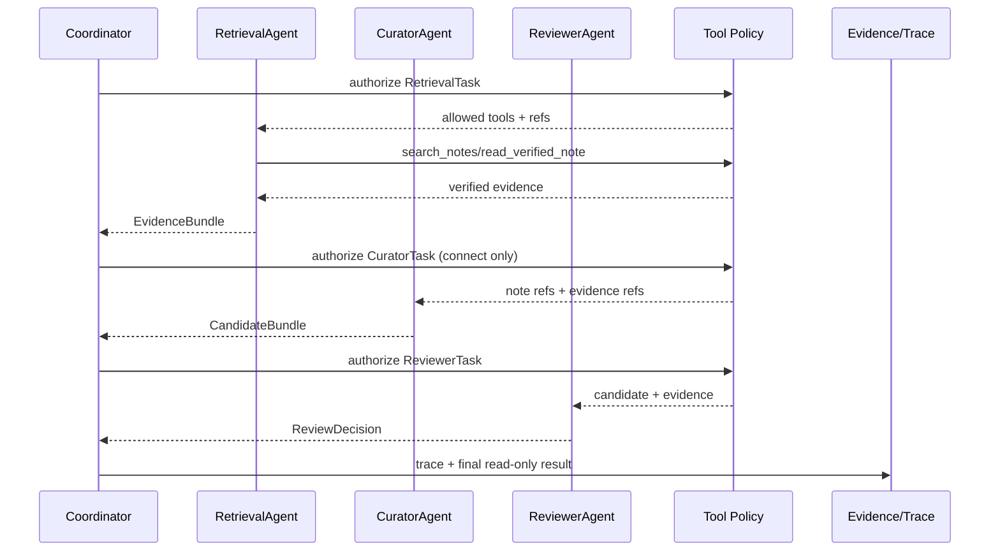

# P4：Multi-Agent（受控专家分工、Handoff 与工具白名单）

> Phase ID：P4  
> 唯一目标：把 P1/P2/P3 的单控制器流程拆成可审计的专业 Agent 协作，同时保持同一份状态、证据和权限合同。  
> 前置：P3 已能输出完整/不完整 trace，且人类明确批准 P4。

## 1. 当前事实

- P1 已有只读 Ask/Connect service；P2 已有 Runtime state/checkpoint；P3 已有 event/trace。
- 当前正式 `src/linkloom` 没有 Agent registry、handoff、tool allowlist 或多 Agent loop。
- `relation_eval/agents/` 只是实验分类器，不是可以直接放进正式 Runtime 的多 Agent 系统。
- 根目录产品合同明确：Agent 是实现选项，不得为了炫技而增加；所有结果仍需要 source evidence 和 human control。
- 当前没有任何 Agent 获得 Writer 权限。

## 2. 唯一目标

实现一个受控的 multi-agent workflow：

```text
Coordinator / Router
        │ calls as tools
        ├── RetrievalAgent  -> EvidenceBundle
        ├── CuratorAgent    -> CandidateBundle
        └── ReviewerAgent   -> ReviewDecision
```

Coordinator 始终拥有 Runtime 控制权。专家 Agent 不直接互相调用、不直接读 Vault、不读 Gold、不写文件；所有 context 通过 typed task 和 evidence references 传递。

P4 的成功不是“有三个类”。成功是：在 trace 中看见受限的角色切换，错误能回退，循环有上限，输入输出可验证，且单 Agent baseline 与 multi-agent 结果可比较。

## 3. 产品作用与面试作用

### 产品作用

- Ask 问题由 RetrievalAgent 负责找证据，ReviewerAgent 负责检查引用是否真实；
- Connect 由 CuratorAgent 负责把结构信号组织成候选，ReviewerAgent 负责标出不足证据；
- 用户看到“哪个角色做了什么”，而不是一个黑盒 Agent 自称完成全部任务；
- 某个专家失败时可以只重试该 task 或回退到单控制器结果。

### 面试作用

可以追问：

- 为什么用 manager-as-tools，而不是多个 Agent 自由 handoff？
- 哪些状态属于 coordinator，哪些属于 specialist？
- 如何限制工具权限和 Agent 步数？
- 如何防止两个 Agent 给出互相矛盾的事实？
- handoff 是控制转移，还是一次受限的函数调用？
- 多 Agent 比单 Agent 何时真的更好？

## 4. 架构决定：先采用 Manager-as-Tools

P4 采用：

```text
Coordinator owns workflow state and calls specialists as typed tools.
```

不采用第一版 peer-to-peer 自由 handoff，原因是：

1. LinkLoom 的 Ask/Connect 主要是固定 workflow，不需要开放式社交网络；
2. 单一控制器可以统一 step budget、source hash、evidence set 和 policy；
3. Reviewer 更容易判断每次 handoff 的输入是否越权；
4. trace 能清楚显示“谁调用谁”，更适合面试演示和失败重放；
5. 将来若出现真实需求，可以在单个 specialist 内部增加受限 subgraph，而不是先放开全局循环。

`handoff` 在 P4 的定义是：Coordinator 把一个 `AgentTask` 交给允许的 specialist，拿回 `AgentResult`；它不是把整个 Runtime 控制权永久交出去。

## 5. 非目标

- 不做无限 peer-to-peer Agent 网络；
- 不让 Agent 直接 `open/read/write` 任意路径；
- 不让 Agent 读 Gold Dataset、scorer、历史 expected label；
- 不把多 Agent 结果自动写回 Vault；
- 不做后台自治、自动调度、消息队列或远程 Agent server；
- 不同时引入 LangGraph multi-agent subgraph 和 OpenAI Agents SDK runner；选择一个控制骨架，其他只作参考/adapter；
- 不为了“角色数量”拆出没有独立输入输出的虚假 Agent；
- 不把 ReviewerAgent 的 `approved` 等同于人类对写入的 approval。

## 6. 必须阅读文件

```text
AGENTS.md
SPEC.md
docs/implementation/00_MASTER_PLAN.md
docs/implementation/01_ARCHITECTURE_CONTRACTS.md
docs/implementation/02_RUNTIME_MODEL.md
phases/P1_WALKING_SKELETON.md
phases/P2_DURABLE_RUNTIME.md
phases/P3_EVENT_AND_TRACING.md
src/linkloom/runtime/models.py
src/linkloom/runtime/graph.py
src/linkloom/observability/events.py
src/linkloom/loader.py
src/linkloom/retrieval.py
```

成熟项目参考：

- [OpenAI Agents SDK agents/handoffs](https://openai.github.io/openai-agents-python/agents/)
- [OpenAI Agents SDK guardrails](https://openai.github.io/openai-agents-python/guardrails/)
- [LangGraph subgraphs](https://docs.langchain.com/oss/python/langgraph/use-subgraphs)
- [OpenHands Agent architecture](https://docs.openhands.dev/sdk/arch/agent)
- [Smart Connections](https://github.com/brianpetro/obsidian-smart-connections)

## 7. 文件范围

### CREATE

```text
src/linkloom/agents/__init__.py
src/linkloom/agents/base.py
src/linkloom/agents/coordinator.py
src/linkloom/agents/retrieval_agent.py
src/linkloom/agents/curator_agent.py
src/linkloom/agents/reviewer_agent.py
src/linkloom/agents/registry.py
src/linkloom/tools/__init__.py
src/linkloom/tools/read_tools.py
src/linkloom/tools/tool_policy.py
tests/unit/test_agent_contracts.py
tests/unit/test_tool_policy.py
tests/unit/test_agent_registry.py
tests/integration/test_multi_agent_workflow.py
tests/integration/test_handoff_trace.py
```

### MODIFY

```text
src/linkloom/runtime/models.py
src/linkloom/runtime/graph.py
src/linkloom/observability/events.py
src/linkloom/cli.py
```

只增加 Agent task 状态、handoff 事件和只读 demo；不改变 P2 checkpoint 语义。

### DO NOT MODIFY

```text
src/linkloom/scanner.py
tests/fixtures/sample_vault/**
relation_eval/**
tests/eval/relation_gold.yaml
src/linkloom/mutations/**
real vaults and credentials
```

## 8. P4 数据合同（字段级）

### 8.1 AgentIdentity

```json
{
  "agent_id": "retrieval_agent",
  "role": "retrieval",
  "version": "p4-retrieval-v1",
  "capabilities": ["search_notes", "read_verified_note"],
  "allowed_workflows": ["ask", "connect"],
  "can_read_gold": false,
  "can_write_vault": false,
  "max_steps": 3
}
```

字段约束：

- `agent_id` 和 `role` 是稳定标识，不用模型返回的自然语言名字；
- capability 必须在 registry 注册；
- `can_read_gold`、`can_write_vault` 在 P4 必须是 false；
- `max_steps` 是硬上限，不能被 prompt 覆盖。

### 8.2 AgentTask

```json
{
  "task_id": "task_p4_0001",
  "run_id": "run_p4_0001",
  "parent_task_id": null,
  "parent_agent_id": "coordinator",
  "agent_id": "retrieval_agent",
  "workflow": "ask",
  "input_refs": ["req_p4_0001", "source_ctx_p4_0001"],
  "allowed_tool_ids": ["search_notes", "read_verified_note"],
  "max_steps": 3,
  "deadline_ms": 5000,
  "status": "queued | running | completed | failed | rejected | timed_out",
  "attempt": 0,
  "created_at": "2026-08-16T00:00:00Z"
}
```

AgentTask 不携带任意 `vault_root`、文件句柄、Gold、Writer 或 provider secret。

### 8.3 AgentResult

```json
{
  "task_id": "task_p4_0001",
  "agent_id": "retrieval_agent",
  "status": "completed",
  "output_type": "evidence_bundle",
  "output_refs": ["ev_p4_0001", "ev_p4_0002"],
  "summary": "找到 2 条 verified evidence",
  "confidence": null,
  "handoff": null,
  "warnings": [],
  "usage": {
    "steps": 2,
    "tool_calls": 2,
    "provider_requests": 0
  },
  "error": null,
  "completed_at": "2026-08-16T00:00:01Z"
}
```

P4 只有在明确有模型/分类器输出时才允许有 `confidence`；结构检索 Agent 应为 null，避免把工具数量当置信度。

### 8.4 HandoffRequest

```json
{
  "handoff_id": "handoff_p4_0001",
  "from_agent_id": "coordinator",
  "to_agent_id": "curator_agent",
  "reason_code": "connect_candidate_generation",
  "task_id": "task_p4_0002",
  "input_refs": ["note_ref_a", "note_ref_b", "ev_p4_0001"],
  "requested_output_type": "candidate_bundle",
  "allowed_tool_ids": ["read_verified_note", "build_pair_signals"],
  "max_steps": 3,
  "status": "requested | accepted | rejected | completed",
  "created_at": "2026-08-16T00:00:01Z"
}
```

`to_agent_id` 必须在 Coordinator 的 allowlist；Agent 不能自己指定任意目标。

### 8.5 ReviewDecision

```json
{
  "review_id": "review_p4_0001",
  "reviewer_agent_id": "reviewer_agent",
  "subject_refs": ["candidate_p4_0001"],
  "decision": "evidence_sufficient | evidence_insufficient | schema_invalid | needs_human",
  "checks": [
    {"check_id": "source_quote_exact", "status": "pass", "details": "..."},
    {"check_id": "both_sides_present", "status": "pass", "details": "..."}
  ],
  "human_approval_required": false,
  "reason": "结构证据存在，但语义关系仍需用户确认",
  "created_at": "2026-08-16T00:00:02Z"
}
```

`evidence_sufficient` 只是“可以展示给用户”，不是写入批准；只有 P7 的人类 exact approval 才有 mutation authority。

### 8.6 ToolCallPolicy

```json
{
  "policy_version": "p4-readonly-tools-v1",
  "agent_id": "retrieval_agent",
  "allowed_tool_ids": ["search_notes", "read_verified_note"],
  "denied_tool_ids": ["write_file", "rename_file", "read_gold", "raw_filesystem"],
  "max_calls": 6,
  "network": "deny",
  "vault_write": "deny",
  "gold_access": "deny"
}
```

## 9. Agent 角色合同

### Coordinator / Router

允许：解析已验证的 Request、选择 workflow、创建 AgentTask、合并结果、触发 Reviewer、结束/回退。

禁止：自己绕过白名单读文件；把模型自由文本直接变成 path；批准写入；读取 Gold。

### RetrievalAgent

输入：query、Index/source context、allowed note refs。输出：EvidenceBundle。

允许工具：`search_notes`、`read_verified_note`。

禁止：推断关系类型、修改 memory、调用 writer。

### CuratorAgent

输入：两个或多个已读 NoteRef、verified evidence、用户 query。输出：CandidateBundle，包含结构信号、理由和缺口。

允许工具：`read_verified_note`、`build_pair_signals`。

禁止：把候选当事实、改 WikiLink、直接创建 ChangePlan。

### ReviewerAgent

输入：Candidate/Answer、EvidenceRef、schema/policy。输出：ReviewDecision。

允许工具：`validate_evidence`、`validate_schema`。

禁止：从 Vault 重新任意搜索、读 Gold 作为答案、替代人类决定。

## 10. 工具白名单

P4 工具必须是 typed function/tool，不是给 Agent 一个“终端”或任意 Python eval：

```text
search_notes(query, source_context, limit) -> CandidateRef[]
read_verified_note(note_ref) -> NoteDocument
build_pair_signals(left_ref, right_ref) -> PairSignal[]
validate_evidence(evidence_ref) -> EvidenceCheck
validate_schema(result_type, payload) -> SchemaCheck
```

每个工具都必须：

- 由 Reader/Policy 层完成路径和 hash 校验；
- 接收 JSON-safe typed input；
- 产生 tool.called/tool.completed/tool.failed trace；
- 有调用次数和超时上限；
- 不接收 `**kwargs` 形式的任意扩展；
- 不执行 shell、网络、写文件或 Gold 读取。

## 11. 实现步骤

### Step 0：写单 Agent baseline

先用 P2 Coordinator 只调用 RetrievalService/ConnectService，生成 baseline trace 和结果。没有 baseline 就无法判断多 Agent 是否带来改善。

### Step 1：实现 registry 和 policy

1. 用静态 registry 注册四个角色。
2. 每个角色声明 capability、allowlist、step/call budget。
3. registry 启动时验证：不存在的 tool、write capability、Gold capability 都直接失败。
4. 不允许模型动态注册 Agent 或工具。

### Step 2：实现 typed AgentTask/Result

1. task 创建时冻结输入 refs 和 policy snapshot。
2. specialist 只能从 refs 获取 context，不能自行扩大 source scope。
3. result 必须先 schema validate 再交给 Coordinator。
4. schema error 进入 trace 和 Bad Case，不把半结构化文本继续往下传。

### Step 3：实现三个 specialists

按 Retrieval → Curator → Reviewer 顺序施工，每完成一个角色就单测/集成测试，不要同时写完整 multi-agent loop。

### Step 4：实现 Coordinator orchestration

```text
Coordinator.accept
  -> create RetrievalTask
  -> await RetrievalResult
  -> if ask: build answer candidate
  -> if connect: create CuratorTask
  -> create ReviewerTask
  -> merge reviewed output
  -> checkpoint + trace + result
```

Coordinator 有硬上限：

- `max_agent_tasks=6`；
- `max_total_steps=12`；
- `max_handoffs=4`；
- `max_tool_calls=20`；
- 检测重复 task/input hash；
- 超限进入 `needs_human` 或失败，不继续循环。

### Step 5：实现 fallback

如果 specialist provider/schema/timeout 失败：

1. 记录失败 AgentTask；
2. 根据 policy 决定 retry 一次或跳过；
3. Ask 可以回退到 P1/P2 deterministic retrieval；
4. Connect 可以返回结构候选但标 `review_incomplete`；
5. 不把失败吞掉，也不把 fallback 伪装成多 Agent 成功。

### Step 6：接 P3 trace

每个 task/handoff 都发出：

```text
agent.task.created
agent.task.started
tool.called
tool.completed/failed
agent.task.completed/failed
handoff.requested/accepted/rejected
agent.fallback.used
```

如果新增 event type，按 P3 的 schema 流程同步修改 reader/summary/test。

### Step 7：CLI demo

增加只读：

```text
linkloom agent ask ...
linkloom agent connect ...
linkloom agent trace --run-id ...
```

输出角色、task、tool、evidence 和 reviewer decision；不输出隐藏 prompt 或 secret。

## 12. 执行路径



## 13. 采用模式与成熟项目参考

### OpenAI Agents SDK

[Agents and handoffs](https://openai.github.io/openai-agents-python/agents/) 提供 agents-as-tools、handoffs、guardrails、sessions 和 runner 的清晰边界。LinkLoom 采用“专家是受限 capability，不是独立主权进程”的精神；第一版选择 manager-as-tools，以便保留统一 policy。

### LangGraph subgraphs

[Subgraphs](https://docs.langchain.com/oss/python/langgraph/use-subgraphs) 区分 per-invocation、per-thread 和 stateless persistence。LinkLoom P4 默认 specialist per-invocation：一次 task 用完即释放上下文，不意外继承跨用户记忆。

### OpenHands

[Agent architecture](https://docs.openhands.dev/sdk/arch/agent) 把 tool orchestration、context management 和 security validation 分开。LinkLoom 借鉴安全验证和事件边界，不给 Agent 一个开放 shell。

### Smart Connections / Obsidian Copilot

[Smart Connections](https://github.com/brianpetro/obsidian-smart-connections) 和
[Obsidian Copilot](https://github.com/logancyang/obsidian-copilot) 说明“相关笔记”和“问 Vault”是不同用户动作。LinkLoom 将 Retrieval、Curator、Reviewer 分开，避免一个 Agent 同时负责搜索、语义判断和审批。

## 14. 单测

### `tests/unit/test_agent_contracts.py`

- AgentIdentity capability 合法性；
- AgentTask 不能带绝对路径、Gold、Writer；
- AgentResult 必须引用存在的 evidence 或显式失败；
- Handoff 目标不在 registry 时拒绝；
- ReviewDecision 的 `evidence_sufficient` 不产生 mutation approval。

### `tests/unit/test_tool_policy.py`

- RetrievalAgent 允许 search/read，拒绝 write/raw_fs/read_gold；
- CuratorAgent 只允许 pair signals/read；
- ReviewerAgent 只能 validate；
- tool calls 超上限后被拒绝；
- network/write/gold policy 在运行时而非 prompt 中强制执行。

### `tests/unit/test_agent_registry.py`

- 重复 agent id、未知 tool、write capability、循环 allowlist 启动失败；
- registry 输出稳定排序；
- registry version 写入 policy snapshot。

## 15. 集成测试

`tests/integration/test_multi_agent_workflow.py`：

1. synthetic Ask：Coordinator → Retrieval → Reviewer → result；
2. synthetic Connect：Coordinator → Retrieval → Curator → Reviewer → result；
3. 结果带 evidence/hash；
4. specialist 失败时 fallback 可见；
5. 原始 fixture 不变；
6. Gold import/access 为 0；
7. 工具数、step 数、handoff 数被 policy 限制。

`tests/integration/test_handoff_trace.py`：

- 每个 task/handoff 的 parent id/trace seq 闭合；
- specialist 不能写 coordinator 的任意 state key；
- 重复输入 hash 被识别为 duplicate；
- cycle injection 进入 `AGENT_CYCLE_DETECTED`；
- Reviewer 标记不足证据时不会被 Coordinator 自动改成通过。

## 16. 失败场景

| 场景 | 预期 | 不允许 |
|---|---|---|
| Agent 请求未授权 tool | `TOOL_NOT_ALLOWED` | 通过 prompt 解释后放行 |
| Agent 请求 raw filesystem | `POLICY_REJECTED` | 给它 terminal |
| specialist timeout | bounded retry/fallback | 无限等待 |
| schema invalid | task failed + bad case | 把自由文本继续下传 |
| evidence stale | 重新 Reader 或 run stale | 沿用旧 quote |
| handoff cycle | `AGENT_CYCLE_DETECTED` | 继续加 step |
| step/tool budget exceeded | paused/failed | 静默扩大预算 |
| Reviewer 不通过 | `needs_human`/review_incomplete | 自动变 approved |
| Gold 依赖出现 | import/contract test 失败 | 运行时偷偷读 Gold |
| 多 Agent 比 baseline 差 | 记录指标，保留可回退路径 | 宣称角色越多越好 |

## 17. 验收命令

```powershell
python -m pytest tests/unit/test_agent_contracts.py tests/unit/test_tool_policy.py tests/unit/test_agent_registry.py -q
python -m pytest tests/integration/test_multi_agent_workflow.py tests/integration/test_handoff_trace.py -q
python -m linkloom agent ask tests/fixtures/sample_vault `
  --index .artifacts/p1/scan/vault_index.json `
  --query "Scanner" `
  --trace .artifacts/p4/traces
python -m linkloom agent connect tests/fixtures/sample_vault `
  --index .artifacts/p1/scan/vault_index.json `
  --query "Scanner" `
  --trace .artifacts/p4/traces
python -m linkloom trace summary --run-id <run_id> --root .artifacts/p4/traces
```

此外必须有一个对比命令或报告，说明 P1/P2 单控制器 baseline 与 P4 multi-agent 在相同 fixture/query 下的：

- evidence coverage；
- tool/step 数；
- latency；
- failure recovery；
- 用户可读性。

## 18. Demo 应看到什么

```text
Coordinator -> RetrievalAgent (2 tool calls) -> 2 verified evidence
Coordinator -> ReviewerAgent (2 validation checks) -> evidence_sufficient
final: read-only answer, source paths + hashes
writer capability: DENY
gold access: DENY
network: DENY
handoffs: 2 / max 4
cycles: 0
```

Connect demo 还应显示 CuratorAgent 的 pair signals，但明确标注为 `candidate`，不是已确认关系。

## 19. 完成证据格式

```text
Phase: P4
Coordination pattern: manager-as-tools
Agent registry version: <...>
Agents enabled: coordinator/retrieval/curator/reviewer
Tool policy: <version>
Max steps/tool calls/handoffs: <...>
Ask trace: <run id + artifact>
Connect trace: <run id + artifact>
Fallback test: <failure + output>
Cycle test: blocked | passed
Gold access: 0
Vault write: 0
Source hash before/after: identical
Tests: <commands and exit codes>
Baseline comparison: <metrics>
Real vault touched: NO
GitHub write performed: NO
Known limitations: <...>
```

## 20. Scope guardrails

- 不以 Agent 数量作为完成指标；以用户结果、evidence、失败恢复和可解释 trace 为指标。
- 不让 specialist 直接修改 shared state；用 result refs 回传。
- 不将 `ReviewerAgent` 变成人类审批替身。
- 不把 handoff 做成隐式递归调用；每次都由 Coordinator 显式创建 task。
- 不同时接多个 Agent framework；选一个控制骨架。
- P4 完成后只能提出 P5 或 P6，不能自动进入 Memory 或写回。

