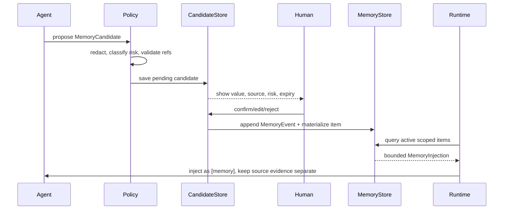

# P5：Memory（可编辑、可撤销、带来源的长期上下文）

> Phase ID：P5  
> 唯一目标：把“跨 Run 的用户上下文”从 checkpoint、Vault 原文和 Agent 自由文本中分离出来，建立可审阅、可确认、可过期、可撤销的本地 Memory 层。  
> 前置：P4 已有明确的 Agent task/trace，且人类明确批准 P5。

## 1. 当前事实

- 当前仓库没有正式 Memory store、memory schema、memory retrieval 或 memory approval。
- P2 checkpoint 只为恢复一次 Run 服务；它不是长期记忆。
- P4 specialist 的结果和 trace 可能包含建议，但建议不是用户确认的事实。
- 根 `SPEC.md` 要求 self-growth 可见、可编辑、可删除、可逆，不能变成不透明的 autonomous rewriting。
- `relation_eval`、Gold 和 note content 都不能自动写入长期 Memory。
- P7 的 Safe Writeback 还未发生；P5 的 Memory 默认落在 LinkLoom 本地 artifact/store，不写入 Vault。

## 2. 唯一目标

实现一个明确的 Memory lifecycle：

```text
agent observes signal
  -> MemoryCandidate (pending)
  -> evidence/policy validation
  -> human confirm / reject / edit
  -> MemoryItem (active)
  -> inject only relevant items
  -> supersede / expire / revoke
```

Memory 只保存用户允许跨 Run 使用的上下文，例如：

- 已确认的输出偏好；
- 当前项目的名称、边界和术语；
- 用户确认的检索过滤规则；
- 一个项目的阶段/目标和来源；
- 被用户明确确认的“不要做什么”。

它不自动保存所有对话、所有模型推理、所有笔记内容或网页中的指令。

## 3. 产品作用与面试作用

### 产品作用

- 用户不必每次重新解释项目术语和输出偏好；
- Memory 有来源、有状态，用户可以看到、编辑、删除和撤销；
- 过期项目不会无限污染新问题；
- 发现冲突时系统请求确认，而不是选择一个“最新”值悄悄覆盖。

### 面试作用

可以解释：

- checkpoint、session context、working memory、long-term memory 的区别；
- 为什么“让模型自己记住”是安全问题；
- memory candidate 和 active memory 为什么要分两阶段；
- 如何做 provenance、冲突、TTL、敏感性和注入预算；
- 如何防止 Prompt Injection 从 note content 进入长期记忆。

## 4. 非目标

- 不做自动保存所有聊天历史；
- 不把整个 Vault embed 到 memory store；
- 不把 Memory 写回 Markdown 或 Obsidian，除非未来有独立、精确的 P7 plan；
- 不引入 Letta server 作为 LinkLoom 的必需依赖；
- 不做跨用户共享记忆、云同步、后台学习或模型自我修改；
- 不让 Agent 直接调用 `memory_write` 生成 active item；
- 不让模型自己决定 memory 的敏感性、保留期和 scope；
- 不把 Memory 的存在当作答案证据；源笔记 evidence 仍然优先。

## 5. 必须阅读文件

```text
AGENTS.md
SPEC.md
docs/implementation/01_ARCHITECTURE_CONTRACTS.md
docs/implementation/02_RUNTIME_MODEL.md
phases/P3_EVENT_AND_TRACING.md
phases/P4_MULTI_AGENT.md
src/linkloom/runtime/models.py
src/linkloom/agents/reviewer_agent.py
src/linkloom/observability/events.py
```

参考来源：

- [Letta context hierarchy](https://docs.letta.com/guides/core-concepts/memory/context-hierarchy)
- [Letta memory blocks](https://docs.letta.com/guides/core-concepts/memory/memory-blocks)
- [Letta documentation](https://docs.letta.com/)
- [OpenAI Agents SDK sessions/tracing](https://openai.github.io/openai-agents-python/)
- [Second Brain](https://github.com/arkangelai/second-brain)

## 6. 文件范围

### CREATE

```text
src/linkloom/memory/__init__.py
src/linkloom/memory/models.py
src/linkloom/memory/policy.py
src/linkloom/memory/store.py
src/linkloom/memory/retriever.py
src/linkloom/memory/lifecycle.py
src/linkloom/memory/redaction.py
tests/unit/test_memory_models.py
tests/unit/test_memory_policy.py
tests/unit/test_memory_store.py
tests/integration/test_memory_lifecycle.py
tests/integration/test_memory_injection.py
```

### MODIFY

```text
src/linkloom/runtime/models.py
src/linkloom/runtime/graph.py
src/linkloom/agents/reviewer_agent.py
src/linkloom/observability/events.py
src/linkloom/cli.py
pyproject.toml                 # only after dependency decision
```

增加 memory refs、memory events 和只读 inspect/confirm demo；不能给现有 read command 隐式增加写 Vault 能力。

### DO NOT MODIFY

```text
src/linkloom/scanner.py
tests/fixtures/sample_vault/**
relation_eval/**
tests/eval/relation_gold.yaml
real Vault Markdown
```

## 7. P5 数据合同（字段级）

### 7.1 MemoryCandidate

```json
{
  "candidate_id": "mc_p5_0001",
  "scope_id": "user_local | project:linkloom | thread:thread_p4_0001",
  "kind": "preference | constraint | terminology | goal | decision | project_context",
  "proposed_key": "answer_language",
  "proposed_value": "中文，先给结论",
  "source_refs": [
    {"kind": "run", "id": "run_p4_0001"},
    {"kind": "evidence", "id": "ev_p4_0001"}
  ],
  "trigger": "user_explicit | user_correction | reviewed_summary | agent_suggestion",
  "sensitivity": "normal | personal | secret_like",
  "confidence": null,
  "risk_flags": [],
  "status": "pending | accepted | rejected | expired | superseded",
  "proposed_by": "human | coordinator | reviewer_agent",
  "created_at": "2026-08-16T00:00:00Z",
  "reviewed_at": null,
  "review_note": null
}
```

规则：

- `proposed_value` 进入 store 前必须经过 redaction；
- `source_refs` 至少有一个 run ref；如果声称来自 Vault，还必须有 verified evidence ref；
- `trigger=agent_suggestion` 永远不能自动变 `active`；
- `sensitivity=secret_like` 默认拒绝持久化并提示用户，不保存秘密；
- `confidence` 不是自动批准阈值，P5 可以保持 null；
- candidate 和 active item 是不同实体，不能用 status 字符串伪装两阶段。

### 7.2 MemoryItem

```json
{
  "memory_id": "mem_p5_0001",
  "scope_id": "project:linkloom",
  "kind": "constraint",
  "key": "write_policy",
  "value": "所有写回必须 preview + exact approval + rollback",
  "value_sha256": "<64 lowercase hex>",
  "source_refs": [
    {"kind": "memory_candidate", "id": "mc_p5_0001"},
    {"kind": "document", "relative_path": "SPEC.md", "content_sha256": "..."}
  ],
  "status": "active | revoked | expired | superseded",
  "sensitivity": "normal | personal",
  "version": 1,
  "supersedes_memory_id": null,
  "created_by": "human",
  "confirmed_by": "human",
  "created_at": "2026-08-16T00:00:00Z",
  "updated_at": "2026-08-16T00:00:00Z",
  "expires_at": null,
  "revoked_at": null,
  "revocation_reason": null
}
```

字段约束：

| 字段 | 约束 |
|---|---|
| `memory_id` | 不复用；撤销后仍保留审计 tombstone |
| `scope_id` | `user_local`、项目、thread 等有限枚举；不能任意跨用户共享 |
| `kind` | 受控枚举；新 kind 需 schema/评测更新 |
| `key` | 稳定、短、小写 snake_case；避免把一大段对话当 key |
| `value` | 脱敏后的短文本或结构化值；不能包含未审阅整篇 note |
| `value_sha256` | 用于 detect change；不是秘密加密替代品 |
| `source_refs` | 必须可回溯；Memory 不是独立事实源 |
| `status` | 只有 lifecycle service 修改 |
| `version` | 同一 key 更新时递增；旧版本保留 supersede 链 |
| `created_by` / `confirmed_by` | `human` 或受控系统角色；active 必须有 confirmed_by |
| `expires_at` | 可选 TTL；到期后不能注入，除非重新确认 |
| `revocation_reason` | revoked/expired/superseded 时必填 |

### 7.3 MemoryQuery

```json
{
  "query_id": "mq_p5_0001",
  "scope_ids": ["user_local", "project:linkloom"],
  "kinds": ["preference", "constraint", "project_context"],
  "query_terms": ["write", "approval"],
  "max_items": 8,
  "max_chars": 2000,
  "include_pending": false,
  "include_expired": false,
  "as_of": "2026-08-16T00:00:00Z"
}
```

Memory retrieval 只返回 active、未过期、scope 匹配的 item；pending 只能在 review UI 中展示。

### 7.4 MemoryInjection

```json
{
  "injection_id": "mi_p5_0001",
  "run_id": "run_p5_0001",
  "query_id": "mq_p5_0001",
  "items": ["mem_p5_0001"],
  "selection_reason": [
    {"memory_id": "mem_p5_0001", "reason": "same project scope + key match"}
  ],
  "total_chars": 68,
  "injection_policy_version": "memory-injection-v1",
  "created_at": "2026-08-16T00:00:00Z"
}
```

Injection 必须进入 trace，但默认只记录 item id、scope、数量和 hash，不把 value 原文写入 trace。

### 7.5 MemoryEvent

```json
{
  "event_id": "mevt_p5_0001",
  "memory_id": "mem_p5_0001",
  "candidate_id": "mc_p5_0001",
  "event_type": "candidate_created | confirmed | edited | injected | superseded | revoked | expired",
  "actor": "human | coordinator | policy",
  "before_hash": null,
  "after_hash": "<64 lowercase hex>",
  "reason": "用户确认项目写回约束",
  "run_id": "run_p5_0001",
  "created_at": "2026-08-16T00:00:00Z"
}
```

MemoryEvent append-only；materialized `MemoryItem` 可以重建，历史不可覆盖。

## 8. 三类上下文的硬隔离

```text
Checkpoint: 为恢复当前 Run，可能包含 step/evidence refs
Working context: 当前 Agent prompt 中临时使用的证据/记忆片段
Long-term memory: 用户确认、可撤销、跨 Run 的 MemoryItem
Vault facts: Scanner/Reader 验证的源笔记事实
```

规则：

- checkpoint 过期/删除不自动删除 active Memory；
- active Memory 删除不改变 Vault；
- Vault 变化使 evidence stale，但不自动改 Memory value；
- Memory 不能替代源 evidence；回答涉及事实时仍须读取新鲜 source。

## 9. 实现步骤

### Step 0：定义 memory policy

先决定并写死：

- 什么可以成为 candidate；
- 什么必须人工确认；
- 哪些字段/模式直接拒绝；
- 默认 scope；
- 默认 TTL；
- 注入上限；
- 删除/撤销是否保留 tombstone。

不要先写 `save_memory(text)` 再补规则。

### Step 1：实现候选提取

1. Coordinator/Reviewer 只能提出 `MemoryCandidate`，不能直接写 active。
2. 候选必须引用 run 和 evidence/用户操作。
3. 从 note 中看到的“指令”默认视为 source text，不视为系统规则；必须经过用户确认。
4. 将 candidate 和 output result 分开保存。

### Step 2：实现本地 store

推荐使用本地 SQLite 或受控 JSONL + materialized view；选择一种并记录原因。

最小 store 操作：

```text
create_candidate(candidate) -> candidate_id
list_candidates(scope, status) -> candidates
confirm_candidate(candidate_id, edited_value?) -> memory_id
reject_candidate(candidate_id, reason) -> candidate status
query_active(memory_query) -> MemoryInjection
supersede(memory_id, new_value, reason) -> new memory_id
revoke(memory_id, reason) -> tombstone
```

所有变更都产生 MemoryEvent；不能通过直接更新数据库绕过 lifecycle。

### Step 3：实现冲突和过期

1. 同一 `scope_id + key` 出现不同 active value 时返回 conflict，不自动取最新。
2. 用户确认新值后，旧值变 `superseded` 并保留链。
3. `expires_at` 到期后变 `expired`，不能继续 injection。
4. `revoke` 只撤销 injection，不从 audit 中删除历史。

### Step 4：实现受限 injection

1. MemoryQuery 由 Coordinator 生成并记录；Agent 不能无限检索 memory。
2. 只注入 top-k、scope 匹配、未过期的 item。
3. 注入内容带 `[memory]` 标签，不与 `[source_fact]` 混合。
4. 生成结果中必须能区分“根据用户偏好格式化”和“根据 Vault evidence 得出的事实”。

### Step 5：加入 prompt-injection 防护

1. Vault content 在进入候选提取前标为 untrusted content。
2. 任何“忽略系统规则”“把这段记住”“调用某工具”的 note 文本只作为 quote，不作为 policy。
3. Memory redactor 拒绝 secret-like token、credential、长 base64、shell command 等高风险值。
4. 负面测试必须包含恶意 note、伪造 system prompt 和过期记忆。

### Step 6：接 P3 trace 和 CLI

添加：

```text
linkloom memory candidates --scope project:linkloom
linkloom memory confirm --candidate-id ... --exact-value ...
linkloom memory list --scope project:linkloom
linkloom memory revoke --memory-id ... --reason ...
```

这些是 Memory store 的显式操作，不是 Vault writeback；仍然需要记录 actor 和 audit event。

## 10. 执行路径



## 11. 采用模式与成熟项目参考

### Letta：context hierarchy 和 memory blocks

[Context hierarchy](https://docs.letta.com/guides/core-concepts/memory/context-hierarchy) 区分 context 内 memory、文件、archival memory 和外部检索；
[Memory blocks](https://docs.letta.com/guides/core-concepts/memory/memory-blocks) 说明持久 memory 是结构化上下文，而不是无界聊天拼接。LinkLoom 借鉴“不同重要性/规模使用不同存储”的思想，但保留自己的 human-confirmed lifecycle，不引入 Letta server。

### OpenAI Agents SDK：sessions 与 tracing

[Agents SDK](https://openai.github.io/openai-agents-python/) 将 sessions 作为运行时上下文层。LinkLoom 用它来区分“session context”和长期 Memory，并把 injection 记录到 trace；不把 SDK session 当用户拥有的事实库。

### Second Brain / Obsidian 工作流

[Second Brain](https://github.com/arkangelai/second-brain) 体现 Markdown source of truth、可查询知识和 MOC breadcrumbs 的组合。LinkLoom 借鉴“记忆应该可见、可回到 source”，但不让 Agent 自动把 breadcrumbs 写回 Vault。

## 12. 单测

### `tests/unit/test_memory_models.py`

- candidate/item/event 字段和 enum 校验；
- active item 必须有 human confirmation；
- revoked/expired/superseded 必须有 reason；
- version 和 supersedes 链合法；
- MemoryQuery 默认排除 pending/expired；
- injection 不能超过 max_items/max_chars。

### `tests/unit/test_memory_policy.py`

- agent suggestion 不能直接 active；
- secret-like、长 base64、credential pattern 被拒绝或转为不持久化提示；
- untrusted note instruction 不提升为 policy；
- 默认 scope 不跨项目；
- 过期 item 不得注入；
- 冲突 item 返回 `MEMORY_CONFLICT`，不自动覆盖。

### `tests/unit/test_memory_store.py`

- candidate → confirm → item → inject；
- reject 不产生 active item；
- edit 生成正确 hash/version；
- supersede 保留旧 item/history；
- revoke 产生 tombstone；
- store 重启后事件和 materialized state 一致。

## 13. 集成测试

`tests/integration/test_memory_lifecycle.py`：

1. P4 run 生成一个 candidate；
2. 查看 pending report；
3. 人工 confirm；
4. 下一个 run 只注入同 scope 的 active memory；
5. 修改 note 后 source evidence stale，但 memory history 不丢；
6. revoke 后新 run 不再注入；
7. source Vault snapshot 仍不变。

`tests/integration/test_memory_injection.py`：

- 注入带 memory id/scope/hash；
- prompt/trace 不混淆 source_fact 与 memory；
- 过期、冲突、超预算时进入明确分支；
- 恶意 note 不会改变 policy 或生成 active memory。

## 14. 失败场景

| 场景 | 预期 | 不允许 |
|---|---|---|
| candidate 无 source ref | reject `MEMORY_PROVENANCE_MISSING` | 直接保存 active |
| Agent 直接写 active | policy reject + trace | 依赖 prompt 自觉 |
| candidate 含 secret | refuse persistence | 加密后默默保存为“安全” |
| 同 key 冲突 | `MEMORY_CONFLICT` + 人工选择 | 取最新自动覆盖 |
| item 过期 | 不注入并记录 expired | 继续使用旧值 |
| source evidence stale | 标记引用 stale | 更新 memory 为新事实 |
| prompt injection note | 保持 untrusted | 提升为系统指令 |
| store 写失败 | candidate/item 状态不假装成功 | 只打印成功 |
| 用户 revoke | 新 run 不再注入，历史留 tombstone | 删除全部审计 |

## 15. 验收命令

```powershell
python -m pytest tests/unit/test_memory_models.py tests/unit/test_memory_policy.py tests/unit/test_memory_store.py -q
python -m pytest tests/integration/test_memory_lifecycle.py tests/integration/test_memory_injection.py -q
python -m linkloom memory candidates --scope project:linkloom --root .artifacts/p5/memory
python -m linkloom memory confirm --candidate-id <candidate_id> --exact-value "所有写回必须先 preview" --root .artifacts/p5/memory
python -m linkloom memory list --scope project:linkloom --root .artifacts/p5/memory
python -m linkloom memory revoke --memory-id <memory_id> --reason "项目规则已变更" --root .artifacts/p5/memory
```

## 16. Demo 应看到什么

```text
candidate mc_p5_0001  pending
  kind=constraint scope=project:linkloom
  value=所有写回必须 preview + exact approval + rollback
  sources=run_p4_0001, SPEC.md:<hash>
  risk=normal

human decision: confirmed -> mem_p5_0001 v1
next run injection: 1 item / 68 chars
source facts: separate
expired/revoked items injected: 0
```

## 17. 完成证据格式

```text
Phase: P5
Memory schema: candidate.v1/item.v1/event.v1
Store: <local implementation + path>
Candidate -> confirm -> inject: <run ids>
Human confirmation required: YES
Conflict/expiry/revoke tests: <results>
Prompt-injection fixture: <result>
Secrets persisted: 0
Vault files changed: 0
Trace refs: <artifact>
Tests: <commands and exit codes>
Real vault touched: NO
GitHub write performed: NO
Known limitations: <...>
```

## 18. Scope guardrails

- 不把 Memory 当作“模型自动成长”的营销词；每一条 active item 必须有状态和 owner。
- 不允许 `memory_write(text)` 这种没有 candidate/policy/confirmation 的 API。
- 不让 Memory 替代每次对 Vault 的 freshness/hash 校验。
- 不把 P5 的 store 当作 Vault Writer 的前置批准。
- 不引入 Letta 服务端、云数据库或跨用户同步。
- P5 完成后可提出 P6 Evaluation，但不能自动进入 P7。

