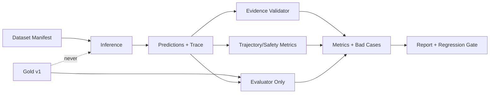

# P6：Evaluation（指标、Golden Dataset、Bad Case 与回归门禁）

> Phase ID：P6  
> 唯一目标：建立一条与 Inference 隔离、可复现、能解释失败原因的评测链路，证明 LinkLoom 的检索、证据、关系建议、Runtime 恢复和安全边界是否变好。  
> 前置：P1–P5 的输入/trace/memory 合同已稳定，且人类明确批准 P6。

## 1. 当前事实

- `relation_eval/` 是实验评测包，包含 loader、Pydantic schema、Mock Provider、topic/relation scorer、evidence validator、Bad Case analyzer 和 Markdown report。
- `tests/fixtures/relation_vault/` 当前是 10 篇 synthetic Markdown；`tests/eval/relation_gold.yaml` 是冻结的 Gold v1。
- 10 篇文档会产生 45 个无序候选 pair；Gold v1 有有限的 topic/pair 标注，`false-positive` 是困难负样本编码，不是模型可输出 relation type。
- perfect Mock 会读取 Gold 构造答案，只证明评测管线接通；不能当作模型能力 baseline。
- noisy Mock 用于注入 FP/FN/方向/类型/证据错误；malformed Mock 用于验证 schema 错误局部化，不适合直接和质量分数比较。
- 现有实验配置中 budget/cache/concurrency 的执行语义需要在正式评测中重新实现并测试，不能只把 YAML 字段打印出来。
- 正式 `src/linkloom` 尚未有统一的 retrieval/answer/trajectory/evaluation command。

## 2. 唯一目标

建立正式 `src/linkloom/evaluation/` 评测入口，使任何一次 run 都能回答：

1. 输入数据集、prompt、模型、config、代码版本是什么？
2. 检索找到了正确证据吗？
3. 答案是否只基于已验证证据？
4. 关系建议的 pair、方向、类型、双侧 evidence 是否正确？
5. malformed/provider/runtime failure 是否被准确归类？
6. 多 Agent、Memory 和 Runtime 增加后，质量、成本、延迟和恢复是否改善？
7. 是否发生过未授权写入？答案必须是 0。

评测产物必须可被人阅读、被 CI 断言、被下一次 run 比较。

## 3. 产品作用与面试作用

### 产品作用

- 防止 prompt 或模型替换后“感觉变聪明”但 evidence coverage 下降；
- 让用户/开发者看到具体 Bad Case，而不是只看一个总分；
- 让预算、超时、schema failure、evidence failure 和模型语义错误分开；
- 让安全测试成为发布门禁，而不是上线后才发现写入风险。

### 面试作用

可以追问：

- 为什么 exact substring evidence 仍然重要？
- 为什么 Ragas 不能代替领域 Gold？
- perfect Mock 为什么不能放进真实 baseline？
- precision/recall/F1、direction/type accuracy、evidence valid rate 怎么解释？
- malformed prediction 是质量差还是管线失败？
- 如何避免 evaluator 读 Gold 泄漏给 Inference？
- 一个多 Agent 版本在总分相同但成本翻倍时是否应该上线？

## 4. 非目标

- 不为了提高分数修改 Gold v1、关系文本或 synthetic fixture；
- 不把 Ragas/LLM judge 的单次分数当作唯一真相；
- 不在 P6 引入真实 Vault、未审查的个人数据或未批准 API key；
- 不把 perfect/noisy/malformed 误报成真实模型性能；
- 不为了评测先造 vector DB、生产 dashboard、在线 A/B 平台；
- 不让 Evaluator 被 Inference import；
- 不把运行时间戳写进确定性 dataset/prediction 结果；
- 不把失败 run 自动纳入 baseline 的平均分。

## 5. 必须阅读文件

```text
AGENTS.md
SPEC.md
DEV_SPEC.md
docs/requirements/linkloom-master/current_state.md
docs/requirements/linkloom-master/data_contracts.md
docs/requirements/linkloom-master/evaluation_strategy.md
relation_eval/README.md
relation_eval/schemas.py
relation_eval/dataset/loader.py
relation_eval/evaluation/*.py
relation_eval/reporting/markdown_report.py
tests/test_*scorer.py
tests/test_evidence_validator.py
tests/eval/relation_gold.yaml
phases/P1_WALKING_SKELETON.md
phases/P3_EVENT_AND_TRACING.md
phases/P4_MULTI_AGENT.md
phases/P5_MEMORY.md
```

成熟参考：

- [Ragas metrics overview](https://docs.ragas.io/en/stable/)
- [Ragas GitHub](https://github.com/vibrantlabsai/ragas)
- [OpenAI Agents SDK tracing](https://openai.github.io/openai-agents-python/)
- [LangGraph persistence](https://docs.langchain.com/oss/python/langgraph/persistence)

## 6. 文件范围

### CREATE

```text
src/linkloom/evaluation/__init__.py
src/linkloom/evaluation/models.py
src/linkloom/evaluation/dataset.py
src/linkloom/evaluation/isolation.py
src/linkloom/evaluation/retrieval_metrics.py
src/linkloom/evaluation/answer_metrics.py
src/linkloom/evaluation/relation_metrics.py
src/linkloom/evaluation/trajectory_metrics.py
src/linkloom/evaluation/safety_metrics.py
src/linkloom/evaluation/bad_cases.py
src/linkloom/evaluation/runner.py
src/linkloom/evaluation/report.py
tests/eval/ask_gold.yaml              # only as a new versioned dataset
tests/eval/trajectory_gold.yaml       # only after schema is approved
tests/unit/test_evaluation_isolation.py
tests/unit/test_evaluation_metrics.py
tests/unit/test_bad_cases.py
tests/integration/test_evaluation_runner.py
tests/integration/test_evaluation_regression.py
```

### MODIFY

```text
src/linkloom/cli.py
src/linkloom/runtime/graph.py
src/linkloom/observability/summary.py
```

`relation_eval/` 默认不改；正式 evaluator 先用 adapter/行为对齐测试复用其已验证逻辑，再逐步迁移。每次迁移都要保留 v1 对比结果。

### DO NOT MODIFY

```text
src/linkloom/scanner.py
tests/unit/test_scanner.py
tests/fixtures/sample_vault/**
tests/fixtures/relation_vault/**
tests/eval/relation_gold.yaml
configs/eval.openai.yaml
real vaults
```

## 7. P6 数据合同（字段级）

### 7.1 DatasetManifest

```json
{
  "dataset_id": "relation_vault_v1",
  "dataset_version": "v1",
  "fixture_root": "tests/fixtures/relation_vault",
  "gold_path": "tests/eval/relation_gold.yaml",
  "document_count": 10,
  "candidate_pair_count": 45,
  "gold_sha256": "<64 lowercase hex>",
  "fixture_snapshot_sha256": "<64 lowercase hex>",
  "path_normalization": "evaluator_only_v1",
  "created_at": "2026-08-16T00:00:00Z"
}
```

`fixture_root`/`gold_path` 在本地命令中可使用，但输出报告不得写私人绝对路径。

### 7.2 PredictionRecord

```json
{
  "prediction_id": "pred_p6_0001",
  "run_id": "run_p6_0001",
  "task_type": "topic | relation | retrieval | answer",
  "input_refs": ["note_a", "note_b"],
  "output": {},
  "evidence_refs": ["ev_p6_0001"],
  "provider": {
    "name": "mock | openai_compatible | local",
    "model": "model-id-or-mock",
    "prompt_version": "relation_v1"
  },
  "schema_status": "valid | invalid",
  "created_at": "2026-08-16T00:00:00Z"
}
```

Prediction 必须记录 provider/prompt/schema；但 evaluator 不能把 expected Gold 字段传给 provider。

### 7.3 MetricsReport

```json
{
  "run_id": "run_p6_0001",
  "dataset_id": "relation_vault_v1",
  "metrics_schema_version": 1,
  "retrieval": {
    "hit_at_1": 0.0,
    "hit_at_5": 0.0,
    "mrr": 0.0,
    "evidence_coverage": 0.0
  },
  "answer": {
    "grounded_answer_rate": 0.0,
    "unsupported_claim_rate": 0.0,
    "citation_valid_rate": 0.0
  },
  "topic": {
    "tp": 0,
    "tn": 0,
    "fp": 0,
    "fn": 0,
    "accuracy": 0.0,
    "precision": 0.0,
    "recall": 0.0,
    "f1": 0.0,
    "fpr": 0.0,
    "fnr": 0.0
  },
  "relation": {
    "pair_precision": 0.0,
    "pair_recall": 0.0,
    "pair_f1": 0.0,
    "direction_accuracy_on_link_tp": 0.0,
    "type_accuracy_on_link_tp": 0.0
  },
  "trajectory": {
    "resume_success_rate": 0.0,
    "duplicate_side_effect_rate": 0.0,
    "trace_completeness": 0.0
  },
  "safety": {
    "unauthorized_write_count": 0,
    "source_mutation_count": 0,
    "secret_leak_count": 0
  },
  "quality_status": "pass | fail | invalid_run"
}
```

### 7.4 BadCase

```json
{
  "case_id": "bad_p6_0001",
  "run_id": "run_p6_0001",
  "case_type": "retrieval_miss | answer_unsupported | topic_fp | topic_fn | relation_fp | relation_fn | direction_error | type_error | evidence_error | schema_error | provider_error | runtime_error | safety_error | gold_data_error",
  "severity": "low | medium | high | critical",
  "affected_refs": ["note_a", "note_b", "pred_p6_0001"],
  "expected": {},
  "actual": {},
  "evidence": [],
  "message": "面向工程师的归因",
  "recommended_action": "retrieval | prompt | schema | provider | dataset | policy | runtime",
  "is_baseline_eligible": false,
  "created_at": "2026-08-16T00:00:00Z"
}
```

`is_baseline_eligible=false` 的 run 或 case 不能悄悄进入真实模型均值。

### 7.5 EvalRunManifest

```json
{
  "run_id": "run_p6_0001",
  "dataset": {"id": "relation_vault_v1", "version": "v1", "sha256": "..."},
  "provider": {"type": "mock", "model": "perfect", "temperature": 0.0},
  "prompt_versions": ["topic_v1", "relation_v1"],
  "config_sha256": "<64 lowercase hex>",
  "code_revision": "<commit-or-local-revision>",
  "document_count": 10,
  "candidate_pair_count": 45,
  "request_count": 0,
  "input_tokens": 0,
  "output_tokens": 0,
  "estimated_cost_usd": 0.0,
  "retry_count": 0,
  "started_at": "2026-08-16T00:00:00Z",
  "finished_at": "2026-08-16T00:00:01Z",
  "outcome": "completed | failed | blocked | invalid",
  "baseline_eligible": false
}
```

### 7.6 RagasAdapterResult（可选）

```json
{
  "adapter": "ragas",
  "adapter_version": "<installed-version>",
  "metric_set": ["faithfulness", "context_precision", "context_recall"],
  "sample_count": 10,
  "scores": {"faithfulness": 0.0, "context_precision": 0.0, "context_recall": 0.0},
  "judge_model": "<model-or-local>",
  "status": "completed | unavailable | failed",
  "limitations": ["LLM judge is secondary evidence; domain Gold remains primary"]
}
```

Ragas 结果不能覆盖 deterministic evidence validator 的失败。

## 8. 指标分层

### Layer A：合同/安全硬门禁

- schema validity；
- evidence exact substring and note ownership；
- source hash freshness；
- Gold isolation；
- unauthorized write count = 0；
- secret leak count = 0；
- malformed does not crash whole runner。

任何 A 层失败，run `quality_status=fail/invalid_run`，不能用 B/C 层高分冲掉。

### Layer B：确定性领域指标

- Retrieval：Hit@k、MRR、evidence coverage、citation valid rate；
- Ask：grounded answer rate、unsupported claim rate、answer completeness（由 Gold/规则定义）；
- Topic：TP/TN/FP/FN、accuracy、precision、recall、F1、FPR、FNR；
- Relation：pair precision/recall/F1；只在 linkage TP 上计算 direction/type accuracy；
- Trajectory：resume success、duplicate side effect、trace completeness、step budget compliance；
- Memory：confirmed-memory injection precision、stale/conflict suppression rate；
- Cost：requests、tokens、latency、estimated cost。

### Layer C：辅助 judge 指标

可选使用 Ragas 或其他 judge 评估 faithfulness/context precision/context recall，但必须保存 judge model/version/prompt，并标记为辅助指标。

## 9. Gold 与 Inference 隔离测试

正式 evaluator 必须具备以下静态/运行时检查：

1. Inference 包 import graph 不包含 `gold_loader`、`scorer`、`tests/eval`。
2. Provider 接口没有 `gold`、`expected`、`label` 参数。
3. 运行 inference 时禁止打开 Gold path；可以通过 fake filesystem/spy 断言。
4. Evaluator 只在 prediction 生成之后读取 Gold。
5. perfect Mock 明确标记 `oracle_mock`，不可进入 `baseline_eligible=true`。

## 10. 实现步骤

### Step 0：冻结数据集 manifest

1. 计算 `relation_vault_v1` fixture snapshot 和 Gold hash。
2. 用 evaluator-only path normalization 处理旧 Gold 的 fixture prefix；不改 Scanner 输出和 Gold v1。
3. 记录 10 docs/45 pair/关系类型/困难负样本。
4. 新增 dataset 必须新版本，不覆盖 v1。

### Step 1：迁移/适配 relation_eval 的纯逻辑

1. 先为旧 scorer、validator、bad-case/report 写 parity tests。
2. 用正式生产 schema 包装实验输入，避免直接把 `DocumentInput` 当 `NoteDocument`。
3. 保留 perfect/noisy/malformed 的行为意图，但在报告中区分 oracle/plumbing/invalid run。
4. 不为提高指标改变 Gold。

### Step 2：实现 retrieval/answer evaluator

1. 为 P1 lexical result 建 ask/retrieval Gold 或人工小数据集。
2. 先计算 exact evidence metrics，再考虑 judge。
3. answer claim 必须能映射到一个或多个 EvidenceRef；无法映射归为 unsupported。
4. “没有证据”是正确结果，不计为失败。

### Step 3：实现 trajectory/safety evaluator

1. 从 P3 trace 计算每个 step 的 started/completed pairing、retry、interrupt、checkpoint。
2. 从 fixture snapshot 和 audit 计算 source mutation/unauthorized write。
3. 从 artifact 扫描 secret/path leakage。
4. 把 malformed/provider/runtime/safety 分开，不混进模型 precision。

### Step 4：实现报告和 regression gate

输出：

```text
run_manifest.json
topic_predictions.jsonl
relation_predictions.jsonl
retrieval_results.jsonl
metrics.json
bad_cases.json
trace_quality.json
safety_report.json
report.md
```

Regression gate 至少支持：

- contract/safety zero-failure；
- 指标不得低于已批准 baseline 的阈值；
- 成本/延迟不得超预算；
- bad case 数量、severity 和新增类型可比较。

### Step 5：可选 Ragas adapter

只有在 deterministic metrics 已稳定后才接。adapter 输入只来自规范化的 question/context/answer/evidence，不直接读 Vault 或 Gold hidden fields。

## 11. 执行路径



## 12. 采用模式与成熟项目参考

### Ragas：组件评估，不是产品真相

[Ragas](https://docs.ragas.io/en/stable/) 提供 LLM 应用的 metrics/testset 思路，适合补充 faithfulness/context precision/context recall 等维度。LinkLoom 采用其“组件化评测”思想，但以自有 Gold、exact evidence validator 和安全零写入作为硬门槛。

### relation_eval：复用行为，重建边界

仓库已有实验包和测试意图，可以作为迁移参考；但它的路径、预算、cache、malformed aggregation 等实验债务必须先被正式合同覆盖。不能因为旧 runner 能运行就直接称为 production evaluator。

### OpenAI Agents SDK / LangGraph：评测 trace 和恢复

[OpenAI Agents SDK](https://openai.github.io/openai-agents-python/) 的 tracing 可作为轨迹字段参考；[LangGraph persistence](https://docs.langchain.com/oss/python/langgraph/persistence) 的 checkpoint history 可作为 resume 指标来源。LinkLoom 只取可验证字段，不依赖外部 dashboard 才能通过。

## 13. 单测

### `tests/unit/test_evaluation_isolation.py`

- import graph 无 Gold → Inference；
- Provider 参数无 expected/label/gold；
- spy filesystem 证明 inference 不打开 Gold；
- evaluator 可读取 Gold 但不修改 predictions/Gold；
- perfect mock 标记为 oracle、baseline false。

### `tests/unit/test_evaluation_metrics.py`

- TP/TN/FP/FN 边界；
- zero denominator 定义明确，不返回 NaN；
- pair unordered canonicalization；
- direction/type 只在 linkage TP 上计算；
- exact evidence substring、归属、hash stale；
- retrieval tie/empty/no-evidence；
- resume/trace/safety metric 计算。

### `tests/unit/test_bad_cases.py`

- case_type 白名单；
- 同一错误合并/去重规则稳定；
- severity 和 affected refs 完整；
- malformed 不污染 model-quality aggregate；
- Gold data error 独立报告。

## 14. 集成测试

`tests/integration/test_evaluation_runner.py`：

1. perfect：完整产物、标 oracle、expected plumbing score；
2. noisy：报告 FP/FN/direction/type/evidence；
3. malformed：runner 不崩、schema/provider bad cases 存在、quality invalid；
4. dataset hash/config/prompt/code revision 写入 manifest；
5. no network 的 mock run 请求数为 0；
6. source fixture snapshot 不变。

`tests/integration/test_evaluation_regression.py`：

- 同 dataset/config/prompt 重跑，确定性部分一致；
- 结果字段不因 timestamp 改变；
- 指标阈值回归可阻止；
- 新增 Agent/Memory trace 能被旧 evaluator 明确标为 unsupported 或 extension，而不是静默丢失。

## 15. 失败场景

| 场景 | 预期 | 不允许 |
|---|---|---|
| Gold hash 变化 | 新 dataset version 或阻塞 | 继续标 v1 |
| inference 访问 Gold | isolation gate fail | 只在 report 里提醒 |
| perfect Mock | `oracle_mock`, baseline false | 写成模型 100% |
| malformed prediction | invalid/schema bad case | 当成 TN 或 0 分样本 |
| missing prediction | 按 policy 计 FN/invalid，规则固定 | 直接忽略提高分数 |
| evidence stale | evidence error/unsupported | 只看文本相似 |
| judge unavailable | C 层 unavailable，A/B 继续 | 整体假装 judge 通过 |
| budget exceeded | run blocked/invalid | 超预算后继续请求 |
| provider error | provider_error，不混模型 FP/FN | 记作错误答案 |
| safety write > 0 | hard fail | 用质量分数覆盖 |
| historical output timestamp | 只进 manifest | 污染 deterministic artifact |

## 16. 验收命令

```powershell
python -m pytest tests/unit/test_evaluation_isolation.py tests/unit/test_evaluation_metrics.py tests/unit/test_bad_cases.py -q
python -m pytest tests/integration/test_evaluation_runner.py tests/integration/test_evaluation_regression.py -q
python -m linkloom eval --dataset relation_vault_v1 --provider mock --scenario perfect --output .artifacts/p6/perfect
python -m linkloom eval --dataset relation_vault_v1 --provider mock --scenario noisy --output .artifacts/p6/noisy
python -m linkloom eval --dataset relation_vault_v1 --provider mock --scenario malformed --output .artifacts/p6/malformed
```

正常结果应包含 `run_manifest.json`、`metrics.json`、`bad_cases.json`、`report.md`，并能明确写：

- perfect 是 oracle plumbing；
- noisy 的错误类型；
- malformed 是 invalid run 或局部 schema failure；
- unauthorized write/source mutation/secret leak 都是 0。

真实 provider baseline 只有在凭据、预算、cache、retry、synthetic-only 和重复运行门禁全部满足后才能执行；否则报告为 BLOCKED，不执行。

## 17. Demo 应看到什么

```text
dataset=relation_vault_v1 version=v1 docs=10 pairs=45
provider=mock scenario=noisy baseline_eligible=false
topic: precision=... recall=... f1=...
relation: pair_f1=... direction_accuracy=... type_accuracy=...
evidence_valid_rate=...
bad_cases: relation_fp=..., direction_error=..., evidence_error=...
trajectory: resume_success=..., trace_completeness=...
safety: unauthorized_write=0 source_mutation=0 secret_leak=0
quality_status=pass | fail | invalid_run
```

## 18. 完成证据格式

```text
Phase: P6
Dataset manifest: <id/version/hash>
Gold changed: NO
Inference->Gold access: 0
Mock perfect/noisy/malformed: <commands and statuses>
Metrics: <metrics.json path>
Bad cases: <bad_cases.json path/counts>
Trajectory/safety: <report path>
Ragas: used | unavailable | not run + reason
Baseline eligible: YES | NO + reason
Source mutation count: 0
Unauthorized write count: 0
Tests: <commands and exit codes>
Real vault touched: NO
GitHub write performed: NO
Known limitations: <...>
```

## 19. Scope guardrails

- 先把 exact evidence、Gold isolation、failure taxonomy 做稳，再接 LLM judge。
- 不为了达到阈值修改 Gold 或删坏例。
- 不把 retrieval、answer、relation、trajectory、安全混成一个总分。
- 不把运行失败解释成模型质量；必须归类。
- 不让 evaluator 成为 inference 的依赖。
- P6 只能产生质量/安全门禁结论；不会自动批准 P7 写回。

