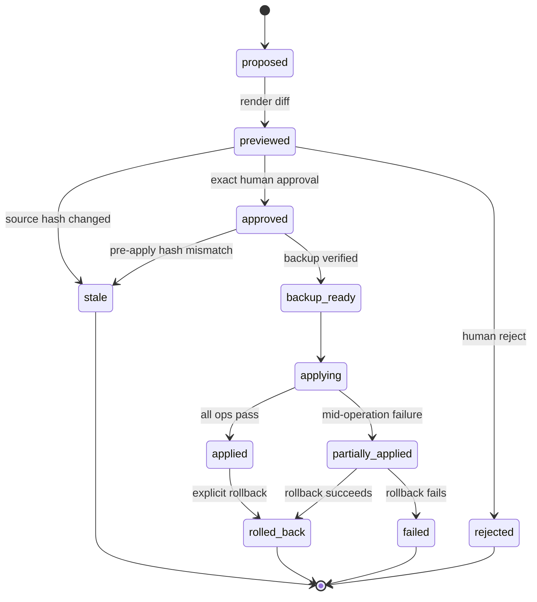
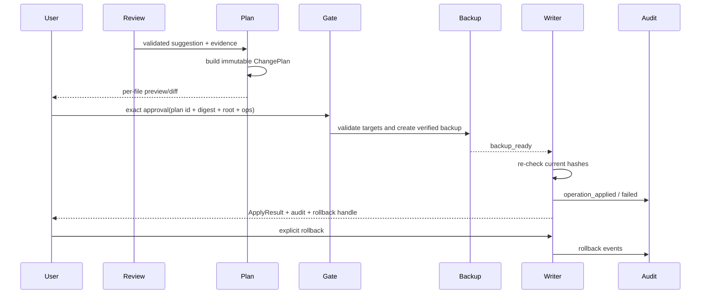

# P7：Safe Writeback（Plan / Preview / Exact Approval / Audit / Rollback）

> Phase ID：P7  
> 唯一目标：把已审阅建议转化为可验证、可预览、需要精确批准、能防 stale、可审计、可回滚的写入流程；第一版只允许 synthetic mutation fixture。  
> 前置：P6 的质量/安全门禁通过，P7 具体边界已由人类明确批准。

## 1. 当前事实

- 当前正式 `src/linkloom` 没有 Safe Writer、ChangePlan、Permission Gate、Backup 或 Rollback 模块。
- 根 `SPEC.md` 和 `AGENTS.md` 禁止在 Milestone 6 门禁前修改真实 Vault。
- P1–P6 都应保持 read-only；P7 的存在不能让 read-only CLI 自动加载写能力。
- 当前 Scanner v1 的 `content_sha256` 可以作为 stale-plan 的源版本基础，但不能修改 Scanner 来支持 Writer。
- `relation_eval`、Gold、历史 output、P1/P4 建议都只是输入证据/建议，不是用户批准。
- P7 的 synthetic fixture 必须独立于用户真实文件；任何 apply demo 都要能 byte-for-byte rollback。

## 2. 唯一目标

实现以下严格生命周期：

```text
validated suggestion
  -> immutable ChangePlan
  -> per-file preview/diff
  -> exact human approval
  -> revalidate path + source hash
  -> backup and verify
  -> apply only approved operations
  -> audit result
  -> tested rollback
```

任何一步失败都必须停止，并把状态、已应用操作、备份和恢复动作写入 audit；系统不能把“部分写入”伪装成成功。

## 3. 产品作用与面试作用

### 产品作用

用户可以安全地把某一条建议变成一项明确变更：先看逐文件 diff，再批准 exact plan；如果文件在 preview 后发生变化，系统会拒绝 apply；如果中途失败，用户可以恢复原始字节。

### 面试作用

可以追问：

- 为什么不能只让用户回复“好的”？
- expected hash 如何防止 stale plan？
- backup 在第一个写入前为什么必须已经验证？
- 多文件操作如何处理部分成功？
- rollback 和 git checkout 有什么不同？
- read-only 命令如何从模块层面保证不加载 Writer？
- 你如何证明 apply 完全匹配 approved preview？

## 4. 非目标

- P7 第一版不接真实 Vault；
- 不支持自动 delete、merge、批量 rewrite、无人值守 rename/move；
- 不允许 Agent 自己生成 approval 或自动确认自己的 plan；
- 不把 Git commit/push 当作 rollback；
- 不允许 source hash 不一致时“尽量应用”；
- 不把 backup 写到 Vault 内或不可验证的临时路径；
- 不实现操作系统级权限提升、管理员权限或远程写入；
- 不把 `ReviewDecision=evidence_sufficient` 解释成人类批准；
- 不因为某个工具支持写文件就让所有命令看见它。

## 5. 必须阅读文件

```text
AGENTS.md
SPEC.md
DEV_SPEC.md
docs/ACCEPTANCE_CHECKLIST.md
docs/requirements/linkloom-master/safety_and_permissions.md
docs/requirements/linkloom-master/data_contracts.md
docs/implementation/01_ARCHITECTURE_CONTRACTS.md
phases/P4_MULTI_AGENT.md
phases/P6_EVALUATION.md
src/linkloom/scanner.py
src/linkloom/cli.py
```

成熟参考：

- [LangGraph human-in-the-loop](https://docs.langchain.com/oss/python/langchain/human-in-the-loop)
- [LangGraph interrupts](https://docs.langchain.com/oss/python/langgraph/interrupts)
- [OpenAI Agents SDK guardrails](https://openai.github.io/openai-agents-python/guardrails/)
- [OpenHands Agent architecture](https://docs.openhands.dev/sdk/arch/agent)
- [Vaultkeeper AI](https://github.com/andy-stack/vaultkeeper-ai)
- [Obsidian Copilot](https://github.com/logancyang/obsidian-copilot)

## 6. 文件范围

### CREATE

```text
src/linkloom/mutations/__init__.py
src/linkloom/mutations/models.py
src/linkloom/mutations/operations.py
src/linkloom/mutations/preview.py
src/linkloom/mutations/permission.py
src/linkloom/mutations/backup.py
src/linkloom/mutations/apply.py
src/linkloom/mutations/rollback.py
src/linkloom/mutations/audit.py
tests/fixtures/mutation_vault/**
tests/unit/test_change_plan.py
tests/unit/test_preview.py
tests/unit/test_permission_gate.py
tests/unit/test_backup_and_rollback.py
tests/integration/test_safe_apply.py
tests/integration/test_partial_failure_recovery.py
tests/e2e/test_write_command_isolation.py
```

### MODIFY

```text
src/linkloom/cli.py
src/linkloom/runtime/graph.py
src/linkloom/observability/events.py
pyproject.toml                 # only if approved dependency is required
```

read-only subcommands必须不 import `src/linkloom/mutations`；可以为 `plan/preview` 通过独立只读 adapter 生成计划，但 `apply` 必须是显式、单独的入口。

### DO NOT MODIFY

```text
src/linkloom/scanner.py
tests/unit/test_scanner.py
tests/fixtures/sample_vault/**
tests/fixtures/relation_vault/**
tests/eval/relation_gold.yaml
relation_eval/**
real user vaults
GitHub remote state
```

## 7. P7 数据合同（字段级）

### 7.1 ChangePlan

```json
{
  "schema_version": 1,
  "plan_id": "plan_p7_0001",
  "plan_sha256": "<64 lowercase hex>",
  "created_from_run_id": "run_p6_0001",
  "source_index_sha256": "<64 lowercase hex>",
  "target_root_fingerprint": "mutation_fixture_v1",
  "target_root_mode": "synthetic_fixture_only",
  "operations": [],
  "operation_count": 1,
  "diff_summary": {
    "files_changed": 1,
    "lines_added": 1,
    "lines_removed": 0
  },
  "approval_status": "pending | approved | rejected | applied | partially_applied | rolled_back | stale | failed",
  "created_at": "2026-08-16T00:00:00Z",
  "expires_at": null
}
```

规则：

- `plan_sha256` 覆盖 canonical JSON，不包含生成时间戳或绝对路径；
- `operations` 排序稳定、operation id 唯一；
- plan 一旦展示给用户就不可就地修改；改动必须新建 plan id/version；
- `target_root_mode=synthetic_fixture_only` 在 P7 第一版必须强制；
- `approval_status` 只能由 Permission/Apply lifecycle 修改。

### 7.2 ChangeOperation

```json
{
  "operation_id": "op_p7_0001",
  "sequence": 1,
  "kind": "insert_wikilink | update_frontmatter | append_block | rename | move",
  "target_relative_path": "notes/example.md",
  "source_relative_path": null,
  "expected_sha256": "<64 lowercase hex>",
  "expected_size_bytes": 428,
  "precondition": {
    "must_exist": true,
    "must_not_be_symlink": true,
    "allowed_root": "mutation_fixture_v1"
  },
  "proposed_content_sha256": "<64 lowercase hex>",
  "payload": {
    "anchor": "## Links",
    "insert_text": "- [[target]]"
  },
  "preview_diff": "@@ ...",
  "evidence_refs": ["ev_p7_0001"],
  "risk": "low | medium | high",
  "status": "pending | validated | applied | failed | rolled_back"
}
```

P7 MVP 可只实现 `insert_wikilink` 或 `append_block` 一种 operation；未实现的 `rename/move` 必须显式返回 unsupported，不能静默当 append。

### 7.3 Approval

```json
{
  "approval_id": "approval_p7_0001",
  "plan_id": "plan_p7_0001",
  "plan_sha256": "<64 lowercase hex>",
  "target_root_fingerprint": "mutation_fixture_v1",
  "approved_operation_ids": ["op_p7_0001"],
  "decision": "approve | reject",
  "actor": "human",
  "confirmation_phrase": "APPROVE plan_p7_0001 root=mutation_fixture_v1 ops=1 sha=<plan_sha256>",
  "created_at": "2026-08-16T00:00:00Z",
  "expires_at": "2026-08-16T00:10:00Z"
}
```

批准必须同时匹配 `plan_id`、`plan_sha256`、目标根 fingerprint、精确 operation ids 和数量。单独的“yes”“继续”“清理一下”不是有效 approval。

### 7.4 BackupManifest

```json
{
  "backup_id": "backup_p7_0001",
  "plan_id": "plan_p7_0001",
  "backup_root": ".artifacts/p7/backups/backup_p7_0001",
  "files": [
    {
      "target_relative_path": "notes/example.md",
      "backup_relative_path": "notes/example.md",
      "original_sha256": "<64 lowercase hex>",
      "original_size_bytes": 428,
      "backup_sha256": "<64 lowercase hex>",
      "verified": true
    }
  ],
  "complete": true,
  "created_at": "2026-08-16T00:00:00Z"
}
```

在 `complete=true`、每个 backup file `verified=true` 之前，不允许写第一个 target。

### 7.5 ApplyResult

```json
{
  "apply_id": "apply_p7_0001",
  "plan_id": "plan_p7_0001",
  "approval_id": "approval_p7_0001",
  "status": "not_started | applied | partially_applied | failed | rolled_back",
  "applied_operation_ids": ["op_p7_0001"],
  "failed_operation_id": null,
  "backup_id": "backup_p7_0001",
  "post_apply_hashes": {
    "notes/example.md": "<64 lowercase hex>"
  },
  "rollback_available": true,
  "audit_log": ".artifacts/p7/audit/apply_p7_0001.jsonl",
  "error": null,
  "started_at": "2026-08-16T00:00:00Z",
  "finished_at": "2026-08-16T00:00:01Z"
}
```

### 7.6 AuditRecord

```json
{
  "audit_id": "audit_p7_0001",
  "event_type": "plan_created | previewed | approval_recorded | backup_created | operation_applied | operation_failed | rollback_started | rollback_completed | rollback_failed",
  "plan_id": "plan_p7_0001",
  "operation_id": "op_p7_0001",
  "actor": "human | system",
  "before_sha256": "<64 lowercase hex>",
  "after_sha256": "<64 lowercase hex>",
  "backup_id": "backup_p7_0001",
  "message": "safe, non-secret description",
  "created_at": "2026-08-16T00:00:00Z"
}
```

Audit 不记录 note 全文、API key、绝对路径或未经脱敏的用户内容；需要查看 diff 时引用 preview artifact。

## 8. 安全状态机



## 9. 实现步骤

### Step 0：冻结操作 allowlist

1. 只选一个最小 operation 做 MVP，例如 `append_block` 或 `insert_wikilink`。
2. 对 unsupported kind 返回 `OPERATION_NOT_SUPPORTED`。
3. 明确哪些文件类型允许、哪些路径禁止、是否允许创建新文件；默认不允许新文件和删除。
4. 规定所有操作必须有 source evidence 或人类明确输入原因。

### Step 1：实现 ChangePlan Builder

1. 从 validated ReviewItem/用户选择生成 canonical operations。
2. 计算 expected hash、proposed hash、diff、operation hash。
3. 对路径做 canonical root check、symlink check、duplicate target check。
4. 生成 immutable `plan.json`；任何编辑都生成新 plan。

### Step 2：实现 Preview

1. Preview 重新读取当前文件并用 expected hash 校验。
2. 生成 per-file、per-operation diff；标记 additions/deletions/renames。
3. 显示证据、原因、风险、目标路径和源版本。
4. Preview 不能写 target、backup 或 source；只写 artifact。

### Step 3：实现 Permission Gate

1. 将 exact approval 解析成结构化 `Approval`。
2. 逐字段匹配 plan digest、root fingerprint、operation ids/count。
3. approval 过期、重复、部分匹配、目标不一致都拒绝。
4. Agent、Reviewer、Provider 永远不能生成 actor=human 的 approval。

### Step 4：实现 Backup

1. 在 apply 前按 operation 顺序读取所有 target bytes。
2. 验证每个 target 的 expected hash、存在性、非 symlink 和 root containment。
3. 复制原始 bytes 到独立 backup root，并逐个 hash 回读。
4. 所有 backup verified 后才允许状态转 `backup_ready`。

### Step 5：实现 Apply

1. 再次校验 plan/approval/root/target hashes；preview 后任何修改都令 plan stale。
2. 每个 operation 应用前后写 audit；单文件写采用临时文件 + 同目录 replace，并保留原始权限策略。
3. 每个新内容 hash 必须等于 plan 的 proposed hash。
4. 发生异常就停止，不跳到下一个未执行 operation。
5. `partially_applied` 必须带 applied ids、failed id 和 backup id。

### Step 6：实现 Rollback

1. 根据 BackupManifest 按逆序恢复已应用 operation。
2. 回读每个文件，比较 original_sha256；任何不一致都标 rollback_failed。
3. rollback 不是删除 audit；它追加 rollback events。
4. 验证 source fixture 可以 byte-for-byte 恢复。

### Step 7：物理隔离 read-only CLI

1. `scan/ask/connect/run/eval/agent/memory` 测试 import graph 不加载 `mutations.apply`。
2. `plan/preview` 可以生成/展示计划，但不执行 apply。
3. `apply/rollback` 使用单独的 CLI entrypoint 或显式 capability flag；默认没有 write capability。
4. 任何 write command 都要求 `--synthetic-only` 直到 P7 被独立接受。

## 10. 执行路径



## 11. 采用模式与成熟项目参考

### LangGraph HITL / interrupt

[Human-in-the-loop](https://docs.langchain.com/oss/python/langchain/human-in-the-loop) 将工具审批建模为 interrupt，并要求 checkpoint 才能可靠 resume。LinkLoom 借鉴“危险动作先暂停、展示决定、再继续”的流程，但把 Writer 权限放在独立 mutation boundary，不让普通 Agent tool 直接应用。

### OpenAI Agents SDK guardrails

[Guardrails](https://openai.github.io/openai-agents-python/guardrails/) 提供输入/输出/tool 层验证的参考。LinkLoom 采用多层验证：schema、path、hash、plan digest、approval、backup、post-write hash；不依赖模型自觉。

### OpenHands security validation

[OpenHands Agent architecture](https://docs.openhands.dev/sdk/arch/agent) 将 security validation 作为 Agent action 之前的责任。LinkLoom 把它落成更窄的 synthetic-only Permission Gate，不开放 shell 或任意 workspace。

### Vaultkeeper / Obsidian Copilot

[Vaultkeeper AI](https://github.com/andy-stack/vaultkeeper-ai) 和
[Obsidian Copilot](https://github.com/logancyang/obsidian-copilot) 作为 Vault AI 助手的对照来源，提醒我们用户最终关心的是“我能否看懂并控制改变了什么”。LinkLoom 只借鉴 preview/用户控制的产品方向，不复制插件内部写入行为。

## 12. 单测

### `tests/unit/test_change_plan.py`

- canonical JSON hash 稳定；
- operation id/sequence/target 去重；
- unsupported operation 拒绝；
- expected/proposed hash 正确；
- evidence ref 缺失不能生成 plan；
- plan 改动后 digest 改变，旧 approval 失效。

### `tests/unit/test_preview.py`

- preview 不改变 target bytes；
- diff 与 proposed content 一致；
- stale target 被标记；
- absolute path/traversal/symlink 被拒绝；
- output artifact 不包含 secret/整篇不必要原文。

### `tests/unit/test_permission_gate.py`

- exact plan id/digest/root/ops 全匹配才批准；
- “yes”“approve all”“继续”无效；
- 人工 actor 必填；
- 过期、重复、部分 operation approval 拒绝；
- Agent/Reviewer 不能伪造 human approval。

### `tests/unit/test_backup_and_rollback.py`

- backup 逐文件 hash verified；
- backup 不完整时 apply 不开始；
- rollback 后原始 bytes/hash 完全恢复；
- rollback 失败被审计，不伪造成功；
- backup path 在安全 artifact root 外不能接受。

## 13. 集成测试

`tests/integration/test_safe_apply.py`：

1. 从 synthetic ReviewItem 生成 plan；
2. preview；
3. 保存 before snapshot；
4. exact approval；
5. backup verified；
6. apply 一个允许 operation；
7. post hash 等于 proposed hash；
8. audit 完整；
9. 读取 rollback；
10. 逐文件比较恢复后的 bytes 与 before snapshot。

`tests/integration/test_partial_failure_recovery.py`：

- 两个 operation，第二个注入失败；
- 第一个成功、第二个 failed；
- ApplyResult=partially_applied；
- rollback 只恢复已应用 operation；
- 最终 fixture 与 before snapshot 完全一致；
- 审计保留 failure 和 rollback 事件。

`tests/e2e/test_write_command_isolation.py`：

- read-only CLI import/test 不创建 write artifact；
- 不传 exact approval 时 apply 拒绝；
- apply 默认 synthetic-only；
- 真实路径 flag 在 P7 MVP 直接拒绝，不做路径探测后放行。

## 14. 失败场景

| 场景 | 预期 | 不允许 |
|---|---|---|
| preview 后 target 改变 | `stale`，要求新 plan | 按旧 diff 写入 |
| plan digest 不匹配 | approval reject | 只看 plan id |
| target symlink | reject | 跟随 symlink |
| target 越界 | reject | resolve 后继续 |
| backup 不完整 | apply 不开始 | 边备份边写 |
| operation unsupported | plan reject | 静默换操作 |
| approval 模糊 | reject | 把“好的”当批准 |
| 中途失败 | partially_applied + stop + backup | 继续批量写 |
| proposed hash 不匹配 | operation failed | 忽略 hash |
| rollback 失败 | rollback_failed + audit | 宣称恢复完成 |
| source fixture 不可恢复 | hard fail | 删除失败 artifact |
| Agent 自批准 | policy reject | 依赖 UI 显示 |
| real vault path | synthetic-only reject | 自动升级到真实路径 |

## 15. 验收命令

```powershell
python -m pytest tests/unit/test_change_plan.py tests/unit/test_preview.py tests/unit/test_permission_gate.py tests/unit/test_backup_and_rollback.py -q
python -m pytest tests/integration/test_safe_apply.py tests/integration/test_partial_failure_recovery.py tests/e2e/test_write_command_isolation.py -q
python -m linkloom plan --fixture tests/fixtures/mutation_vault --from-review .artifacts/p6/review.json --output .artifacts/p7/plan
python -m linkloom preview --plan .artifacts/p7/plan/plan.json --fixture tests/fixtures/mutation_vault --output .artifacts/p7/preview
python -m linkloom approve --plan .artifacts/p7/plan/plan.json --root-fingerprint mutation_fixture_v1 --operations-sha256 <plan_sha256> --confirm "APPROVE plan_p7_0001 root=mutation_fixture_v1 ops=1 sha=<plan_sha256>"
python -m linkloom apply --synthetic-only --plan .artifacts/p7/plan/plan.json --approval .artifacts/p7/approval.json --fixture tests/fixtures/mutation_vault --backup-root .artifacts/p7/backups
python -m linkloom rollback --synthetic-only --apply .artifacts/p7/apply/apply.json --fixture tests/fixtures/mutation_vault
```

命令中的 `<...>` 只是 shell 占位符；完成证据必须记录实际值和实际输出。真实 Vault 命令在 P7 MVP 中应明确拒绝。

## 16. Demo 应看到什么

```text
plan=plan_p7_0001 status=previewed operations=1
target=notes/example.md
expected_sha256=<...>
preview_diff=<...>
approval=matched plan_sha256/root/operation_count
backup=backup_p7_0001 verified=true
apply=applied operation=op_p7_0001
post_hash=<proposed_sha256>
rollback=rolled_back original_hash_restored=true
source_fixture_changed_after_rollback=false
```

如果注入第二个 operation 失败，应看到 `partially_applied`、`failed_operation_id`、`rollback_available=true`，而不是 `success`。

## 17. 完成证据格式

```text
Phase: P7
Mutation mode: synthetic_fixture_only
Supported operation kinds: <exact list>
Plan id/digest: <...>
Preview artifact: <path>
Approval: exact fields matched; actor=human
Backup manifest: <path>; every file verified=true
Apply result: <status>
Post-apply hashes: <...>
Injected partial failure: <result>
Rollback result: <status>; byte-for-byte=true|false
Read-only import isolation: passed
Real vault touched: NO
GitHub write performed: NO
Tests: <commands and exit codes>
Known limitations: <...>
Next step: separate human approval for any future real path; do not assume it
```

## 18. Scope guardrails

- P7 先证明一个小 operation 的完整安全生命周期，再扩充 operation kinds。
- 不因为 rename/move 看起来炫技就同时实现 link repair、merge、delete。
- 不把 backup 当“有 Git 就够了”；backup 必须独立、可验证、可读回。
- 不把 rollback 设计成“重新跑一次正向操作”；必须从原始 backup 恢复。
- 不允许 read-only 命令加载 writer capability。
- P7 synthetic acceptance 通过后，真实 Vault 仍需另一个明确的路径、计划和人类审批，不自动开放。

