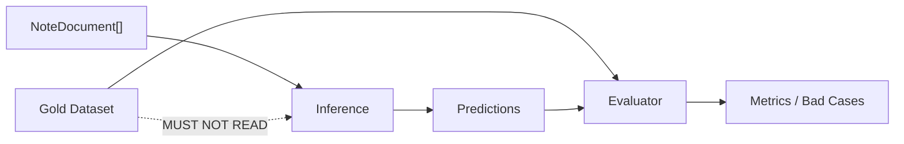
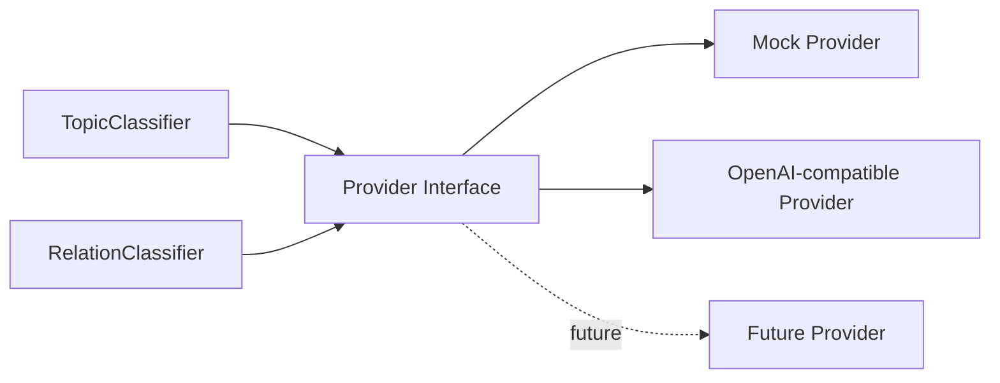
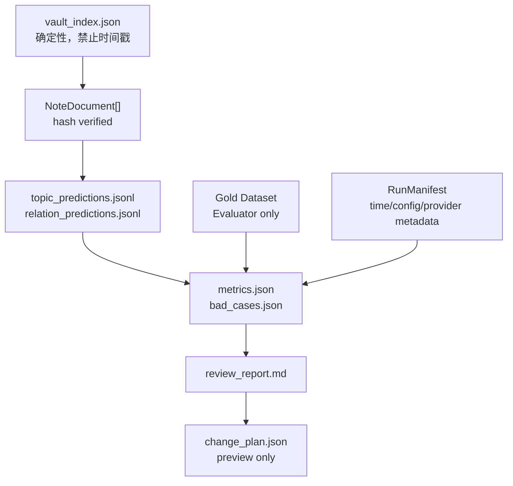

# 架构与依赖方向

## 系统主链路

```mermaid
flowchart LR
  V["Synthetic Markdown Vault"] --> S["Read-Only Vault Scanner"]
  S --> I["vault_index.json"]
  I --> L["Read-Only Note Loader"]
  L --> D["NoteDocument[]"]
  D --> C["Candidate Pair Generator"]
  D --> T["Topic Classifier"]
  C --> R["Relation Classifier"]
  T --> TP["TopicPrediction[]"]
  R --> RP["RelationPrediction[]"]
  TP --> E["Evaluator"]
  RP --> E
  E --> M["Metrics + Bad Cases"]
  M --> H["Human Review Report"]
  H --> P["Approved Change Plan"]
  P -. "future only" .-> W["Safe Writeback"]
```



Scanner 负责“事实索引”；Loader 负责“受 hash 约束的正文”；Agent 只负责“提出预测”；Evaluator 负责“对比 Gold”；Review 负责“让人做决定”。任何箭头都不允许反向绕过权限边界。

## 推理与评测隔离



**Inference 不能读取 Gold Dataset。** perfect Mock 是唯一刻意例外：它只用于证明 evaluator 管线，必须在报告中标记为 oracle mock，绝不当作模型能力。

## Provider 架构



Provider 只负责把受限输入转换为结构化预测；不负责读取 Vault、读 Gold、打分、写文件或决定写回。

## 中间数据产物流



`VaultIndex`、`NoteDocument` 与 Gold 是可比较的确定性事实；prediction、metrics、report 是一次 run 的可追溯产物；只有 `RunManifest` 可记录时钟和成本。`ChangePlan` 是计划，不是写入命令。

## 模块职责与依赖规则

| 模块 | 职责 | 禁止依赖/行为 |
|---|---|---|
| Scanner | 输出确定性 VaultIndex | 模型、Gold、写源笔记 |
| Note Loader | 根据 Index 读取并 hash 验证正文 | Gold、Provider、写入 |
| Candidate Pair Generator | 产生确定性无序 pair | 模型语义、Gold、写入 |
| Topic/Relation Classifier | 请求 Provider 并校验预测 schema | Gold、写入 |
| Provider | Mock 或远程结构化输出适配 | 直接读文件、评测、自动审批 |
| Evaluator | 对 Gold 评分与归因 | 修改预测、提供推理输入 |
| Evidence Validator | 检查必要片段是否真实存在 | 判断语义蕴含（v1 非目标） |
| Bad Case Analyzer | 归类失败 | 修改 Gold 以提高分数 |
| Human Review Reporter | 输出用户可读审核项 | 写源笔记 |
| Change Plan Builder | 生成带 hash/diff 的未来预览 | 执行 change |
| Future Safe Writer | 仅产品 Milestone 6 后处理批准计划 | 当前 MVP 不实现 |

## 推荐代码结构与迁移

```text
src/linkloom/
  scanner.py                 # 保留，冻结
  loader.py                  # WP-1
  schemas.py                 # WP-2，生产合同
  providers/{base,mock,openai_compatible}.py
  agents/{topic_classifier,relation_classifier}.py
  evaluation/{gold_loader,topic_scorer,relation_scorer,evidence_validator,bad_cases}.py
  review/{report,change_plan}.py
  runner/evaluate.py
```

`relation_eval/` 暂时保留为实验区。WP-2 至 WP-6 以小步方式把可验证逻辑迁入或由 `src/linkloom` 调用；不能复制一套平行的 scorer/schema。迁移完成前，实验区不得成为用户命令或产品依赖的唯一来源。

Vault Profile 只可在以后从 `vault_index.json` 生成统计画像；它不是搜索、语义关系或主线阻塞项。Safe Writer 只属于未来的用户产品 Milestone 6，不属于任何 Master 工作包。
